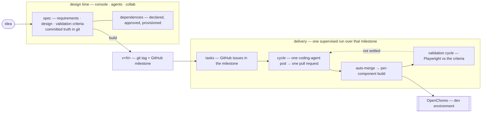

# WSO2 Labs: Agentic Engineer

> 🧪 **Early lab project** — APIs, data models, and features are still evolving,
> and subsystems may change shape between commits. Try it, break it, tell us what
> you think — just don't build on it as a stable surface yet.

Repository: [`wso2/labs-agentic-engineer`](https://github.com/wso2/labs-agentic-engineer)

An experimental, open-source platform that explores what **agent-driven software
engineering** looks like when the agents work inside an enterprise platform instead
of a blank editor. It's an early WSO2 lab project, built on top of
[OpenChoreo](https://github.com/openchoreo/openchoreo) and shared in the spirit of
"let's see what works."

## The premise

Agentic coding tools have made greenfield code generation fast and accessible. But
enterprise software isn't bottlenecked on typing — it's bottlenecked on requirements,
integrations, identity, deployment, and architectural conformance. The bet behind
this project is that to push productivity further, agents need to operate **inside a
platform that already understands those concerns**, so they can produce systems that
slot into the existing ecosystem rather than ignore it.

OpenChoreo already handles API management, identity, deployments, observability, and
policy enforcement. The agents in this repo build on that foundation, so what they
produce lands in an environment that enforces enterprise concerns automatically.

## What the platform does

It treats the SDLC as a chain of stages — **Specification → Design → Implementation
→ Build → Deploy → Manage** — and gives each stage a specialized agent with only the
tools and skills it needs. The flow:

- A **business owner** describes the solution they want; a chat agent guides
  requirements elicitation.
- A **shared workspace** lets BAs, designers, and engineers collaborate on the same
  artifacts, each with a view suited to them.
- Everything is captured as **spec files in a Git repository** (`specs/requirements/`,
  `specs/design/`, wireframes, domain models). Those specs become the contract
  downstream agents work against.
- Coding agents pick up tasks from those specs, work via **GitHub issues + branches
  + PRs** (no merge without human review), and the platform watches webhooks to drive
  each task through `pending → in_progress → ready_for_review → merged → building → deployed`.
- Because agents share context across artifacts, the system stays internally
  consistent — change a requirement and the wireframes, design, and tasks move with it.

## Demo

https://github.com/user-attachments/assets/9723e5a5-c187-49b5-886e-50c217da6c28

## The model



Skills are how the platform is taught rather than changed.

## Running Locally

The whole platform runs on one laptop: a k3d cluster with OpenChoreo, Thunder
(identity), Temporal, and the AEP services, plus one-shot coding-agent pods. The
canonical scripts live in [`deployments/`](deployments/README.md).

### Prerequisites

**Container runtime.** Docker Desktop or Colima, sized generously — the cluster
runs the OpenChoreo control/data/workflow planes, Thunder and Temporal, with the
AEP services alongside it as host containers. Colima wants at least
`--cpu 7 --memory 8`, plus several GB of free disk for the coding-agent runner
image. Nothing else is needed on the host: every service image builds inside
Docker, toolchains included.

**CLI tools.** `docker` (with Compose v2 and buildx), `k3d`, `kubectl`, `helm`,
`jq`, `yq`, `openssl`, `curl`.

**Credentials.** An Anthropic API key and a GitHub PAT (or GitHub App). Neither
is needed to bring the platform up — you connect both from the console
afterwards, and they're stored per organization.

**Free ports.** The cluster claims `6550`, `8080`, `8443`, `19080`, `19443`,
`10081`, `10082` (setup refuses to start if any are taken); the services claim
`8090`, `9090`, `4000`, `3400`, `3401`, `5433`, `8085`.

### Bring it up

Two commands, with two different lifecycles — the first is once per machine, the
second is every time you start the platform:

```bash
bash deployments/scripts/setup.sh    # the cluster and everything under it
bash deployments/scripts/start.sh    # the AEP services
```

`setup.sh` creates the k3d cluster, installs the platform underneath
(cert-manager, External Secrets, kgateway, OpenBao, then OpenChoreo's control,
data and workflow planes, Thunder for identity, Temporal for the run supervisor),
registers the AEP workflows and component types with OpenChoreo, builds the
coding-agent runner image, and writes `deployments/.env`. Expect it to take a
while on a cold machine — chart installs, image pulls, and a multi-GB runner
image. It is idempotent, so if a step fails you fix the cause and re-run it.

`start.sh` builds and starts the services as containers (`docker compose up`):
the console, the BFF, the agents runtime, collab, the MCP server and Postgres.
It also re-checks the things that drift when your machine restarts — cluster DNS,
the OpenBao bridge, per-org secrets — which is why it's a script rather than a
bare `docker compose up`. Stop them again with
`bash deployments/scripts/stop.sh`; the cluster keeps running.

Coding agents don't run in Compose. Each one is dispatched into the cluster as a
one-shot pod, as it is in a real deployment.

Observability is off by default because it's the heaviest install
(`ENABLE_OBSERVABILITY=1 bash deployments/scripts/setup.sh` adds OpenSearch,
Fluent Bit and the RCA agent). It's what the in-UI live progress streaming and
the [SRE handoff pipeline](docs/developer-guide/sre-handoff-runbook.md) need. The
RCA agent is platform-level rather than per-org, so it's the one component that
wants an `ANTHROPIC_API_KEY` in `deployments/.env`.

### Accessing the portal

The console is at **http://localhost:8090**. Sign in as `admin` / `admin` — the
Thunder default admin, which setup binds to OpenChoreo's `admin` role. Login
redirects through `thunder.openchoreo.localhost`, so if your OS doesn't resolve
`*.localhost`, point that name at `127.0.0.1` in `/etc/hosts`.

Before the first project, connect the organization's credentials in the console —
both are per-org, which is why bring-up doesn't ask for them:

- **Settings → GitHub Integration** — the PAT (or GitHub App) that specs,
  component repos, issues and PRs are created under.
- **Settings → Anthropic Integration** — the key every agent turn and coding run
  is billed to. There is no platform fallback, so nothing generates until it's
  connected.

If you'd rather not click through that on every fresh cluster, put
`LOCAL_DEV_ADMIN_GITHUB_PAT`, `LOCAL_DEV_ADMIN_GITHUB_OWNER` and
`ANTHROPIC_API_KEY` in `deployments/.env` and `start.sh` connects them for you.

GitHub webhooks — the ones that drive a merged PR through build and deploy —
already work: setup provisions a [smee.io](https://smee.io) channel into `.env`
and the stack runs a relay for it.

Other surfaces worth knowing: the BFF at `localhost:9090`, the Temporal Web UI at
`localhost:8233` for the run workflows, and OpenChoreo's Argo UI in the workflow
plane for build and coding-agent pods.

Tear down the services with `bash deployments/scripts/stop.sh`, or the whole
cluster with `k3d cluster delete openchoreo`, which drops all OpenChoreo state.

## Where the code lives

| Path | What it is |
|---|---|
| [`apps/console`](apps/console/README.md) | the human surface: React SPA over the BFF, its only backend |
| [`services/aep-api`](services/aep-api/README.md) | the Go BFF — seven domains behind one tenant-gated edge; owns spec git, the milestone run supervisor (Temporal), provisioning, and the GitHub webhook plane |
| [`services/agents`](services/agents/AGENTS.md) | design-time agent runtime (Vercel AI SDK). One turn = one POST, streamed as SSE; writes no files itself |
| [`services/collab`](services/collab/AGENTS.md) | Yjs server hosting the live spec document, one room per project |
| `services/aep-mcp-server` | MCP surface letting external agents (OpenChoreo's SRE/RCA agent) search issues, file one, and dispatch a coding run |
| [`runners/`](runners/AGENTS.md) | `remote-worker`, the coding agent: a one-shot pod running the Claude Agent SDK. One image serves implementation and validation; its ADRs are in `runners/remote-worker/design/decisions/` |
| [`skills/`](skills/AGENTS.md) | the one authored skill library, seeded and reconciled into every org's own repo |
| [`packages/`](packages/contracts/AGENTS.md) | shared libraries. `packages/contracts` holds the hand-authored OpenAPI every client and server is generated from |
| [`playground/`](playground/AGENTS.md) | a cluster-free harness that runs the real agents against a plain local directory — how the skills and prompts get tuned |
| [`evals/spec-agents`](evals/spec-agents/README.md) | scenario evals for the design-time agents. On demand, never in CI |
| [`deployments/`](deployments/README.md) | the local stack: k3d + OpenChoreo under the AEP services in Compose |


## Status and feedback

This is an **early lab project**, and the whole point of putting it out now is to
learn from people working through similar problems: where agent boundaries should
sit, how skills map to your conventions, what felt natural, what got in the way.
Feedback goes via GitHub issues on
[`wso2/labs-agentic-engineer`](https://github.com/wso2/labs-agentic-engineer).

## License

Apache 2.0 — see [`LICENSE`](./LICENSE).
