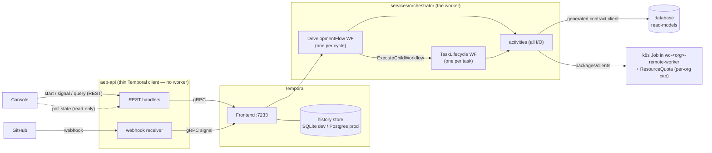
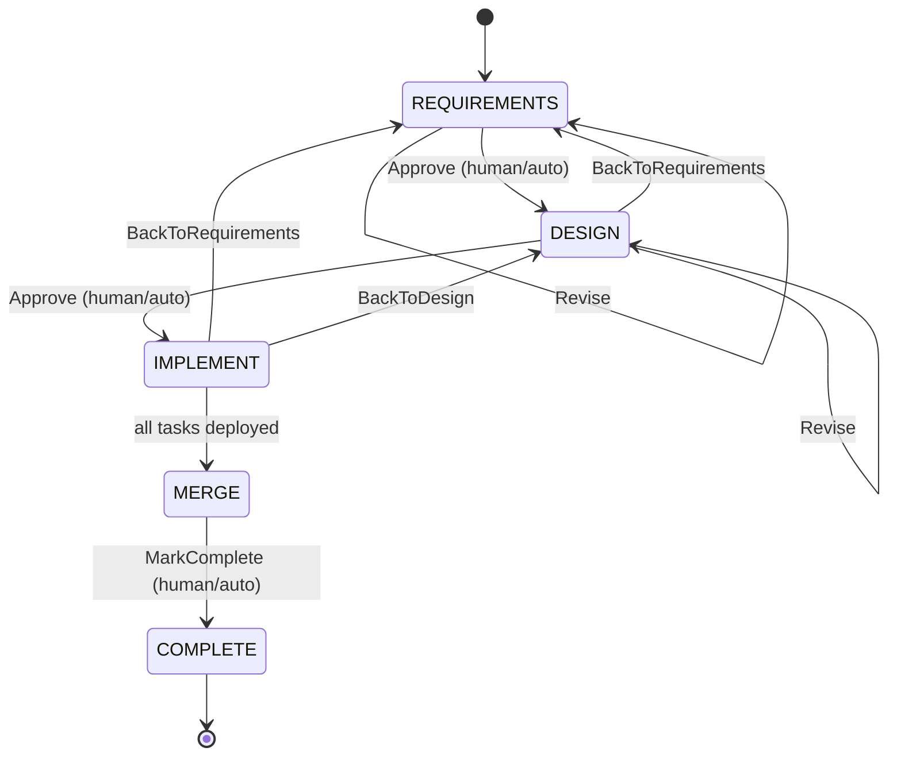
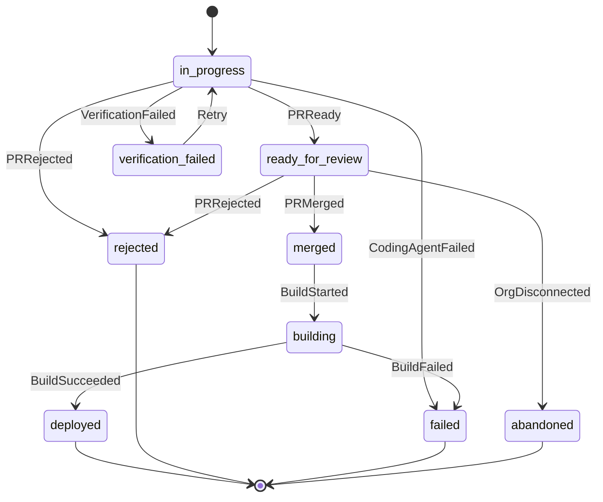

# Workflow Orchestration — Design Overview

> Status: **design / proposed**. Target: the `aep` rewrite (`services/orchestrator` + `aep-api`).
> Companion: diagrams `01`–`03` (`.excalidraw`), full sequence in `04-sequence-full-flow.md`.
> The phased execution plan (O0–O5) is tracked separately in the implementation plan.

This document explains **why** we introduce a workflow engine, **how** the orchestration is
structured, the **sequence** of a development cycle, and the **advantages** and **complexities** of
the approach.

---

## 1. Why a workflow engine

Today the development lifecycle is driven by UI buttons + ad-hoc endpoints + a webhook-fed
state-machine table + polling watchers. None of these models *"wait for the human"* or *"resume after a
crash"* as a durable step. Position is **derived** (recomputed from artifacts/tags), precedence is a
409 tag-check, the deploy cascade is serialized by a Postgres advisory lock, and there is no real DAG
scheduler.

A **durable workflow engine (Temporal)** models the whole development cycle — including the human
approval gates — as one resumable process:

- **Durable position** that survives restarts (replaces derived phase).
- **Human gates as first-class `await` points** (an approval can't be lost to a crash).
- **GitHub webhooks as signals** into the running workflow (replaces the projector table + watchers).
- **Parallel DAG scheduling** of tasks, with retries/compensation, natively.
- **Autonomous mode nearly for free** — a gate is a decision point; a human signal or an automated
  check can satisfy it.

Because the rewrite is a clean slate (`services/aep-api` not yet ported), Temporal is the **primary
orchestrator** from day one — *not* a dual-write shadow over a legacy state machine (the approach the
old `main` branch was forced into).

---

## 2. How we introduce it (approach)

- **Temporal is primary.** The workflow *is* the state machine. No hand-rolled DB state-machine table,
  no polling watchers, no advisory locks. The `database` service holds **read-models** for the UI
  (written from idempotent activities); Temporal keeps its **own** engine datastore (SQLite dev /
  Postgres prod) for workflow history.
- **Standalone `services/orchestrator`** runs the Temporal worker and owns all workflow + activity
  code. `aep-api` is a **thin client** (start/signal/query only). This is a deliberate change from
  `main`, where the worker ran in-process in the BFF — separating it lets the workflows be tested,
  deployed, and scaled independently.
- **Phased & provable.** Infra + rails + workflow skeletons land first on the scaffold (green builds,
  ping workflow in the Web UI, mocked-activity unit tests); the real activities land when the
  `database`/`aep-api` ports arrive. (Phases O0–O5 in the implementation plan.)

---

## 3. Workflow architecture

Two workflow tiers; no standing coordinator. See `02-workflow-topology.excalidraw` for the visual.

**Components**
- **`DevelopmentFlowWorkflow`** — one instance per **change cycle**
  (`devflow:<org>:<project>:<cycle>`). Runs `requirements → design → implement → merge → complete`
  with iterate-back edges. **Starts the task workflows** itself (`ExecuteChildWorkflow`). A new
  requirement/issue = a **new cycle instance** (same type), so cycles run concurrently.
- **`TaskLifecycleWorkflow`** — one child per task (`task:<org>:<project>:<id>`). Per-task state
  machine driven by GitHub-webhook signals. Build/deploy run as a **k8s Job** dispatched from an
  activity.
- **`aep-api`** — dial-only Temporal client. Translates console clicks + GitHub webhooks into
  `StartWorkflow` / `SignalWorkflow` / `QueryWorkflow`. Runs **no** worker.
- **`packages/contracts/orchestration`** — shared Go module: signal/query name constants, payload
  structs, workflow-ID builders, task-queue name. Imported by *both* services → no stringly-typed
  drift (exactly one definition of `"PRMerged"`).
- **Activity dependency rule** — owned services (`database`) via **generated contract clients**; infra
  (k8s/OpenChoreo/Argo/git) via **`packages/clients`**; never direct/stringly.

### State machines

`DevelopmentFlowWorkflow` (phase loop with back-edges; gates are `human` or `auto`):

`TaskLifecycleWorkflow` (signals from GitHub webhooks; `deployed` unblocks dependents):

### IMPLEMENT scheduling (DAG + per-org cap)
The cycle workflow runs a dynamic DAG scheduler: a task is spawned once **all** its dependencies have
reached `deployed` (independent tasks run in parallel). Per-org concurrency is **platform-enforced** —
each task is a k8s Job in the org's `wc-<org>-remote-worker` namespace, capped by a `ResourceQuota`;
the dispatch activity is retriable when the quota is full. No coordination workflow, no DB lock.

### Gate modes (interactive ↔ autonomous)
Each cycle carries a `GatePolicy{Requirements, Design, CodeReview}`; each stage is `human` (await the
Approve signal) or `auto` (run checks — tests/lint/agent self-review — then advance; `auto` never skips
blindly). Autonomous mode = all stages `auto`; `CodeReview: auto` drives PR auto-merge (which flows
through the same `PRMerged` webhook path). Same workflow, same states — only *who acts at each gate*
differs.

---

## 4. Sequence of a development cycle

Full end-to-end sequence (start → gates → implement/DAG → per-task PR/build/deploy via webhook→signal →
merge → complete, plus the loop-back path) is in **`04-sequence-full-flow.md`** (Mermaid, renders on
GitHub). Condensed:

1. User submits a requirement → `aep-api` → `StartWorkflow(devflow:…)` → orchestrator runs the cycle.
2. Requirements & Design gates: human `Approve` signal **or** an `auto` checks-activity.
3. IMPLEMENT: the cycle workflow spawns a `TaskLifecycleWorkflow` per ready task (DAG-ordered, per-org
   Job quota). Each task dispatches a coding-agent **Job** → opens a PR.
4. GitHub webhooks (`PR ready/merged`, `build started/succeeded`) → `aep-api` → **signals** to the
   exact task workflow → it advances to `deployed`.
5. `deployed` children unblock dependents; when all are deployed → MERGE → COMPLETE.
6. Throughout, the Console **polls** workflow state via a read-only `QueryWorkflow`.

---

## 5. Advantages

- **Durable position** — survives BFF/worker restarts; no recomputation from artifacts.
- **Enforced precedence** — sequencing is structural (workflow code), not a tag check.
- **Human gates that can't be lost** — an approval is an `await`; a pre-crash approval persists in
  history.
- **Crash-resumable** — a worker dying mid-cycle resumes from the last completed step.
- **Autonomous mode almost free** — flip gates to `auto`; same workflow drives a hands-off
  requirement→deploy run with checks.
- **Real parallel DAG** — independent tasks build concurrently; dependents wait — no advisory lock.
- **Per-task isolation** — a task's retries/failures don't perturb siblings; webhooks address the exact
  task workflow by ID.
- **Multi-tenant by construction** — org in every workflow ID + a Search Attribute; orgs run in
  parallel on stateless, horizontally-scalable workers.
- **Audit & visibility** — full event history + a per-cycle timeline in the Temporal Web UI, free.
- **Cap at the right layer** — per-org concurrency is a k8s `ResourceQuota`, not bespoke coordination.

---

## 6. Complexities (and how we manage them)

| Complexity | Why it exists | Mitigation |
|---|---|---|
| **Determinism discipline** | Workflow code is replayed; nondeterminism breaks replay. | All I/O in activities; `internal/workflows` forbids `time.Now`/`os`/`uuid`/HTTP/DB (optional `depguard` lint). Transitions are pure helpers. |
| **Activity idempotency** | Temporal retries activities; one can succeed then re-run. | "Ensure X / set Y", never "create X / increment Y". Read-model writes are `UPSERT (workflowID, version)`; dispatch checks-before-create; signals carry dedupe keys. |
| **Workflow versioning** | Editing workflow code can break in-flight runs. | `workflow.GetVersion` patches; prefer additive changes; Worker Build IDs for big jumps; a `WorkflowReplayer` CI test over committed history fixtures; an ADR tracks `changeID`s. |
| **Eventual-consistent read-models** | DB is written *after* the transition by an activity. | Gate-critical reads go through `QueryWorkflow` (truth); the DB read-model is a cache for lists/UI. |
| **Webhook → signal hop** | Standalone orchestrator adds a network hop vs in-process. | `SignalWithStartWorkflow` (webhook before workflow exists still works); idempotent signal handlers; fast 2xx ack. |
| **Two services + shared boundary** | orchestrator + aep-api must agree on signal/query/ID names. | One shared `packages/contracts/orchestration` Go module — single source of truth, imported by both. |
| **New infra** | Temporal Server + its datastore (Postgres in prod), Web UI behind the gateway. | docker-compose dev-server for local; Helm into the cluster for prod (platform-design-expert + cluster-health pre-flight). |
| **Learning curve** | Signals/queries/activities/replay are a new model for the team. | Start with the ping-workflow rails; mirror the unit-test suite; this doc + diagrams as the reference. |

---

## 7. References
- `01-user-flow.excalidraw` — user-facing development cycle.
- `02-workflow-topology.excalidraw` — workflow tiers + state machines + DAG/Job cap.
- `03-interactions.excalidraw` — runtime interactions (lanes).
- `04-sequence-full-flow.md` — full end-to-end + loop-back sequence (Mermaid).
- Implementation plan (O0–O5) — phased execution, verification gates.
