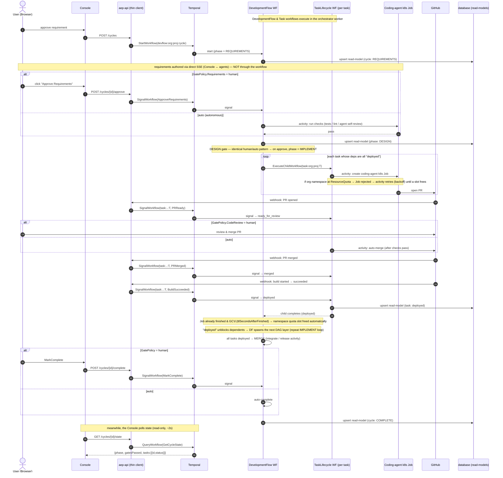

# Full flow — sequence diagram

End-to-end runtime sequence for one development cycle, including the per-task lifecycle, gate modes
(human / auto), the DAG + per-org cap, GitHub-webhook→signal routing, and the read-only state poll.

**Key relationship:** `DevelopmentFlowWorkflow` (the cycle) **starts the `TaskLifecycleWorkflow`s**
itself via `ExecuteChildWorkflow` during IMPLEMENT. `aep-api` starts only the cycle workflow and relays
signals/queries; GitHub webhooks for a task are relayed by `aep-api` as **signals to the existing task
workflow** (routed by deterministic ID, e.g. `task:<org>:<proj>:<taskId>`).



## Loop-back (iterate) — what changes mid-flight

```mermaid
sequenceDiagram
    autonumber
    actor U as User
    participant API as aep-api
    participant TMP as Temporal
    participant DF as DevelopmentFlow WF
    participant TK as TaskLifecycle WF (running)
    participant JOB as Coding-agent k8s Job
    participant GH as GitHub

    U->>API: "Back to Requirements" (during IMPLEMENT)
    API->>TMP: SignalWorkflow(BackToRequirements)
    TMP->>DF: signal
    DF->>TK: cancel child workflow(s)
    TK->>JOB: delete Job / cancel build
    TK->>GH: comment "superseded — requirements revised" (PR left open)
    Note over DF: deployed components stay running (re-plan, not rollback)
    DF->>DF: phase = REQUIREMENTS
    Note over DF: next IMPLEMENT pass re-derives tasks; idempotent dispatch acts only on what changed
```

## Notes / invariants
- **Only the orchestrator runs a worker.** `aep-api` dials Temporal for `StartWorkflow` /
  `SignalWorkflow` / `SignalWithStartWorkflow` / `QueryWorkflow` only.
- **Parent starts children.** `DevelopmentFlowWorkflow` → `ExecuteChildWorkflow(TaskLifecycleWorkflow)`.
  `aep-api` never starts a task workflow; it only signals existing ones.
- **GitHub issue fast-path:** an issue webhook starts a `DevelopmentFlowWorkflow` with
  `startPhase=tasks` (skips requirements/design) — same diagram from the IMPLEMENT loop onward.
- **All I/O is in activities** (dispatch, build, auto-merge, read-model writes); activities are
  idempotent (Temporal retries). Workflow code stays deterministic.
- **Parallel tasks:** the IMPLEMENT loop runs concurrently per ready task (bounded by the per-org cap);
  the diagram shows one task for clarity.
