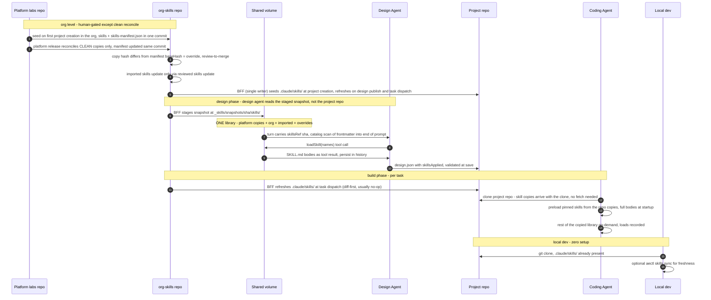

# Skills Experience — Design Spec

**Date:** 2026-07-21 · **Status:** Accepted · **Scope:** agent-facing skill behavior + skill lifecycle/storage

> **Chosen approach:** project repos carry a **copy of the org's whole skill library** in `.claude/skills/`. Considered and not adopted: copying only the pinned subset and serving the rest from a per-task org-skills clone — leaner repos, but it reintroduces runtime network dependence and loses zero-setup local discovery.

## 1. Goals & priorities

Proactive design review — no observed failures. Priorities when trade-offs conflict:

1. **Determinism & auditability** — know exactly which guidance shaped any build; reproducible.
2. **Output quality** — never build without guidance that exists.

Secondary: token efficiency, operational simplicity.

**Fixed constraints:** design agent = Vercel AI SDK turn loop (`services/agents`); coding agent = Claude Code Agent SDK (`runners/remote-worker`). Local development parity is a requirement.

**Non-goals:** authoring UX redesign; agents beyond the current design/task/coding agents.

## 2. Concepts

| Term | Meaning |
|---|---|
| Skill | Guidance text, never code. `SKILL.md` (`name` + `description` frontmatter, markdown body) + optional `references/*.md` |
| Platform skill | Shipped by us (authored in this repo's `skills/`), copied into org repos with provenance |
| Org skill | Authored by the org in their `org-skills` repo |
| Override | A platform skill the org modified — detected by hash, not declared |
| Imported skill | Third-party skill copied in with provenance (source + pinned hash) |
| Pinned | Listed in a component's `skillsApplied[]` — certainly needed for its build |
| Preload | Full skill body injected at session start (SDK `skills:` array) |
| On-demand | Catalog line (name+description) in context; body loads only on invoke |

### Frontmatter contract

Standard `name`/`description` is the **required interop surface** (works with any Claude Code skill, including third-party). All `metadata.aep.*` fields are **optional with safe defaults**:

```yaml
metadata:
  aep:
    kind: platform | org | imported      # default: org — human-facing label only
    source: <owner/repo>                  # imported skills — human-facing pointer
```

Frontmatter carries only **identity and human-facing labels**. All machine bookkeeping (hashes, sources) lives in the org repo's `skills-manifest.json` (§3) — never in the skill file itself, so hashes cover whole file bytes with no self-reference. Where frontmatter and manifest overlap (`kind`, `source`), the **manifest is authoritative**; frontmatter is a browsing convenience.

There is **no `phase` field**: which agent a skill serves is carried by its description and structure, not metadata — a deliberate decision (a phase enum cannot express skills that span agents, and both agents see the full catalog anyway).

### Audience-structured skills (how routing is authored)

Many skills serve a workflow that **spans agents** — e.g. `wireframes`: the design agent must *author* `wireframes.dsl`, the coding agent must *implement* screens from it. Authoring structure carries that:

```
skills/wireframes/
  SKILL.md          # description names BOTH uses; body = shared core (DSL concepts)
  references/
    authoring.md    # design agent: sketching screens, writing wireframes.dsl
    implementing.md # coding agent: translating the DSL into components
```

- **Description carries every trigger** ("Use when sketching UI wireframes… or when implementing screens from an existing wireframes.dsl") — each agent's catalog line self-selects; no enum needed. Since both agents see the full catalog anyway, structure is what routes, not metadata.
- **Body = shared core; references = per-audience depth**, loaded via `loadSkillReference` / native reference reads only by the agent that needs them. One skill, no authoring/implementing twin-drift.

### The `skill-creator` meta-skill

The platform ships a `skill-creator` skill — guidance for writing skills — in the standard library, so orgs authoring their own skills inherit the conventions: trigger-rich descriptions naming all audiences, shared-core + audience-references layout, the frontmatter contract above, size budgets. It flows like any platform skill (seeded, reconciled, override-able).

## 3. Storage & lifecycle — managed materialized copies

One principle at every tier: **copies are fine when every copy is managed** — auto-refreshed while clean, flagged the moment it diverges, never silently clobbered.

| Tier | Copy lives in | Refreshed by | Divergence handling |
|---|---|---|---|
| Platform → org | `org-skills` repo | reconcile on platform release — **unmodified copies only** | hash mismatch = override; never overwritten; "review the diff" flow |
| Upstream → org (imported) | `org-skills` repo | reviewed `skills update` only (never automatic — supply-chain boundary) | hash-detected fork; merge by review |
| Org → project | project skill copies (`.claude/skills/` in project repo) | BFF (project creation, design publish, task dispatch) + optional `aectl skills sync` | self-healing: copies are generated, the next diff-first refresh overwrites any hand-edit |

Key properties:

- **One org repo = whole truth.** A single org-repo sha fully determines the org's guidance. Visibility: orgs browse their entire working set (platform skills included) in their own repo; platform updates appear as commits in their git history.
- **`skills-manifest.json` — the per-org baseline memory.** A platform-managed sidecar at the org repo root records, per non-org-authored skill, "the content as it was handed to this org":

  ```json
  {
    "go":            { "kind": "platform", "baseHash": "sha256:ab12…" },
    "agent-browser": { "kind": "imported", "source": "vercel-labs/agent-browser",
                       "baseHash": "sha256:cd34…" }
  }
  ```

  Three fields, nothing more: `kind` selects the update flow (platform → auto-reconcile of clean copies; imported → reviewed `skills update`); `source` is where imported updates are checked (platform skills need none); `baseHash` is the one shared baseline. No `baseVersion` (platform skills are not versioned today — embedded in the binary; add the field if releases ever get versioned) and no `sourceRef` (update checks compare the source's *current* content hash against `baseHash` — matching the vercel `skills-lock.json` shape: source + hash).

  Hashes are **content hashes of the whole skill dir bytes** (computable before any commit — no chicken-and-egg with git shas). The manifest and the skill files it describes are always written **in the same atomic commit** (seed, reconcile refresh, import), so no copy ever exists without its baseline. Skills the org authored directly simply have no manifest entry.
- **Modified-detection is three-way, using the baseline.** Two questions per skill: did the org change their copy (`hash(org copy)` vs manifest `baseHash`)? did the platform change theirs (`hash(embedded)` vs `baseHash`)? Org clean + platform updated → refresh copy + manifest. Org edited → override, never touched. Both → conflict, review flow. Edit-then-revert returns to clean automatically. This replaces today's two-way compare in `reconcile.go`, which cannot distinguish org edits from platform updates and so clobbers them.
- **Purge follows the same rule.** A platform skill retired from the embedded library is removed from org repos **only if the org's copy is clean** (`hash == baseHash`). An overridden copy is the org's now — divergence = ownership — so it stays (its manifest entry drops, making it a plain org skill). Today's reconcile purges unconditionally.
- **Org seeding stays** (embedded library → new org repo), writing each skill's `baseHash` manifest entry in the seed commit. Trigger unchanged from today: provisioned eagerly on the org's **first project creation** (`EnsureProvisioned` — per-org, idempotent, self-healing on read), not on org creation.
- `/import`, `/updates`, `/sync` endpoints refocus on: import with provenance, upstream/platform update review, divergence reporting.
- **Provenance exists only if written at the door.** "Imported" is not detectable from content — the platform import flow writes the manifest entry (`kind`/`source`/`baseHash`) because the user just told it the source. A skill `git push`ed directly into org-skills has no manifest entry: treated as org-authored, no upstream update checks (lifecycle convenience lost, runtime identical). Impersonation is a non-issue: platform skills are recognized by their manifest `baseHash` matching a platform release, never by a file's self-declared kind.

### Org-level vs project-level

```
org-level update  = change WHAT the org library contains (human, occasional, reviewed)
project refresh   = copy org's current library INTO one project repo (machine, constant, no judgment)
```

Analogy: org-level update = editing `package.json`; project refresh = `pnpm install`.

## 4. Selection & routing

Who decides which skill reaches which agent — three layers, each covering a different failure mode:

| Decision | Decided by | Mechanism |
|---|---|---|
| Which agent(s) a skill serves, and how each uses it | Skill author, once | audience-structured authoring (trigger-rich description + per-audience references, per `skill-creator`) |
| Which build skills a component certainly needs | Design agent + platform auto-attach | `skillsApplied[]` in component `design.json`; CRT annotation auto-attach (`attach_skills.go`) stays tolerant but **reports** unresolvables in the save response |
| Which skills the design agent itself reads | Design agent, self-serve | `loadSkill` from catalog |
| Recovery when pinning missed something | Coding agent, self-serve | on-demand from the project's skill copies; every load **recorded** |

Rules:

- **Design save validates `skillsApplied`** against the org catalog. Unknown name → corrective error to the design agent (same pattern as `SCHEMA_VIOLATION`). Kills today's silent warn-and-skip at build time.
- **A dangling pin at dispatch warns visibly and builds on.** A pinned skill can vanish from the library *after* design save (org-level deletion — a reviewed act, so the guidance is presumed intentionally retired). Resolution then proceeds without the skill but the warning is **surfaced** — recorded on the execution row / build record and shown in the console run view, telling the org the design's `skillsApplied` needs updating — never just a pod-log line. A deliberate, narrow exception to priority #2: the alternative (failing every dispatch until the design is edited) punishes a curated library change harder than it deserves.
- Descriptions carry the routing: a build-only skill's description says so ("Apply to every Go component"), which tells the design agent it is for assignment, not for loading.
- Preloading requires pinning — nothing else preloads anything.
- Imported skills without AEP metadata degrade gracefully: visible in both catalogs, on-demand, preloaded only if pinned.

## 5. Delivery & runtime

### One delivery contract, three consumers

The shared artifact is a **contract** — the manifest schema, the content-hash rule, the `.claude/skills/` layout — pinned by a cross-language hash test. Each consumer implements its side in its own language; none calls another:

| Sync operation | Runs where | Language / home | Trigger | Necessity |
|---|---|---|---|---|
| Org reconcile (platform → org repo, 3-way) | BFF, server-side | Go — existing `Reconcile()` behind `POST /org/skills/sync` | settings-page button, project creation, platform release | core |
| Project seed/refresh (org repo → project skill copies) | BFF, server-side — the **single writer** of skill copies | Go — same committed-truth write surface as design files; diff-first, commits to main | project creation; design save/publish; **task dispatch** (guarantees fresh copies in every task clone) | core |
| Runner consumption (no sync) | runner pod | TS — reads `.claude/skills/` from its project clone; preload pinned via SDK `skills:` array; on-demand for the rest; records loads | every task — zero skill-related network; the org-skills clone of today's `skills_resolver.ts` is retired | core |
| Local freshness (org repo → dev clone) | developer machine | Go — new `aectl skills sync` command in the existing `tools/aectl` CLI (binary `aectl`, already has `login` + `~/.aectl/config.yaml`); writes the project skill copies + `CLAUDE.md` "load these first" note | manual, **optional** | convenience — ship last |

The CLI is never packed into project repos and is not required for local dev: a fresh clone already carries the full library from the last refresh commit — `aectl skills sync` only closes the staleness window between refresh commits. Project repos carry only data: `skillsApplied[]` (already committed) + the skill copies.

### Skill copies in the project repo

- **What:** the org's whole current library, committed under `.claude/skills/` (native Claude Code discovery). Whole library — not just the applied subset — so the on-demand safety net exists locally and in the runner.
- **The BFF is the single writer of skill copies.** Seeded at **project creation**, refreshed on **design save/publish** and at **task dispatch** — always diff-first (`chore(skills): refresh skills from org repo to <org-sha>` on main, via the same committed-truth surface as design files; no-op when nothing moved). Copies exist from the repo's first clone and are fresh-as-of-dispatch in every task clone; in v1 they never depend on `skillsApplied` (whole library regardless), so no design is needed to seed them.
- **The runner never syncs skills.** It clones the project repo and reads `.claude/skills/` from the clone — zero skill-related network, no git writes for skills, today's per-task org-skills clone retired. Local developers get the identical copies from the identical clone.
- **Guard:** the project skill copies are generated files — no CI gate. The `aep` workflow-skill instruction tells the coding agent not to hand-edit them, and any edit that lands anyway is overwritten by the next diff-first refresh (drift is temporary by construction). Editing guidance happens in org-skills only.

### Coding-agent runtime split

| Skill group | Behavior |
|---|---|
| Pinned (`skillsApplied`) | **Preloaded** — all of them, regardless of kind (replaces today's org-kind-only preload) |
| Rest of the copied library | On-demand — one catalog line each; body on invoke; loads recorded |
| Base `aep` workflow plugin | Unchanged — always loaded |

### Design-agent runtime (unchanged mechanism)

Catalog (name+description) appended to end of system prompt; `loadSkill(names[])` / `loadSkillReference(name, path)` read bodies on demand from the `_skills` snapshot. Only change: snapshot content now comes from the divergence-aware org repo (no reader-side change). Skills route via their descriptions and per-audience references (§2).

## 6. Sequence — end to end



## 7. Audit & determinism

- **Git is the lock.** Vendored dir pins exact guidance per project commit; refresh commits stamp every change with the org-sha. Reproducing any historical build's guidance = checking out its commit.
- Org repo sha alone determines the org's library (one repo = whole truth).
- Build record: pinned skills + on-demand skills actually invoked.
- Design save rejects dangling `skillsApplied` names (fail loudly at design time, not silently at build).

## 8. What changes vs today

| Area | Today | New |
|---|---|---|
| Platform copies in org repo | reconcile overwrites on any SHA mismatch (can clobber org edits) | reconcile touches clean copies only; mismatch = tracked override |
| Override tracking | none | three-way baseline via `skills-manifest.json` (baseHash written at seed/reconcile/import, same commit as the files) |
| Coding agent's skill universe | only `skillsApplied` — rest unreachable | whole library copied into the repo; pinned preloaded + rest on-demand |
| Preload rule | `org`-kind among applied | everything pinned, any kind |
| Skill delivery to runner | per-task org-skills clone → scratch → `.aep/skills-plugin/` | read the skill copies (`.claude/skills/`) from the workspace clone |
| Local dev | no skills at all | zero-setup via the committed skill copies; optional `aectl skills sync` |
| `skillsApplied` typo | silent warn-and-skip at build | corrective error at design save |
| pin deleted after save | silent warn-and-skip at build (pod log only) | build proceeds; warning surfaced on execution row + console |
| Audit | none | git-anchored + build record of actual loads |
| Delivery code | runner-private | shared `@aep/skills-delivery` (runner + CLI) |

Explicitly kept: design-agent progressive disclosure (catalog + `loadSkill`); `skillsApplied` as the pinning contract; org seeding; base `aep` plugin; snapshot-mount flow for design turns.

## 9. Open questions

- Exact SDK wiring for preloading the project skill copies (non-plugin) — `skills:` array vs plugin pointer at `.claude/skills/`; decide at implementation.
- Recording the coding agent's **on-demand** loads (§7's "skills actually invoked"): a native skill load is invisible to the platform — no API call leaves the pod — so the **runner** must observe its own session (SDK hook on skill invocation) and report each load (progress feed and/or execution row). Decide the exact hook + destination together with the preload wiring above; without it the build record silently degrades to pinned-only.
- Per-org platform release pinning: dropped for now (reconcile pushes latest to clean copies); holding back a version = overriding. Revisit if orgs ask.
- `.aep/` runtime dir (bearer, credhelper) still lacks a `.git/info/exclude` entry — hardening fix, fold into implementation.
- Reconcile fan-out cost (one commit per org per platform release) — acceptable at current org counts; monitor.
