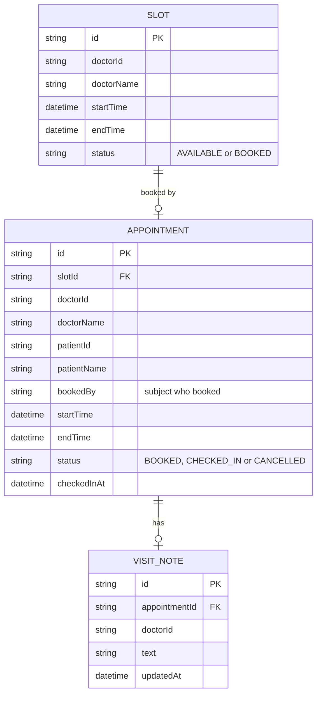

# Domain model

Doctors publish Slots; an Appointment occupies exactly one Slot; a VisitNote belongs to one Appointment. People are identified by the sign-in subject, so there are no user tables.

A slot is BOOKED by at most one active appointment; cancelling frees the slot. Rescheduling moves the appointment to another AVAILABLE slot and frees the old one. Cancel and reschedule are refused within 2 hours of the appointment start. Visit notes are exposed only through doctor-scoped operations.
