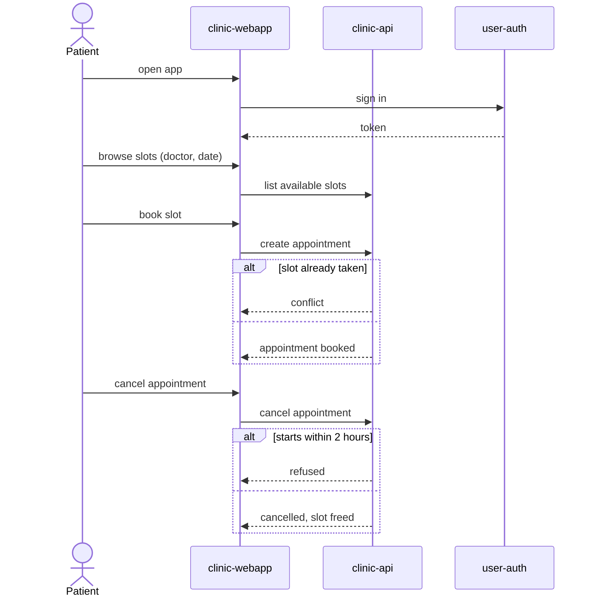

# Book and cancel an appointment

A patient finds an available slot, books it, and later cancels it; the API refuses double booking and late cancellation.

```mermaid
sequenceDiagram
    actor Patient
    participant clinic-webapp
    participant clinic-api
    participant user-auth

    Patient->>clinic-webapp: open app
    clinic-webapp->>user-auth: sign in
    user-auth-->>clinic-webapp: token
    Patient->>clinic-webapp: browse slots (doctor, date)
    clinic-webapp->>clinic-api: list available slots
    Patient->>clinic-webapp: book slot
    clinic-webapp->>clinic-api: create appointment
    alt slot already taken
        clinic-api-->>clinic-webapp: conflict
    else
        clinic-api-->>clinic-webapp: appointment booked
    end
    Patient->>clinic-webapp: cancel appointment
    clinic-webapp->>clinic-api: cancel appointment
    alt starts within 2 hours
        clinic-api-->>clinic-webapp: refused
    else
        clinic-api-->>clinic-webapp: cancelled, slot freed
    end
```
