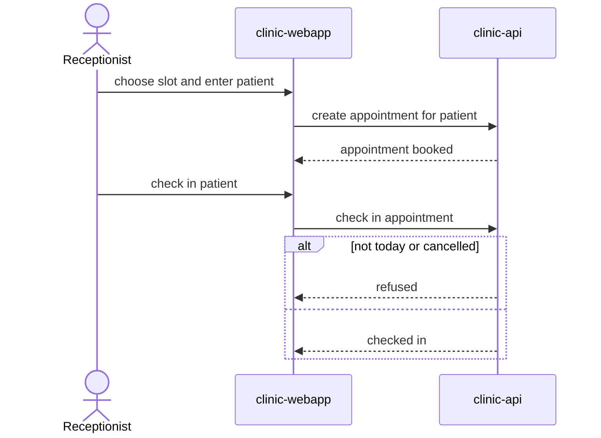

# Front desk booking and check-in

A receptionist books a slot for a patient and checks the patient in on the day.

```mermaid
sequenceDiagram
    actor Receptionist
    participant clinic-webapp
    participant clinic-api

    Receptionist->>clinic-webapp: choose slot and enter patient
    clinic-webapp->>clinic-api: create appointment for patient
    clinic-api-->>clinic-webapp: appointment booked
    Receptionist->>clinic-webapp: check in patient
    clinic-webapp->>clinic-api: check in appointment
    alt not today or cancelled
        clinic-api-->>clinic-webapp: refused
    else
        clinic-api-->>clinic-webapp: checked in
    end
```
