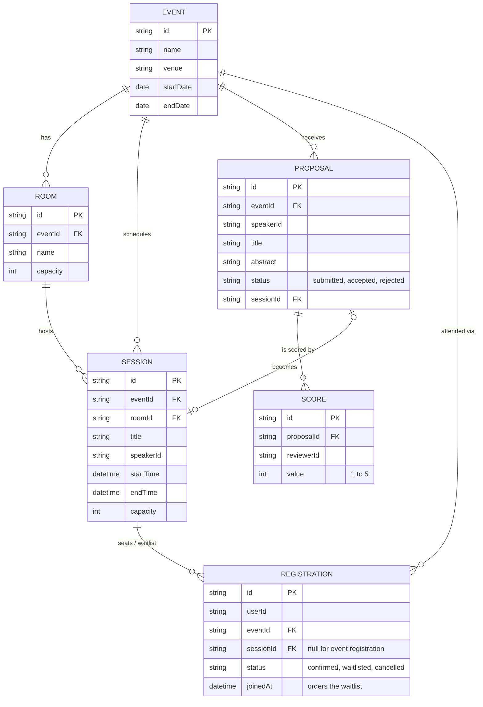

# Conference Planner — Domain Model

Events own rooms, sessions and talk proposals. Registrations (seats and waitlist) are owned by the registration service and reference events and sessions by id only.

- Session capacity is set by the events API and held by the registration service, which counts seats and orders the waitlist by `joinedAt`.
- A reviewer has at most one SCORE per proposal; the proposal's score is the average.
