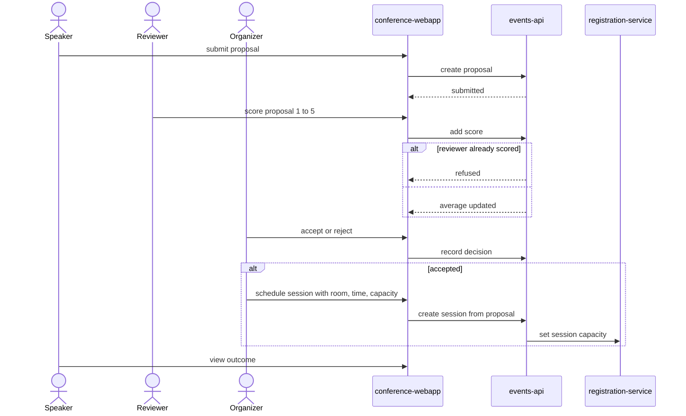

# Proposal review and acceptance

A speaker submits a proposal, reviewers score it, and an organizer accepts it into a scheduled session or rejects it.

```mermaid
sequenceDiagram
    actor Speaker
    actor Reviewer
    actor Organizer
    participant conference-webapp
    participant events-api
    participant registration-service

    Speaker->>conference-webapp: submit proposal
    conference-webapp->>events-api: create proposal
    events-api-->>conference-webapp: submitted
    Reviewer->>conference-webapp: score proposal 1 to 5
    conference-webapp->>events-api: add score
    alt reviewer already scored
        events-api-->>conference-webapp: refused
    else
        events-api-->>conference-webapp: average updated
    end
    Organizer->>conference-webapp: accept or reject
    conference-webapp->>events-api: record decision
    alt accepted
        Organizer->>conference-webapp: schedule session with room, time, capacity
        conference-webapp->>events-api: create session from proposal
        events-api->>registration-service: set session capacity
    end
    Speaker->>conference-webapp: view outcome
```
