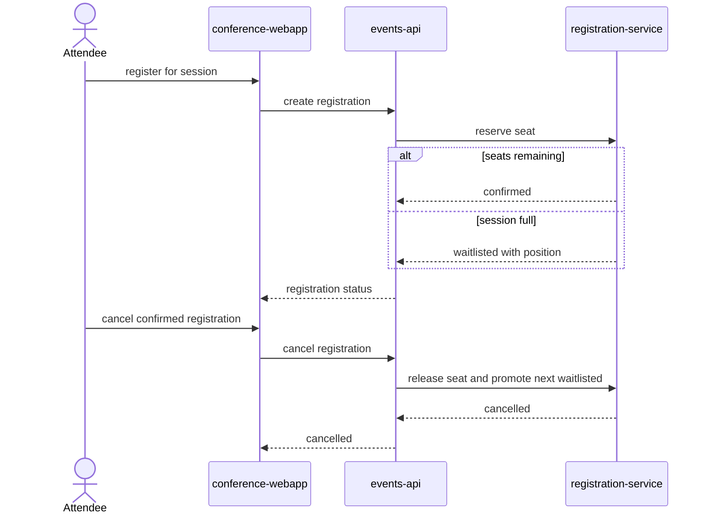

# Session registration and waitlist

An attendee registers for a session; if it is full they are waitlisted, and when a seat holder cancels the next waitlisted person is promoted.

```mermaid
sequenceDiagram
    actor Attendee
    participant conference-webapp
    participant events-api
    participant registration-service

    Attendee->>conference-webapp: register for session
    conference-webapp->>events-api: create registration
    events-api->>registration-service: reserve seat
    alt seats remaining
        registration-service-->>events-api: confirmed
    else session full
        registration-service-->>events-api: waitlisted with position
    end
    events-api-->>conference-webapp: registration status
    Attendee->>conference-webapp: cancel confirmed registration
    conference-webapp->>events-api: cancel registration
    events-api->>registration-service: release seat and promote next waitlisted
    registration-service-->>events-api: cancelled
    events-api-->>conference-webapp: cancelled
```
