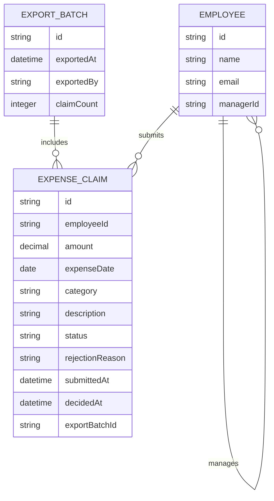

# Domain Model

Expense claims move from submission through manager review to a finance
export. An employee's manager is modeled as a self-reference on `EMPLOYEE` so
a manager's team can be resolved without a separate assignment table.

- **EMPLOYEE** — every signed-in user; `managerId` points at another
  `EMPLOYEE` and defines the team a Manager reviews.
- **EXPENSE_CLAIM** — `status` is one of `pending`, `approved`, `rejected`,
  `withdrawn`. `rejectionReason` is set only when rejected. `exportBatchId` is
  set once the claim is included in an export.
- **EXPORT_BATCH** — one row per finance export; groups the claims exported
  together so a claim is never exported twice.
