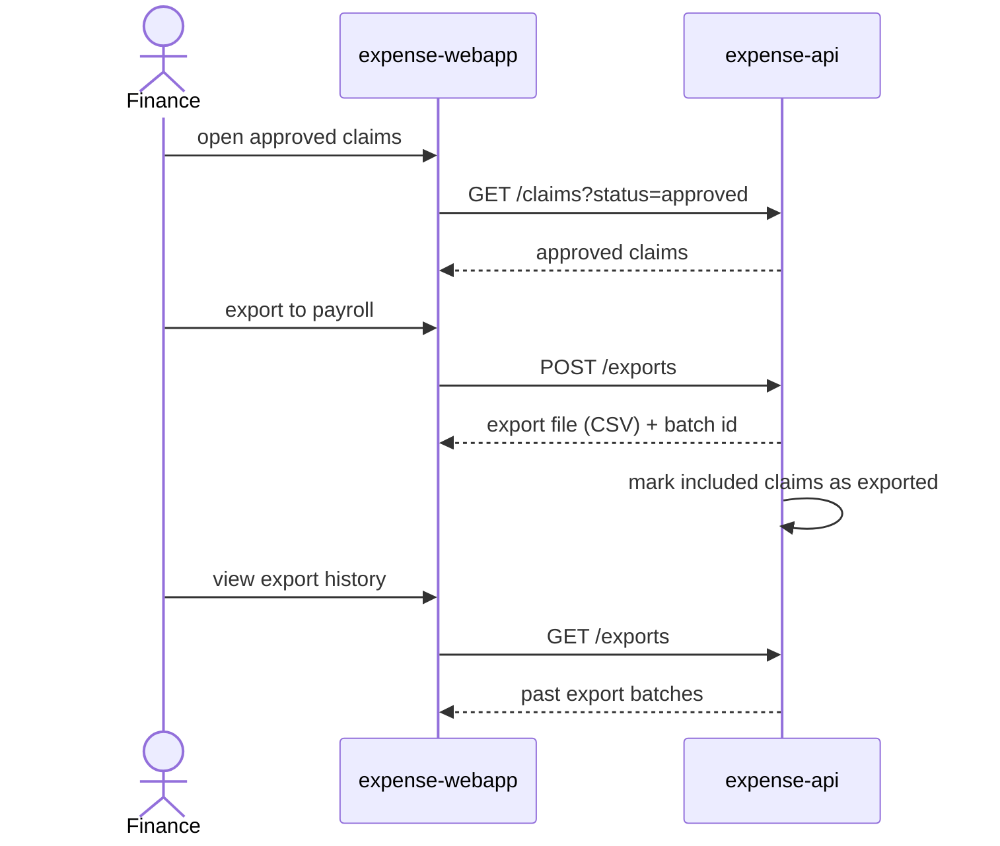

# Export Approved Claims to Payroll

Finance reviews approved claims and exports the not-yet-exported ones as a
CSV file for payroll, marking them exported so they are never exported twice.

```mermaid
sequenceDiagram
    actor Finance
    participant webapp as expense-webapp
    participant api as expense-api

    Finance->>webapp: open approved claims
    webapp->>api: GET /claims?status=approved
    api-->>webapp: approved claims

    Finance->>webapp: export to payroll
    webapp->>api: POST /exports
    api-->>webapp: export file (CSV) + batch id

    api->>api: mark included claims as exported

    Finance->>webapp: view export history
    webapp->>api: GET /exports
    api-->>webapp: past export batches
```
