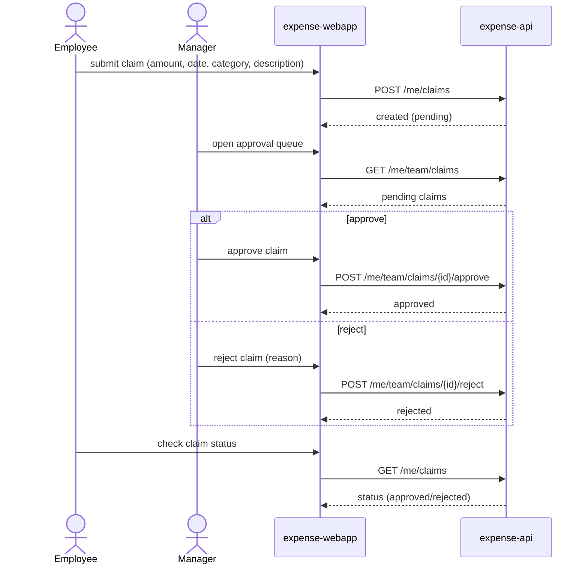

# Submit and Approve a Claim

An Employee submits an expense claim; their Manager reviews it and approves
or rejects it.

```mermaid
sequenceDiagram
    actor Employee
    actor Manager
    participant webapp as expense-webapp
    participant api as expense-api

    Employee->>webapp: submit claim (amount, date, category, description)
    webapp->>api: POST /me/claims
    api-->>webapp: created (pending)

    Manager->>webapp: open approval queue
    webapp->>api: GET /me/team/claims
    api-->>webapp: pending claims

    alt approve
        Manager->>webapp: approve claim
        webapp->>api: POST /me/team/claims/{id}/approve
        api-->>webapp: approved
    else reject
        Manager->>webapp: reject claim (reason)
        webapp->>api: POST /me/team/claims/{id}/reject
        api-->>webapp: rejected
    end

    Employee->>webapp: check claim status
    webapp->>api: GET /me/claims
    api-->>webapp: status (approved/rejected)
```
