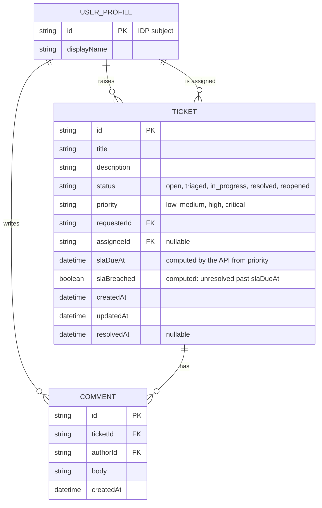

# Domain model

Tickets are raised by employees, worked by support agents and watched by team leads. Each ticket has a comment thread and an SLA due time the API computes from its priority.

- Status moves open → triaged → in_progress → resolved; resolved → reopened; a reopened ticket can be triaged again or started. *assumed*
- `slaDueAt` is creation time plus the priority's target, recomputed from creation time when priority changes. *assumed*
- `slaBreached` is derived, never stored; resolved tickets are not breached unless resolved after the due time. *assumed*
- USER_PROFILE is recorded from the signed-in identity on first use so agents can be listed for assignment.
