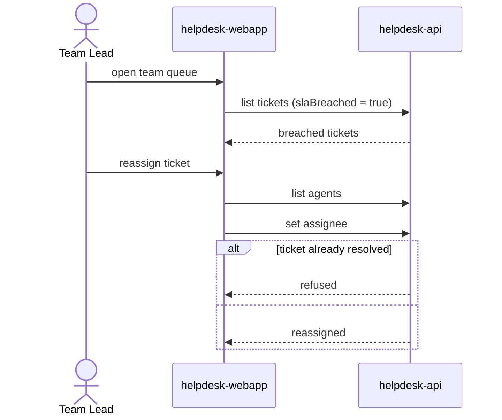

# SLA breach monitoring

A Team Lead filters the queue for SLA breaches and reassigns an overdue ticket.

```mermaid
sequenceDiagram
    actor TeamLead as Team Lead
    participant helpdesk-webapp
    participant helpdesk-api

    TeamLead->>helpdesk-webapp: open team queue
    helpdesk-webapp->>helpdesk-api: list tickets (slaBreached = true)
    helpdesk-api-->>helpdesk-webapp: breached tickets
    TeamLead->>helpdesk-webapp: reassign ticket
    helpdesk-webapp->>helpdesk-api: list agents
    helpdesk-webapp->>helpdesk-api: set assignee
    alt ticket already resolved
        helpdesk-api-->>helpdesk-webapp: refused
    else
        helpdesk-api-->>helpdesk-webapp: reassigned
    end
```
