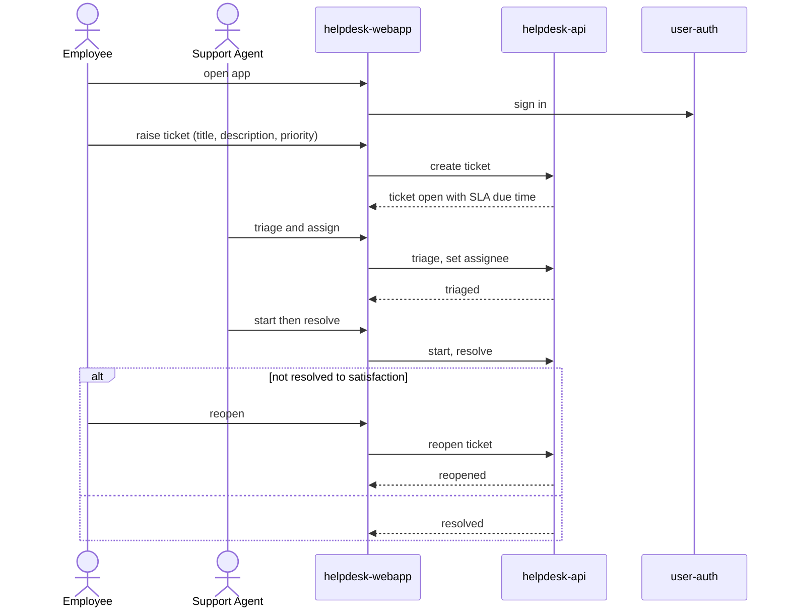

# Ticket: raise to resolution

An Employee raises a ticket, a Support Agent triages, assigns and resolves it, and the Employee may reopen it.

```mermaid
sequenceDiagram
    actor Employee
    actor SupportAgent as Support Agent
    participant helpdesk-webapp
    participant helpdesk-api
    participant user-auth

    Employee->>helpdesk-webapp: open app
    helpdesk-webapp->>user-auth: sign in
    Employee->>helpdesk-webapp: raise ticket (title, description, priority)
    helpdesk-webapp->>helpdesk-api: create ticket
    helpdesk-api-->>helpdesk-webapp: ticket open with SLA due time
    SupportAgent->>helpdesk-webapp: triage and assign
    helpdesk-webapp->>helpdesk-api: triage, set assignee
    helpdesk-api-->>helpdesk-webapp: triaged
    SupportAgent->>helpdesk-webapp: start then resolve
    helpdesk-webapp->>helpdesk-api: start, resolve
    alt not resolved to satisfaction
        Employee->>helpdesk-webapp: reopen
        helpdesk-webapp->>helpdesk-api: reopen ticket
        helpdesk-api-->>helpdesk-webapp: reopened
    else
        helpdesk-api-->>helpdesk-webapp: resolved
    end
```
