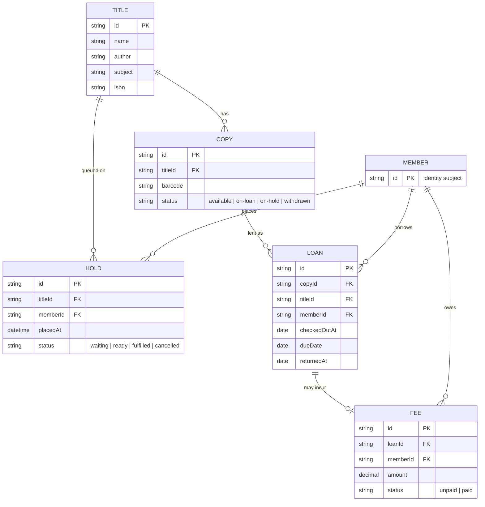

# Library Circulation — Domain Model

Titles and copies belong to the catalogue service; loans, holds and fees belong to the circulation API. Members are identified by the signed-in subject, not stored as a profile.

Title and Copy live in the catalogue service; Loan, Hold and Fee in the circulation API. A loan's due date is checkout plus 14 days; a late return creates a Fee of 0.25 per day overdue (both assumed in the PRD). Loans store `copyId`/`titleId` as references into the catalogue.
