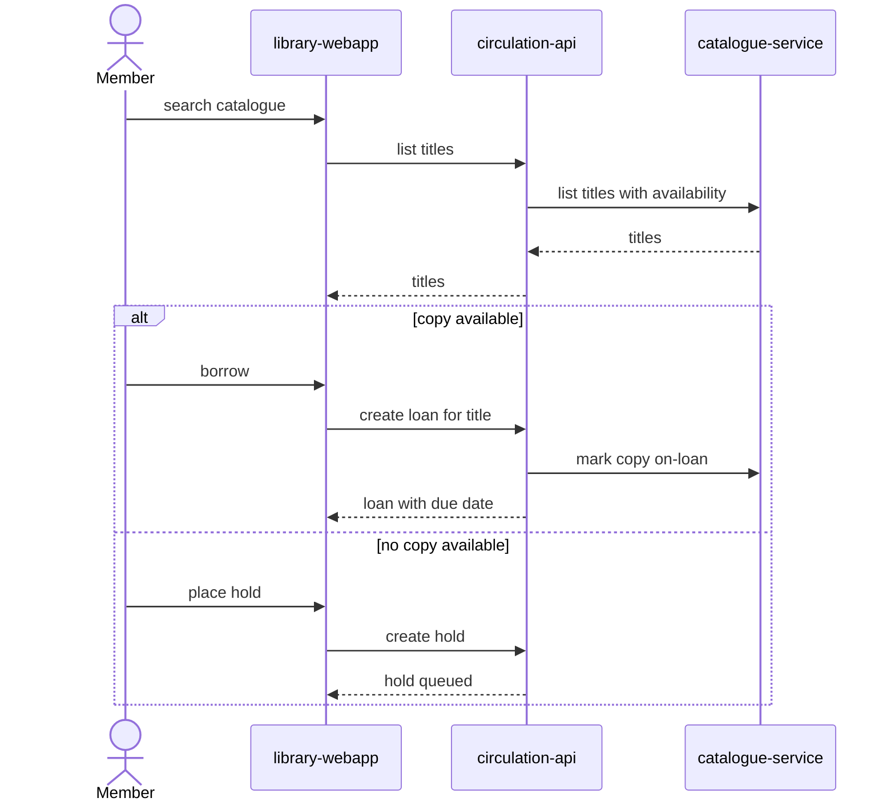

# Borrow or place a hold

A member finds a title, then either borrows an available copy or, when none is available, places a hold.

```mermaid
sequenceDiagram
    actor Member
    participant library-webapp
    participant circulation-api
    participant catalogue-service

    Member->>library-webapp: search catalogue
    library-webapp->>circulation-api: list titles
    circulation-api->>catalogue-service: list titles with availability
    catalogue-service-->>circulation-api: titles
    circulation-api-->>library-webapp: titles
    alt copy available
        Member->>library-webapp: borrow
        library-webapp->>circulation-api: create loan for title
        circulation-api->>catalogue-service: mark copy on-loan
        circulation-api-->>library-webapp: loan with due date
    else no copy available
        Member->>library-webapp: place hold
        library-webapp->>circulation-api: create hold
        circulation-api-->>library-webapp: hold queued
    end
```
