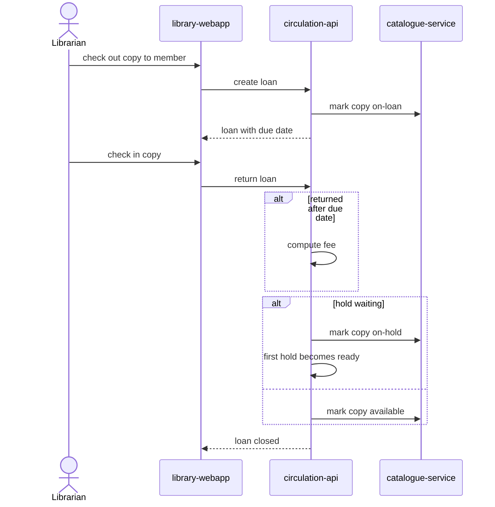

# Check out and check in a copy

A librarian checks a copy out to a member, and later checks it in; a late return computes a fee and a waiting hold is offered the copy.

```mermaid
sequenceDiagram
    actor Librarian
    participant library-webapp
    participant circulation-api
    participant catalogue-service

    Librarian->>library-webapp: check out copy to member
    library-webapp->>circulation-api: create loan
    circulation-api->>catalogue-service: mark copy on-loan
    circulation-api-->>library-webapp: loan with due date
    Librarian->>library-webapp: check in copy
    library-webapp->>circulation-api: return loan
    alt returned after due date
        circulation-api->>circulation-api: compute fee
    end
    alt hold waiting
        circulation-api->>catalogue-service: mark copy on-hold
        circulation-api->>circulation-api: first hold becomes ready
    else
        circulation-api->>catalogue-service: mark copy available
    end
    circulation-api-->>library-webapp: loan closed
```
