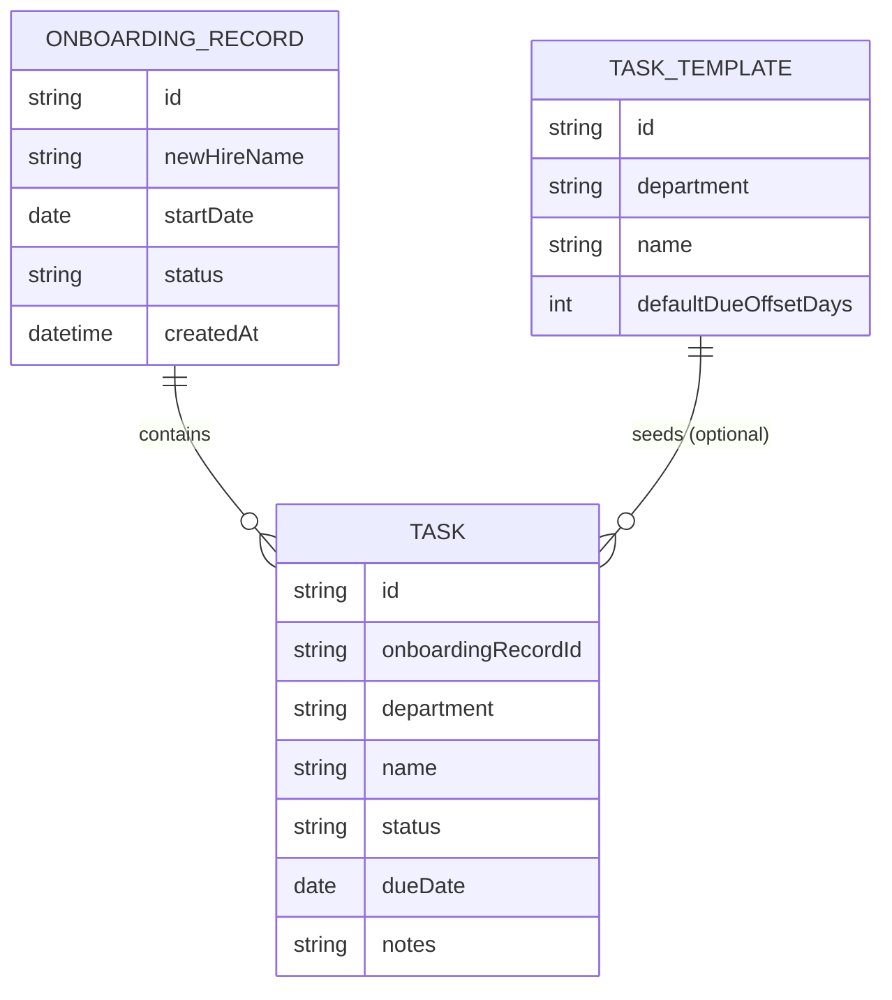

# Domain Model

The tracker centers on one onboarding record per new hire, holding tasks
scoped to a department and, optionally, drawn from a reusable per-department
template.

- **OnboardingRecord** — one per new hire; `status` is `in-progress` or
  `complete`, the latter only reachable once every task is done.
- **Task** — belongs to exactly one department (`it`, `hr`, `facilities`);
  `status` is `pending`, `in-progress`, or `complete`; a task is **overdue**
  when `dueDate` has passed and `status` is not `complete` — computed, not
  stored.
- **TaskTemplate** — a department's standard checklist item, applied when an
  HR Coordinator creates a new onboarding record so it starts pre-populated;
  an HR Coordinator may still add, edit, or remove individual tasks afterward.
