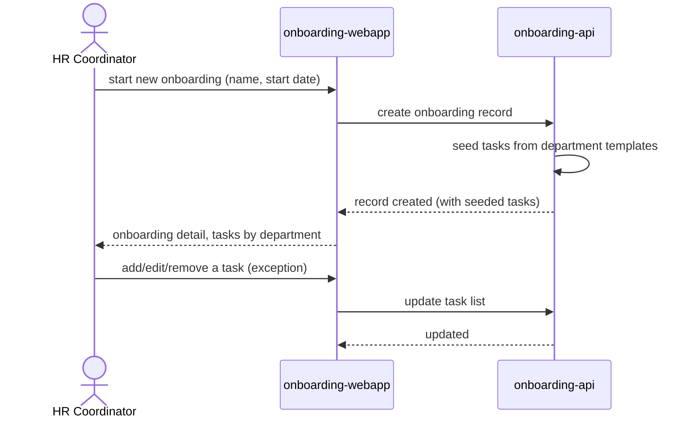

# Create a new hire's onboarding record

An HR Coordinator starts a new hire's onboarding; the tracker pre-populates
the checklist from standard department templates so IT and Facilities see
their tasks immediately.

