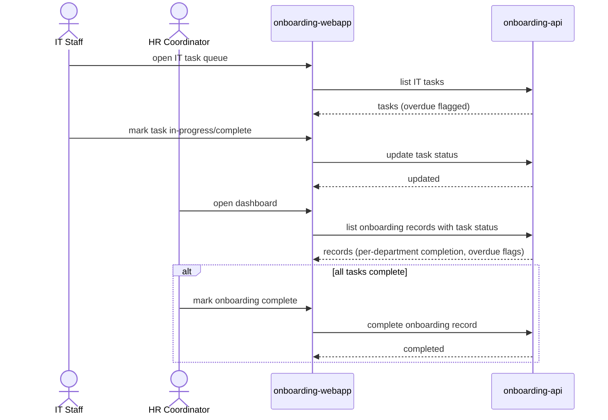

# Work a department's task queue

An IT Staff member (Facilities Staff follows the identical path on their own
department) works through their department's tasks across all new hires,
noticing overdue items directly in the app, and the HR Coordinator watches
overall progress on the dashboard.

