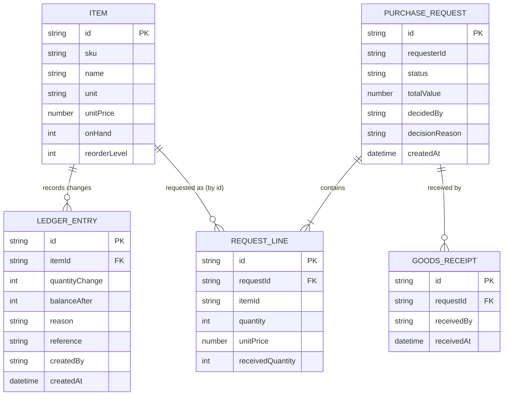

# Domain model

Items, stock levels and the stock ledger belong to the inventory service; purchase requests, receipts and approval limits belong to the procurement API.

- Request status: pending, approved, rejected, partially-received, received. *assumed*
- A receipt writes one ledger entry per received line in the inventory service, with the receipt id as the reference.
- The approval limit is one configured value, 5000, for all approvers; it is service configuration of the procurement API, not stored per approver.
- A new item starts with 0 on hand and no ledger entry; clerks add and edit items (name, unit, unit price, reorder level); the SKU is assigned by the inventory service.
