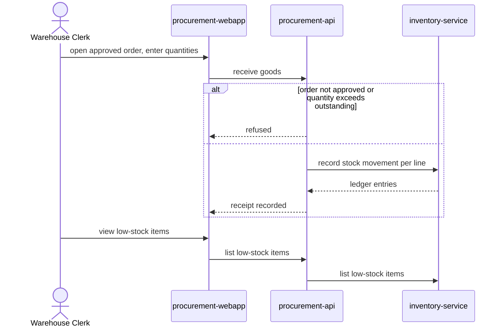

# Goods receipt

A Warehouse Clerk receives goods against an approved order, raising stock and writing ledger entries.

```mermaid
sequenceDiagram
    actor Clerk as Warehouse Clerk
    participant procurement-webapp
    participant procurement-api
    participant inventory-service

    Clerk->>procurement-webapp: open approved order, enter quantities
    procurement-webapp->>procurement-api: receive goods
    alt order not approved or quantity exceeds outstanding
        procurement-api-->>procurement-webapp: refused
    else
        procurement-api->>inventory-service: record stock movement per line
        inventory-service-->>procurement-api: ledger entries
        procurement-api-->>procurement-webapp: receipt recorded
    end
    Clerk->>procurement-webapp: view low-stock items
    procurement-webapp->>procurement-api: list low-stock items
    procurement-api->>inventory-service: list low-stock items
```
