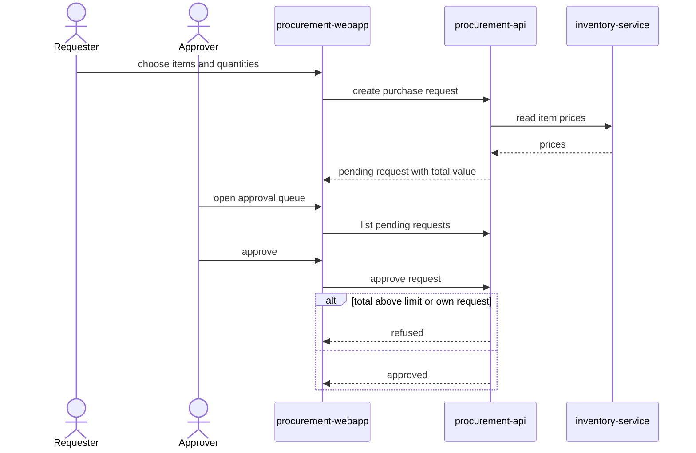

# Purchase approval

A Requester raises a purchase request and an Approver decides it within their approval limit.

```mermaid
sequenceDiagram
    actor Requester
    actor Approver
    participant procurement-webapp
    participant procurement-api
    participant inventory-service

    Requester->>procurement-webapp: choose items and quantities
    procurement-webapp->>procurement-api: create purchase request
    procurement-api->>inventory-service: read item prices
    inventory-service-->>procurement-api: prices
    procurement-api-->>procurement-webapp: pending request with total value
    Approver->>procurement-webapp: open approval queue
    procurement-webapp->>procurement-api: list pending requests
    Approver->>procurement-webapp: approve
    procurement-webapp->>procurement-api: approve request
    alt total above limit or own request
        procurement-api-->>procurement-webapp: refused
    else
        procurement-api-->>procurement-webapp: approved
    end
```
