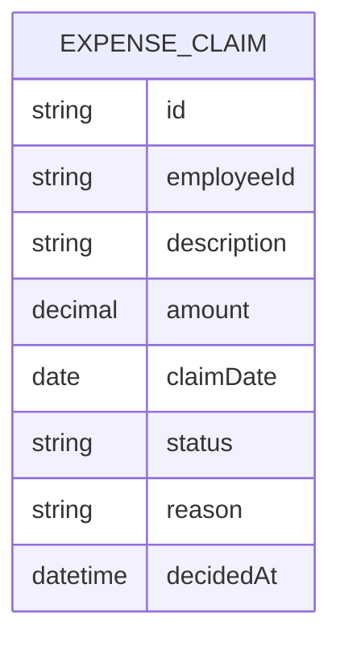

# Domain Model

One entity carries the whole product: an expense claim, filed by an employee
and decided once by an approver.

- `status` is one of `submitted`, `approved`, `rejected`; there is no draft
  state and no multi-step chain.
- `reason` is set only when `status` is `rejected`; `decidedAt` is set the
  moment a decision is made and never changes after.
- `employeeId` ties a claim to the Employee who filed it. An Employee's own
  claims and the Approver's queue of every claim are the same records, read
  through different permissions — not two copies of the data.
