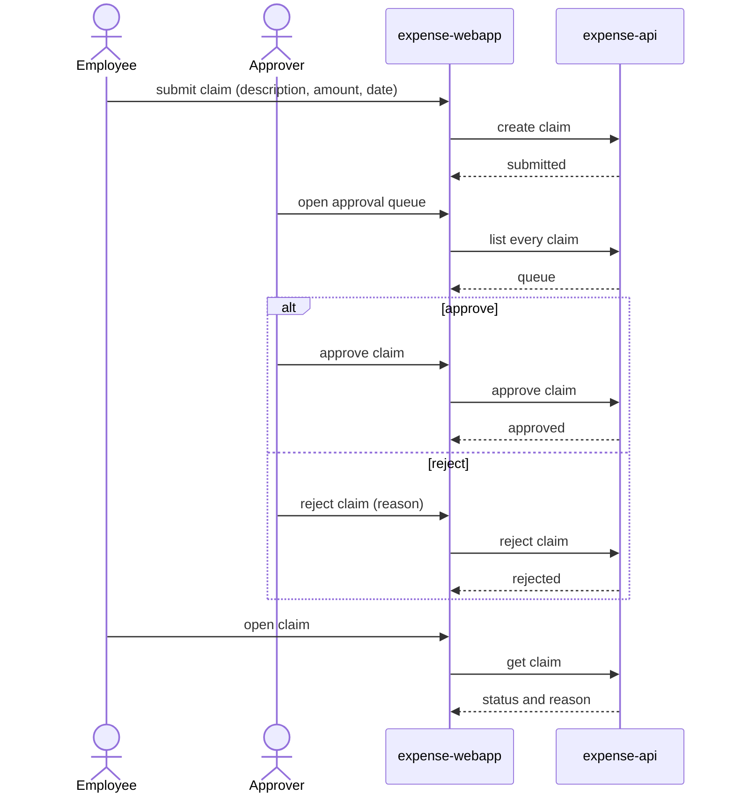

# Claim decision

An Employee files a claim, an Approver decides it from the shared queue, and
the Employee then sees the outcome on the same record.

```mermaid
sequenceDiagram
    actor Employee
    actor Approver
    participant expense-webapp
    participant expense-api

    Employee->>expense-webapp: submit claim (description, amount, date)
    expense-webapp->>expense-api: create claim
    expense-api-->>expense-webapp: submitted

    Approver->>expense-webapp: open approval queue
    expense-webapp->>expense-api: list every claim
    expense-api-->>expense-webapp: queue

    alt approve
        Approver->>expense-webapp: approve claim
        expense-webapp->>expense-api: approve claim
        expense-api-->>expense-webapp: approved
    else reject
        Approver->>expense-webapp: reject claim (reason)
        expense-webapp->>expense-api: reject claim
        expense-api-->>expense-webapp: rejected
    end

    Employee->>expense-webapp: open claim
    expense-webapp->>expense-api: get claim
    expense-api-->>expense-webapp: status and reason
```
