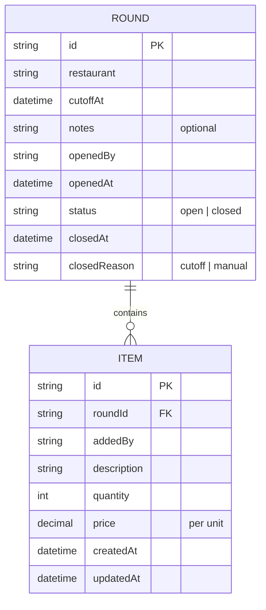

# Team Lunch Ordering — Domain model

The entities behind lunch-api: rounds opened by teammates and the items they
add before cutoff.

Exactly one `open` ROUND may exist at a time. The consolidated order is
derived from a closed ROUND's ITEMs (grouped totals, per-person breakdown,
grand total) — computed on read, never stored.
