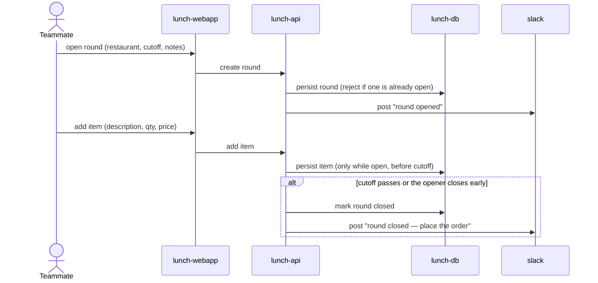

# Open a round and add items

A teammate opens the daily lunch round; teammates add items until cutoff (or
an early manual close), and Slack hears about both ends of the round.

```mermaid
sequenceDiagram
    actor Teammate
    participant lunch-webapp
    participant lunch-api
    participant lunch-db
    participant slack

    Teammate->>lunch-webapp: open round (restaurant, cutoff, notes)
    lunch-webapp->>lunch-api: create round
    lunch-api->>lunch-db: persist round (reject if one is already open)
    lunch-api->>slack: post "round opened"
    Teammate->>lunch-webapp: add item (description, qty, price)
    lunch-webapp->>lunch-api: add item
    lunch-api->>lunch-db: persist item (only while open, before cutoff)
    alt cutoff passes or the opener closes early
        lunch-api->>lunch-db: mark round closed
        lunch-api->>slack: post "round closed — place the order"
    end
```
