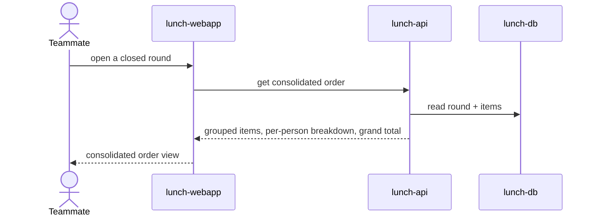

# View the consolidated order

After a round closes, any teammate opens it to see items grouped by
description, the per-person breakdown of items and cost, and the grand total.

```mermaid
sequenceDiagram
    actor Teammate
    participant lunch-webapp
    participant lunch-api
    participant lunch-db

    Teammate->>lunch-webapp: open a closed round
    lunch-webapp->>lunch-api: get consolidated order
    lunch-api->>lunch-db: read round + items
    lunch-api-->>lunch-webapp: grouped items, per-person breakdown, grand total
    lunch-webapp-->>Teammate: consolidated order view
```
