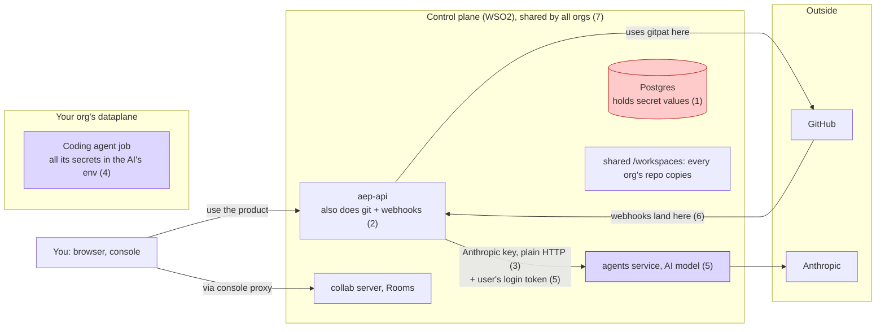
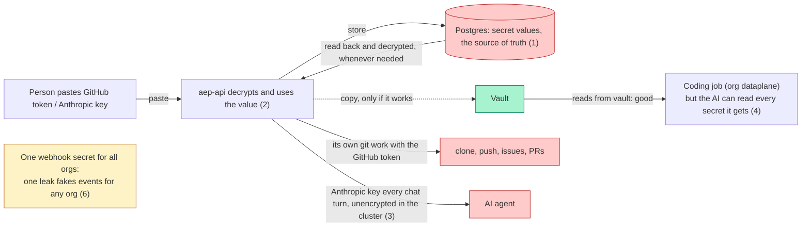

# 02 Today and its problems

This chapter describes AE as it is built and deployed today. It is the baseline the rest of the spec changes. WSO2 Cloud facts come from the **dev** environment.

## Where things run today

| Runtime | What it is | Where it runs |
|---|---|---|
| console | React app behind nginx. nginx proxies `/aep-api-service/` to `aep-api` and `/collab` to collab. | Control plane. Cloud: `app-factory-console`, public route. |
| `aep-api` | Go backend (BFF). It also does all git work, receives GitHub webhooks, and runs the Temporal worker in the same process. | Control plane. Cloud: `app-factory-api`, public route (API and webhook). |
| agents service | The design agent (TypeScript, SSE). Knows the org only from the `X-Org-Id` header. | Control plane. Cloud: `app-factory-agents-service`, ClusterIP only. |
| collab | Yjs (Hocuspocus) Room server. In-memory Rooms, one replica. It checks nothing itself. | Control plane. Cloud: `app-factory-collab`, ClusterIP only. |
| Postgres | Shared database. `aep-api` and agents both use it. | Control plane. |
| Temporal | Workflow frontend. The worker runs inside `aep-api`. | Control plane. |
| `/workspaces` volume | Shared volume of every org's repository copies. `aep-api` writes, agents reads. | Control plane. |
| coding agent Job | One-shot Claude Agent SDK pod, one container named `main`. OpenChoreo renders it from a `coding-agent` Component. | **Org dataplane**, already today. |
| smee client | Forwards GitHub webhooks to a local cluster. | Local install only. |

In WSO2 Cloud dev, App Factory orgs have no `wc-system` Project, no per-org API Platform gateway, and no `ae-system` Project. The org dataplane's user APIs use API keys, not Platform IdP `jwt-auth`.

## Where secrets live today

| Secret | Stored | Who reads the value |
|---|---|---|
| gitpat | Postgres `org_secrets`, AES-256-GCM. A vault copy is written "best effort": if it fails, a warning is logged and Postgres stays the source of truth. | `aep-api`, for every git and GitHub call. |
| Default key | Postgres `org_secrets`. | `aep-api` decrypts it and sends it to the agents service on every design turn as `X-Anthropic-Key`, over plain HTTP inside the cluster. |
| Coding agent key | Postgres `org_secrets`. | The coding agent Job, through ESO. `aep-api` passes only references. |
| Webhook HMAC | One platform secret `GITHUB_WEBHOOK_SECRET`, copied into every org's `org_credentials` row at gitpat connect. | `aep-api`, to check `X-Hub-Signature-256`. |
| Publisher client secret | Postgres `organization_idp_profiles` column **and** a SecretReference. | The coding agent Job, through ESO. |

The open-source Helm chart does not set `CREDENTIAL_ENCRYPTION_KEY`. The code default is 32 zero bytes.

## How the main calls work today

- **Design turn.** Browser → console nginx → `aep-api` with the user's Platform IdP JWT. `aep-api` decrypts the Default key and calls the agents service with an HS256 service token, `X-Org-Id` and `X-Anthropic-Key`. For a Room turn, `aep-api` copies the **user's JWT** into the turn, and the agents service uses it to join the Room on collab.
- **Room.** The browser opens `wss://<host>/collab` through console nginx. collab asks `aep-api` `collab/validate` with the user's JWT, then seeds and flushes through `aep-api`'s Files API. `aep-api` commits with the gitpat.
- **Git.** `aep-api` clones, fetches and pushes with the gitpat, and calls GitHub REST with it.
- **Webhook.** GitHub posts to a public control-plane webhook RestApi (CORS only, no `jwt-auth`). `aep-api` picks the org from the repository name in the body, then checks the HMAC.
- **Coding Job.** Temporal inside `aep-api` creates the Job through the OpenChoreo API with secret **references** only. ESO puts `GITHUB_TOKEN`, the Anthropic key and the publisher client into the one `main` container. The Job calls `aep-api` as the publisher client.

## The seven problems

The problems fall into three groups. The numbers are the same in every picture.

Source: [C1-today-big-picture.excalidraw](diagrams/C1-today-big-picture.excalidraw).

Mermaid version of C1

### Group A: secrets are held in the wrong place

1. **Secret values are kept in the control-plane database.** `aep-api` also tries to copy them to vault, but if that copy fails it only logs a warning. Postgres is the real store; vault may be missing or stale.
2. **`aep-api` decrypts the gitpat and uses it itself** for every git and GitHub call.
3. **The Anthropic key is taken out of the database and sent with every chat turn** (`X-Anthropic-Key`), unencrypted inside the cluster. The agent needs the key. The problem is the read-back from the database on every turn and the plain hop.
4. **The coding agent can read every secret it is given.** The Job has one container, `main`: an AI with a shell. The gitpat, the publisher client secret and the Anthropic key are all environment variables in it. A prompt injection (for example, text in an issue or a repository file) can make it read them and send them out.

### Group B: someone can act as someone else

5. **The AI service gets a copy of the user's full login token**, not a key to one Room. `aep-api` accepts that token on every user API. One agents service serves every org, so taking over the service gives many users' tokens from many orgs, usable until each expires.
6. **One webhook secret for all orgs.** `aep-api` picks the org from the repository name in the body, then checks the signature with a secret that is the same for every org. One leak lets someone forge GitHub events for any org's repository.

### Group C: no isolation between orgs

7. **All orgs share the same services.** Every org's AI agent, collab, git work and repository copies run in the same shared services on the WSO2 control plane. A bug or a break-in in one reaches all orgs.

Already good today: the coding agent Job runs in the org dataplane and gets its secrets through ESO, with references only at dispatch.

The coding Job's `credentials/refresh` path, which returns the gitpat, is not listed as a problem. The Job already has `GITHUB_TOKEN`, so the path is not used. It is removed ([13-change-inventory.md](13-change-inventory.md)).

## Secrets today

Source: [C2-today-secrets.excalidraw](diagrams/C2-today-secrets.excalidraw).

Mermaid version of C2

