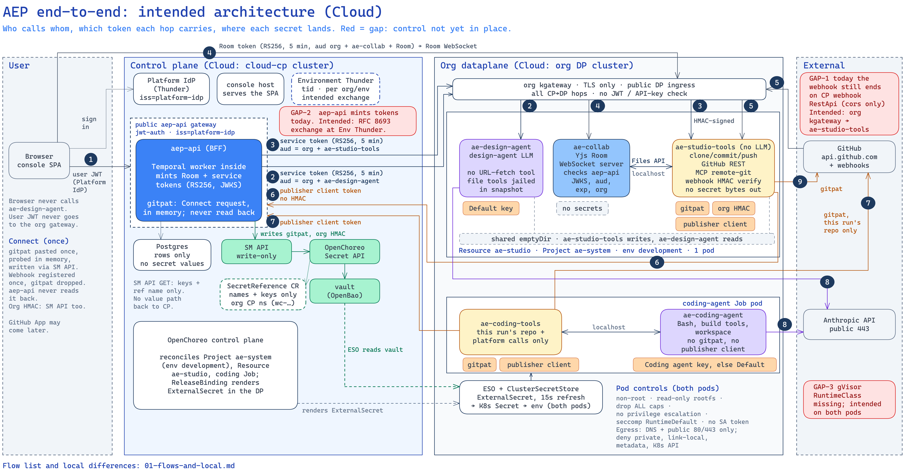
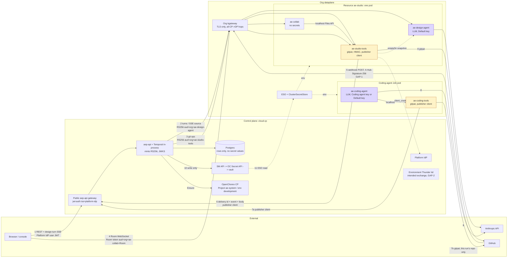

# 03 Components

Every runtime in the intended architecture: its job, what it mounts, and what it exposes. The picture shows WSO2 Cloud. Local differences are in [11-local-vs-cloud.md](11-local-vs-cloud.md). Flow numbers on the arrows are explained in [04-flows.md](04-flows.md).

Source: [01-end-to-end.excalidraw](diagrams/01-end-to-end.excalidraw).

Mermaid version of 01

## The naming rule

Each dataplane pod is an **agent** plus its **tools**:

- A `*-agent` container runs a model. It holds only an Anthropic key.
- A `*-tools` container runs no model. It holds the gitpat, the org HMAC (on `ae-studio-tools` only) and the publisher client.

Each image has the same name as its container.

## Control plane

| Component | Job | Holds | Exposes |
|---|---|---|---|
| console | The browser app. | Nothing secret. | Browser UI. |
| `aep-api` (BFF) | Authorizes users. Keeps rows in Postgres. Writes secrets through the SM API. Ensures the dataplane Resource. Mints short RS256 tokens (the CP → DP service token and the Room token). Runs the Temporal worker in the same process. | The signing key for its minted tokens. A gitpat or org HMAC only in memory, only during gitpat submit. | Public `aep-api` gateway (`jwt-auth`, `iss=platform-idp`); its JWKS. |
| Postgres | Rows: repositories, webhook deliveries, conversations. | **No organization secret values.** | Only to `aep-api`. |
| SM API | Writes secret values into vault through the OpenChoreo Secret API, and creates a SecretReference with names only. | Nothing it gives back. | Write-only. GET returns keys and `secretReferenceName` only. |
| Platform IdP | The shared Thunder issuer (`iss=platform-idp`). Issues user JWTs and publisher client tokens. | Inherited platform. | Inherited platform. |
| Environment Thunder | The per-(org, environment) Thunder. In WSO2 Cloud it runs on cloud-cp (Resource `tid`), not in the org dataplane. Intended issuer for exchanged tokens (GAP-2). | Inherited platform. | Inherited platform. |
| OpenChoreo control plane | Holds Project `ae-system`, its `development` ProjectReleaseBinding, and Resource `ae-studio`. Renders them into the dataplane. | SecretReference objects (names only) in the org control-plane namespace (`wc-…` in Cloud, `default` locally). | Inherited platform. |

## Org dataplane

### Resource `ae-studio`

An OpenChoreo **Resource** of a custom ResourceType, also named `ae-studio`. It lives in Project `ae-system`, environment `development`, in both installs. It is one pod with three containers. It is **not** a Room. Many Rooms can be live on it.

| Container | Job | Mounts | Exposes |
|---|---|---|---|
| `ae-design-agent` | Runs the design agent model. Streams design turns. Reads snapshots from the shared emptyDir. No URL-fetch tool; its file tools stay inside the snapshot. | **Default key only.** A short token that `aep-api` puts on one turn may sit in memory. | Turn / SSE route behind the org kgateway (flow 2). |
| `ae-collab` | The Yjs Room WebSocket server. Talks the Files API on localhost to `ae-studio-tools` (`files/bundle`, `files/apply`, seed, flush). It does not speak git. | **No secrets.** | Room WebSocket behind the org kgateway (flow 4). |
| `ae-studio-tools` | Runs no model. Clone, fetch, commit, push. GitHub REST (issues, PRs, milestones, merge, repo create). MCP remote-git. Webhook receive and HMAC check. Writes snapshots to the shared emptyDir. Calls `aep-api` as the publisher client. | gitpat, org HMAC, publisher client (`client_id`, `client_secret`). | Service route (flow 3) and webhook route (flow 5) behind the org kgateway. Files API on localhost. It never returns a secret value. |

Inside the pod, containers talk over `localhost` and share a named emptyDir. `localhost` has no extra token.

### Coding agent Job

A separate, one-shot pod per run cycle. OpenChoreo renders it from a `coding-agent` Component, as today, now with two containers.

| Container | Job | Mounts | Exposes |
|---|---|---|---|
| `ae-coding-agent` | Runs the coding agent model with Bash, the build tools and the workspace. | The Coding agent key when the org has one, otherwise the Default key. No gitpat, no publisher client, no HMAC. | Nothing inbound. |
| `ae-coding-tools` | Runs no model. Does git and GitHub for **this run's repository only**, and platform calls for **this run only**. | gitpat, publisher client. | A localhost API for `ae-coding-agent`. It never returns a secret value and never writes one into the shared workspace. |

### Shared dataplane parts

| Part | Job |
|---|---|
| Org kgateway | Public gateway of the org dataplane. TLS only. It does not check identity; each container checks its own token. |
| ESO + ClusterSecretStore | Reads vault and writes a Kubernetes Secret into the release namespace. Containers get values as environment variables. |

## Outside

| Party | Talks to |
|---|---|
| Browser | `aep-api` gateway (flow 1), `ae-collab` Room WebSocket (flow 4). |
| GitHub | Receives git and REST calls with the gitpat (flows 7b, 9). Posts webhooks to `ae-studio-tools` (flow 5). |
| Anthropic API | Called by `ae-design-agent` and `ae-coding-agent` on public 443 (flow 8). |

## Not chosen, and why

- **A stock `service` Component for the runtime.** It has one `main` container, so every secret would land on the model container.
- **One container for the whole runtime.** The model would sit next to the gitpat and the HMAC.
- **Two OpenChoreo Components for the runtime.** More objects to Ensure, and the split between them does not match the secret split.
- **A custom Component, like the coding agent.** It brings the `coding-agent` Ensure chain and still needs a Project. A Resource fits a long-lived system runtime.
- **collab and git in one container.** Needs a rewrite or a process supervisor, and puts the gitpat next to collab. A later wish for this needs a fresh decision, because it changes the secret split and the trust boundaries.
- **agent and collab in one container.** Mixes the model with the Room server.
- **Project `wc-system`.** App Factory orgs do not get `wc-system`.
- **A user Project.** Deleting the user's Project would delete the runtime.
- **A ClusterResourceType on cloud-cp.** Wrong plane: the runtime must run in the org dataplane.
- **`ae-workspace` as the Resource name.** "Workspace" already names other things (the `/workspaces` volume, the coding Job's emptyDir), and the glossary avoids it for Room and Spec bundle.
