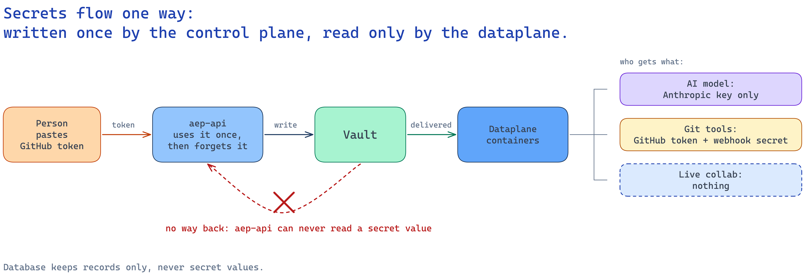
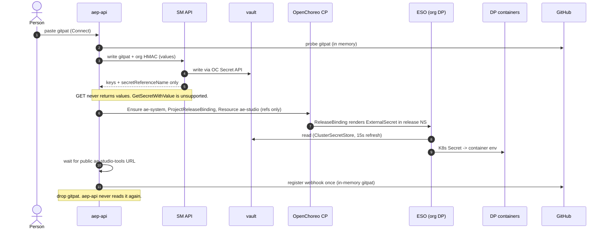

# 06 Secrets

Secrets go one way. The control plane writes them. Only the dataplane reads them.

Source: [S3-secrets-one-way.excalidraw](diagrams/S3-secrets-one-way.excalidraw).

## Rules

- **Vault is the only store** of organization secret values. Postgres holds no organization secret values: no gitpat, no Anthropic key, no org HMAC, no publisher client secret.
- **The SM API is write-only to `aep-api`.** A write returns keys and `secretReferenceName` only. GET returns the same. Reading a value back (`GetSecretWithValue`) is not supported. There is no path for a value to return to the control plane.
- **`aep-api` holds a value only while it writes it.** The gitpat and the org HMAC exist in `aep-api` memory only during gitpat submit ([05-lifecycle.md](05-lifecycle.md)). A key exists in `aep-api` memory only during its write request.
- **Every value reaches its container the same way:** SecretReference → ExternalSecret → Kubernetes Secret → container env.
- **Each container mounts only what it needs** (table below). Model containers hold only an Anthropic key.
- **No container returns a secret value** over any API, and `ae-coding-tools` never writes one into the shared workspace.

## Write path

| Install | How the value is written |
|---|---|
| WSO2 Cloud | `aep-api` → SM API → OpenChoreo Secret API → vault. SM API creates the SecretReference (names and keys only). |
| Local | `aep-api` writes OpenBao directly and creates the SecretReference itself. |

The SecretReference lives in the org's control-plane namespace (`wc-…` in WSO2 Cloud, `default` locally).

## Read path

1. The Resource or Workload carries references: the environment variable name, the SecretReference name and the key.
2. OpenChoreo's ReleaseBinding collects the SecretReferences and renders an ExternalSecret in the dataplane release namespace.
3. ESO reads vault through a ClusterSecretStore. The ExternalSecret refreshes every 15 seconds.
4. ESO writes a Kubernetes Secret, and the container gets the value as an environment variable.

Source: [03-secret-write-read.excalidraw](diagrams/03-secret-write-read.excalidraw).

Mermaid version of 03

## Which secret lands where

| Secret | `ae-design-agent` | `ae-studio-tools` | `ae-collab` | `ae-coding-agent` | `ae-coding-tools` |
|---|---|---|---|---|---|
| Default key | ✓ | | | (✓) | |
| Coding agent key | | | | ✓ | |
| gitpat | | ✓ | | | ✓ |
| org HMAC | | ✓ | | | |
| publisher client (`client_id` / `client_secret`) | | ✓ | | | ✓ |

- (✓): `ae-coding-agent` gets the Default key only when the org has no Coding agent key.
- `ae-collab` mounts no secrets.
- `ae-design-agent`, `ae-studio-tools` and `ae-collab` run in Resource `ae-studio` (one pod). `ae-coding-agent` and `ae-coding-tools` run in the coding agent Job (a separate pod).

The **org HMAC** is one secret per organization. It replaces today's single platform webhook secret. Only `ae-studio-tools` checks it ([08-git-and-github.md](08-git-and-github.md)).

## What is not a secret here

Tokens that `aep-api` mints (the CP → DP service token and the Room token) are short-lived and are not stored anywhere: not in Postgres, not in vault. The key that signs them is a platform secret of `aep-api`, not an organization secret. See [07-identity-and-tokens.md](07-identity-and-tokens.md).

## Not chosen, and why

- **Keep git writes on `aep-api`.** It would need the control plane to read the gitpat, a GitHub App, or a Secret API read of the value.
- **A platform HMAC checked on `aep-api`.** One secret for all orgs: one leak forges events for every org.
- **Check the org HMAC on `aep-api` through a Secret API read.** It gives the control plane a read path to a value.
- **Postgres as the source of truth with a vault copy.** That is today's design and problem 1.
- **An AI gateway that holds the Default key.** Out of scope. The model containers keep the Anthropic key they need.
