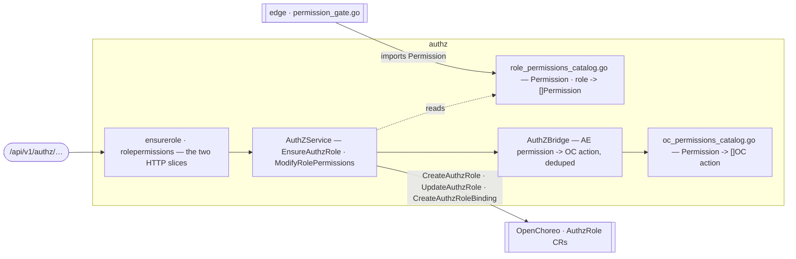

# authz — the AE↔OC permission vocabulary and the AE→OC RBAC bridge

> **L2 · a domain.** Part of the [aep-api architecture](../../README.md).

Owns the `Permission` vocabulary (`ae:build`, `ae:model-config`, …) and two
things built on top of it that point in **opposite directions**:

- **Outbound, to OpenChoreo.** The AE→OC RBAC bridge translates AE roles to
  OC actions and provisions OC `AuthzRole`/`AuthzRoleBinding` CRs, so
  **OpenChoreo** can authorize calls the platform makes on a user's behalf.
- **Inbound, consumed elsewhere.** `internal/edge/permission_gate.go` imports
  this package's `Permission` constants to enforce AE permissions on
  aep-api's *own* HTTP handlers. That gate is not part of this domain — see
  [ADR-0027](../../../../docs/decisions/ADR-0027-ae-permissions-ride-the-oauth-scope-claim.md)
  — but this package is the single place both directions get their
  vocabulary from.

## Owns

| | |
|---|---|
| `role_permissions_catalog.go` | `Permission` — the typed AE permission key vocabulary (8 constants) — and `rolePermissionsCatalog`, mapping an AE role name to the permissions it holds. Two roles: `ae-admin` (all 8) and `ae-developer` (`ae:requirement-view`, `ae:design-view`, `ae:build`). |
| `oc_permissions_catalog.go` | `OcActionCatalog`, mapping an AE `Permission` to the OC actions it resolves to. **Placeholder** (#743): only `ae:model-config` and `ae:skill-config` are mapped, both to the same starter pair (`component:view`, `component:create`), pending a real per-permission OC action design. |
| `authz_bridge.go` | `AuthZBridge` — implements `PermissionResolver`; dedupes AE→OC translation across a permission set. |
| `authz_service.go` | `AuthZService` — `EnsureAuthzRole` (idempotent create-if-missing OC role + binding, entitled on the `groups` JWT claim) and `ModifyRolePermissions` (updates OC role actions per AE role, with rollback on partial failure). |
| `ports.go` | `PermissionResolver`, `OCAuthZClient` (the OC CRUD narrowing), the sentinel errors, and the domain-shaped `CreatedAuthzRole`/`CreatedAuthzRoleBinding`/`EntitlementClaim` types. |
| `ensurerole/` | The `GET /authz/ensure` slice — the console's onboarding hard gate. |
| `rolepermissions/` | The `POST /authz/role-permissions` slice (`ModifyAuthzRolePermissions`) — despite the path name, this **applies** the mapping to OC (via `AuthZService.ModifyRolePermissions`), it does not merely log it. |
| `httpapi/` | The aggregator the edge embeds; declares no methods of its own. |

## Ports

| Port | Satisfied by | Mapped at |
|---|---|---|
| `OCAuthZClient` | `clients/openchoreo.AuthZClient` | `app/app.go` |

## Invariants

**`EnsureAuthzRole` is the console's onboarding hard gate.** The console's
onboarding flow calls `GET /authz/ensure` as a blocking step before treating
an org as usable (`apps/console/src/features/onboarding/components/RepositorySetupStep.tsx`).
A misconfigured `OcActionCatalog` mapping therefore blocks every user, not
just an admin surface — this is why `oc_permissions_catalog.go` carries an
explicit PLACEHOLDER warning rather than being extended casually.

**Two roles exist:** `ae-admin` (all 8 permissions) and `ae-developer`
(`ae:requirement-view`, `ae:design-view`, `ae:build`). Thunder provisions the
matching resource server, actions, groups, and roles (`tools/aectl/internal/thunder`
for the real cluster; `deployments/dev-thunder-setup/bootstrap/61-ae-roles.yaml`
for local dev), but no real *user*-provisioning path exists yet — no
`identity.EnsureService`-style flow enrolls a signing-in org member into
either group at runtime (contrast [`identity`](../identity/README.md), whose
project-scoped roles ARE provisioned end-to-end), and the k3d/single-cluster
Thunder bundle doesn't even declare the `ae` resource server or its
groups/roles yet. The one exception is local dev: `dev-thunder-setup` seeds a
single fixed test account (`aeadmin`) as a member of `ae-admin` at bootstrap
time, so the permission gate has something real to test against — that is a
static, one-account dev seed, not a provisioning path a real org's users go
through. Who actually ends up in `ae-admin` or `ae-developer` for a real org
is a separate, later workstream, not a gap in this domain's own code.

**This domain does not enforce anything on aep-api's own requests.** It only
grants OC-side permissions. The inbound question — "may this caller invoke
this aep-api operation" — is answered entirely in `internal/edge`, which
imports `Permission` from here but is a different package with a different
job. See [ADR-0027](../../../../docs/decisions/ADR-0027-ae-permissions-ride-the-oauth-scope-claim.md)
for why the two are split this way.

## See also

- [`ADR-0027`](../../../../docs/decisions/ADR-0027-ae-permissions-ride-the-oauth-scope-claim.md) — why AE permissions ride the OAuth scope claim, and how the inbound gate in `internal/edge` uses this package's vocabulary.
