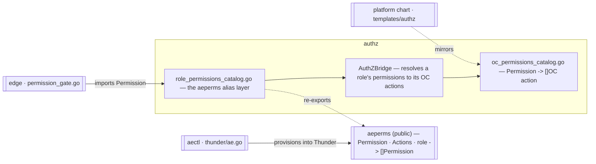

# authz — the AE↔OC permission mapping

> **L2 · a domain, and a small one: it serves no HTTP.** Part of the
> [aep-api architecture](../../README.md).

Holds the mapping from an AE permission to the OpenChoreo actions it implies,
and re-exports the AE permission vocabulary that
[`aeperms`](../../aeperms) defines.

Both are consumed by things outside this service:

- **`OcActionCatalog` → the platform Helm chart.** OpenChoreo authorizes calls
  against its own `AuthzRole` / `AuthzRoleBinding` CRs. Those CRs are
  *installed*, by `templates/authz/ae-roles.yaml`, and this catalog is where
  their `spec.actions` comes from.
- **`Permission` → `internal/edge/permission_gate.go`**, which enforces AE
  permissions on aep-api's own handlers. That gate is not part of this domain;
  see [ADR-0039](../../../../docs/decisions/ADR-0039-ae-permissions-ride-the-oauth-scope-claim.md).

```mermaid
flowchart LR
  EDGE[[edge · permission_gate.go]] -->|imports Permission| CAT
  CHART[[platform chart · templates/authz]] -.mirrors.-> OCCAT
  AECTL[[aectl · thunder/ae.go]] -->|provisions into Thunder| PERMS
  subgraph authz
    CAT["role_permissions_catalog.go — the aeperms alias layer"]
    OCCAT["oc_permissions_catalog.go — Permission -> []OC action"]
    BRIDGE["AuthZBridge — resolves a role's permissions to its OC actions"]
    CAT --> BRIDGE
    BRIDGE --> OCCAT
  end
  CAT -.re-exports.-> PERMS[["aeperms (public) — Permission · Actions · role -> []Permission"]]
```

## Owns

| | |
|---|---|
| `oc_permissions_catalog.go` | `OcActionCatalog`, mapping an AE `Permission` to the OC actions it resolves to. Several permissions — `ae:design-view`, `ae:design`, `ae:skill-view`, `ae:usage-view`, `ae:observability-view` — carry no entry at all: either they gate a surface that never reaches OC (git-backed reads, agent/turn orchestration, or console-only UI gating), or (per the `PermissionSkillConfig`/`PermissionBuild` placeholder noted in the catalog's own comments, #743) a real per-permission OC action design is still pending. |
| `authz_bridge.go` | `AuthZBridge` — resolves a set of AE permissions to the deduplicated OC actions they imply. This is the definition of a role's `spec.actions`. |
| `role_permissions_catalog.go` | The alias layer over [`aeperms`](../../aeperms), so the rest of aep-api goes on saying `authz.Permission` / `authz.PermissionBuild`. The vocabulary itself — the keys, their Thunder actions, and the two roles' permission sets — is defined there, public, because aectl provisions the same list into Thunder. |

## Invariants

**The roles are installed, not provisioned at runtime.** `templates/authz/ae-roles.yaml`
creates the org's `ae-admin` / `ae-developer` `AuthzRole`s and their bindings
with the platform. They used to be created on demand by `GET /authz/ensure`,
which the console called as onboarding's first step — an authorization boundary
that only existed once somebody had signed in and reached a wizard, and whose
failure surfaced as an opaque 403 several systems away. Nothing in this package
writes to OpenChoreo any more; there is no OC client here and no HTTP slice.

**The chart's action lists and `OcActionCatalog` must agree exactly**, and YAML
cannot import Go. `TestChartAuthzRolesMatchCatalog` parses the template and
fails on any difference in either direction — a missing action is a 403 from
OpenChoreo on a call the AE gate already allowed, and an extra one is a grant
nobody decided to make. Change the catalog, run that test, and it prints the
list the YAML should carry.

**Two roles exist:** `ae-admin` (every permission) and `ae-developer` (a working
subset — see [`aeperms`](../../aeperms) for the exact list and the reasoning
behind each inclusion and exclusion).

**One org per install.** The chart names a single `orgNamespace`, which matches
today's one-install-per-org model. A multi-org deployment needs these CRs
created per org as it is created — the way platform-api's `ProvisionOrgUnit`
creates the namespaced ComponentTypes — because a chart cannot know about an org
that does not exist at install time. No runtime path enrols a real org member
into either Thunder group either; the installer seeds one account.

**This domain enforces nothing on aep-api's own requests.** The inbound
question — "may this caller invoke this operation" — is answered entirely in
`internal/edge`, which imports `Permission` from here but is a different package
with a different job.

## See also

- [`ADR-0039`](../../../../docs/decisions/ADR-0039-ae-permissions-ride-the-oauth-scope-claim.md) — why AE permissions ride the OAuth scope claim, and how the inbound gate in `internal/edge` uses this package's vocabulary.
- [`deployments/helm-charts/design/authz.md`](../../../../deployments/helm-charts/design/authz.md) — the installed objects, and why they are installed.
