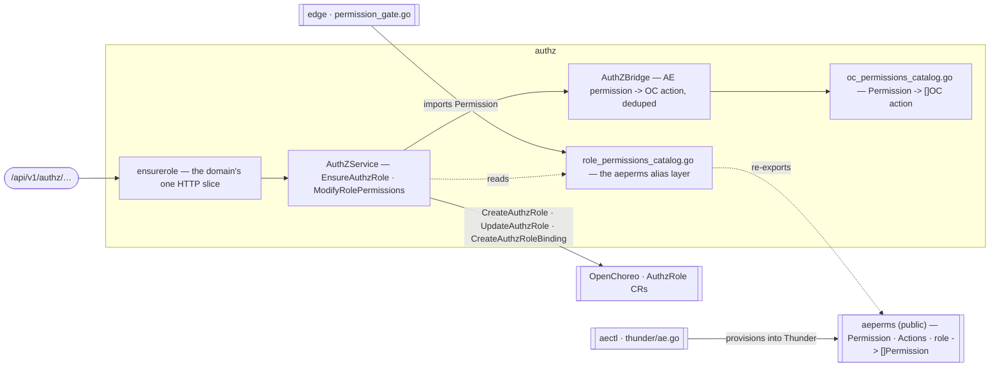

# authz — the AE↔OC permission vocabulary and the AE→OC RBAC bridge

> **L2 · a domain.** Part of the [aep-api architecture](../../README.md).

Owns the `Permission` vocabulary (`ae:build`, `ae:model-config`, …) and two
things built on top of it that point in **opposite directions**:

- **Outbound, to OpenChoreo.** The AE→OC RBAC bridge translates AE roles to
  OC actions and provisions OC `AuthzRole`/`AuthzRoleBinding` CRs, so
  **OpenChoreo** can authorize calls the platform makes on a user's behalf.
- **Inbound, consumed elsewhere.** `internal/edge/permission_gate.go` imports
  this package's `Permission` constants to enforce AE permissions on
  aep-api's *own* HTTP handlers. That gate is not part of this domain — see
  [ADR-0039](../../../../docs/decisions/ADR-0039-ae-permissions-ride-the-oauth-scope-claim.md)
  — but this package is the single place both directions get their
  vocabulary from.

```mermaid
flowchart LR
  API(["/api/v1/authz/…"]) --> HTTP
  EDGE[[edge · permission_gate.go]] -->|imports Permission| CAT
  AECTL[[aectl · thunder/ae.go]] -->|provisions into Thunder| PERMS
  subgraph authz
    HTTP["ensurerole — the domain's one HTTP slice"]
    SVC["AuthZService — EnsureAuthzRole · ModifyRolePermissions"]
    BRIDGE["AuthZBridge — AE permission -> OC action, deduped"]
    CAT["role_permissions_catalog.go — the aeperms alias layer"]
    OCCAT["oc_permissions_catalog.go — Permission -> []OC action"]
    HTTP --> SVC
    SVC --> BRIDGE
    BRIDGE --> OCCAT
    SVC -.reads.-> CAT
  end
  CAT -.re-exports.-> PERMS[["aeperms (public) — Permission · Actions · role -> []Permission"]]
  SVC -->|CreateAuthzRole · UpdateAuthzRole · CreateAuthzRoleBinding| OC[[OpenChoreo · AuthzRole CRs]]
```

## Owns

| | |
|---|---|
| `role_permissions_catalog.go` | The alias layer over [`aeperms`](../../aeperms), so the rest of aep-api goes on saying `authz.Permission` / `authz.PermissionBuild`. The vocabulary itself — the keys, their Thunder actions, and the two roles' permission sets — is defined there, public, because aectl provisions the same list into Thunder. |
| `oc_permissions_catalog.go` | `OcActionCatalog`, mapping an AE `Permission` to the OC actions it resolves to. Several permissions — `ae:design-view`, `ae:design`, `ae:skill-view`, `ae:usage-view`, `ae:observability-view` — carry no entry at all: either they gate a surface that never reaches OC (git-backed reads, agent/turn orchestration, or console-only UI gating), or (per the `PermissionSkillConfig`/`PermissionBuild` placeholder noted in the catalog's own comments, #743) a real per-permission OC action design is still pending. |
| `authz_bridge.go` | `AuthZBridge` — implements `PermissionResolver`; dedupes AE→OC translation across a permission set. |
| `authz_service.go` | `AuthZService` — `EnsureAuthzRole` (idempotent create-if-missing OC role + binding, entitled on the `groups` JWT claim) and `ModifyRolePermissions` (updates OC role actions per AE role, with rollback on partial failure). The latter carries **no route**: rewriting an org's authorization model is an operator action whose surface has not been designed, so the logic is retained as unwired infrastructure rather than left reachable. |
| `ports.go` | `PermissionResolver`, `OCAuthZClient` (the OC CRUD narrowing), the sentinel errors, and the domain-shaped `CreatedAuthzRole`/`CreatedAuthzRoleBinding`/`EntitlementClaim` types. |
| `ensurerole/` | The `GET /authz/ensure` slice — the console's onboarding hard gate, and the domain's only route. |
| `httpapi/` | The aggregator the edge embeds; declares no methods of its own. |

## Ports

| Port | Satisfied by | Mapped at |
|---|---|---|
| `OCAuthZClient` | `clients/openchoreo.AuthZClient` | `app/app.go` |

## Invariants

**`EnsureAuthzRole` is the console's onboarding hard gate**, and it runs
first. The onboarding flow calls `GET /authz/ensure` as a blocking step before
anything else touches OpenChoreo
(`apps/console/src/features/onboarding/components/RepositorySetupStep.tsx`) —
the skills sync that follows creates a component OC authorizes against the very
role this establishes. A misconfigured `OcActionCatalog` mapping therefore
blocks every user rather than just an admin surface, which is why the two
placeholder entries there are marked as such rather than extended casually.

**Two roles exist:** `ae-admin` (every permission) and `ae-developer` (a
working subset — see [`aeperms`](../../aeperms) for the exact list and the
reasoning behind each inclusion/exclusion).

**The vocabulary itself lives in [`aeperms`](../../aeperms), not here**, and
that package is public rather than internal because a second module needs it:
`aectl platform install` provisions the `ae` resource server, one Thunder action
per permission, both groups and both roles over Thunder's admin API
(`tools/aectl/internal/thunder/ae.go`). The two halves must agree exactly — an
action aectl never creates is a permission no role can hold and no token can
carry, so the gate would refuse a caller who did everything right, in
production, with nothing in the logs but a 403. Sharing the definition in Go is
what makes that a compile-time fact. This package keeps what is aep-api's alone:
the OC actions each permission implies (`oc_permissions_catalog.go`).

Provisioning is an installer's job rather than a ThunderID bootstrap document's
because a bootstrap folder is read once, at install, by a pre-install hook Job
— so a document can only seed an IdP that AEP itself installs, while the
platform IdP is shared infrastructure (ADR-0027/ADR-0028) that AEP may find
already running.

What still does not exist is a *user*-provisioning path: no
`identity.EnsureService`-style flow enrolls a signing-in org member into either
group at runtime (contrast [`identity`](../identity/README.md), whose
project-scoped roles ARE provisioned end-to-end). The installer seeds one
account (`aeadmin`, its password supplied at install) into `ae-admin`, so the
gate has a real holder to answer; who else ends up in either group for a real
org is still decided by hand in Thunder.

**This domain does not enforce anything on aep-api's own requests.** It only
grants OC-side permissions. The inbound question — "may this caller invoke
this aep-api operation" — is answered entirely in `internal/edge`, which
imports `Permission` from here but is a different package with a different
job. See [ADR-0039](../../../../docs/decisions/ADR-0039-ae-permissions-ride-the-oauth-scope-claim.md)
for why the two are split this way.

## See also

- [`ADR-0039`](../../../../docs/decisions/ADR-0039-ae-permissions-ride-the-oauth-scope-claim.md) — why AE permissions ride the OAuth scope claim, and how the inbound gate in `internal/edge` uses this package's vocabulary.
