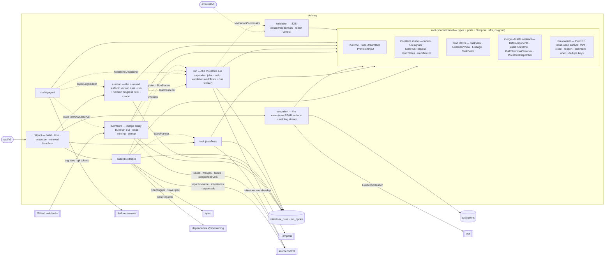

# delivery — Delivery Pipeline

> **L2 · a domain.** Part of the [aep-api architecture](../../README.md).

Take a versioned Spec end-to-end: cut the version, plan its Tasks into a GitHub MILESTONE, and run a
supervised loop that dispatches the coding agent at that milestone until it settles — merging, building
and deploying along the way — then judge what was deployed against the version's validation criteria.
**Single write-authority over the milestone-run store and the three Temporal workflows that drive it.**

## Internal shape — kernel-root + feature sub-packages

Delivery is **not** the flat-root-of-services layout spec/organization/ops use, and **not** per-op slices.
Its absorbed features are densely cross-coupled AND carry a load-bearing split — the GitHub-facing Task
surface must never reach the dispatcher — which the ordinary rules (`root ⊥ slice`, `slice ⊥ sibling`)
cannot satisfy flat. The resolution: **anything referenced across a feature boundary is a TYPE or PORT
that lives in the ROOT; the feature logic that uses it lives in a sub-package importing only the root.**
`task` and `run` are then peer sub-packages that never import each other (`TestTaskRunSplit` re-asserts
it), and every former feature→feature edge becomes a legal slice→root type reference.

The root holds one piece of BEHAVIOUR beside those types: **`IssueWriter` (`issue_writer.go`), the one
surface every issue this domain writes passes through** — mint, close, reopen, comment, label — together
with the dedupe-key vocabulary it mints against. Four sub-packages file issues (`eventcore` detects and
mints, `task` mints a planned Task, `validation` mints the version's validation issue and its repair
issues, `build` closes a superseded version's leftovers) and none of them may import another, so the
choice is the root or four copies of the label and dedupe policy. It is legal here for the same reason
the labels are, and it is deliberately decision-free: it holds no rule about WHEN an issue is filed, and
never invents or rewrites a caller's labels or key. In particular it does **not** pre-check for a
duplicate — the host's create holds a per-repo lock that makes check-then-create atomic, and a check
outside that lock is the duplicate-issue race the lock exists to close.

| Sub-package | Owns | Reaches the root for |
|---|---|---|
| `build` (buildpipe) | the whole-spec gate + `v<N>` tag cut, **the milestone plan path** (mint `v<N>`'s milestone, supersede the previous version into it, admit the run row, then plan its Tasks and mint its gates), the version ledger, dependency preflight | `MilestoneRun`/`StartRunRequest`, and the planner via `SpecPlanner` |
| `task` (taskflow) | the GitHub-native Task READ surface (list/get, scoped to a version by milestone membership) + the plan turn, which mints one **prose** issue per Task **into the version's milestone**, assigned at creation; plus the SRE/RCA handoff's adoption leg | the read DTOs, the milestone label vocabulary, and the run rows (via `MilestoneResolver`) |
| `execution` | the executions READ surface: the per-Task progress endpoint, the task-log SSE stream, `OpsExecutionReader`. It writes nothing and dispatches nothing — the only execution rows left are the provisioning gates' | `TaskStreamHub`, the executions kernel |
| `eventcore` | the event plane of the milestone-run loop: the auto-merge policy seam, the merged-PR path-diff build fan-out + per-`(component, SHA)` re-trigger budget, fix/conflict/red-main issue minting, the halt of a failed run's unfinished work and the close of a cancelled run's in-flight work, milestone-matched predicate re-evaluation, adoption, the reconcile sweep (trigger router; halted-aware, and blind to cancelled increments), and the build sweep that observes those builds reaching terminal | the milestone model (labels, `MilestoneRun`/`RunCycle`, run signals), `DiffComponents`/`BuildRunName` and `BuildTerminalObserver`; **no Temporal** — it reaches the supervisor only through the `RunSignaler`/`RunStarter` ports |
| `run` | the milestone run SUPERVISOR — three workflows over one shared loop: the wait state + dispatch predicate, the cycle loop, the four budgets + no-progress + ceiling, the version's judgement, settle, and cancel. Plus the `Supervisor` handle the event plane and the build click signal and start runs through | `Runtime`, the milestone model, `RunStatus`/`MilestoneRunWorkflowID`, `MilestoneDispatch`, `DiffComponents`/`BuildRunNamePrefix`; **no GitHub client, no gorm** |
| `runread` | the run READ surface: a version's runs + their cycles, TWO SSE streams over the per-cycle agent logs (one per run, one per version), and the two writes beside them — cancel, and revalidate. Owns no state and decides nothing: both writes resolve their target through the org-scoped read, then hand off | the run/cycle entities and `IsTerminalRunState`; reaches the pod log through `CycleLogReader` (OC API while the Component lives, observer archive while retained), the supervisor through `RunCanceller` and the event plane through `Revalidator`, so it drags in neither a cluster client, a workflow engine nor GitHub |
| `codingagent` | the CodingExecutor (ONE dispatch entry point: dispatch a run cycle as an ephemeral OpenChoreo `coding-agent` job Component), the build-auth retry, the pod-truth watcher, retention/LRU and the cancel-time delete. Design: [`codingagent/design/oc-job-dispatch.md`](codingagent/design/oc-job-dispatch.md) | `MilestoneDispatch`/`MilestoneDispatcher`, `TaskStreamHub`, `BuildTerminalObserver` |
| `validation` | the S2S validation runner callback (validation-context: the deployed endpoint URLs, kept out of the public issue), the per-version validation issue, and the report → verdict rule. A test user's login is NOT served here — it is published on the roles gate ticket (ADR-0022) | — (no cross-edges; least entangled) |
| `httpapi` | the aggregator: embeds build/task/execution/runread handlers; **holds `Deps`** (see below) | imports the sub-packages (the exempt aggregator) |

**`Deps` lives in `httpapi`, not the root.** Every other domain keeps its `Deps` in the domain root, but
delivery's services live in sub-packages the root may not import (`root ⊥ slice`). The `httpapi` aggregator
is the one package allowed to name them, so `httpapi.Deps` + `httpapi.New` is where composition sits.

## Ports
| Port | Dir | Peer · contract |
|---|---|---|
| `Adopter` (`AdoptIssue`) | needs | `task` → the event plane. The handoff's dispatch leg: file a bare issue under the deployed version's milestone and start an incident run over it |
| `MilestoneResolver` (`MilestoneNumberForTag`) | needs | `task` → the root run repository. A `?tag=` query is milestone membership, resolved through the platform's own rows |
| `SpecTagger` (`*spec.SpecSaveResult`) · `SpecCollector` · `AuthDeriver` | needs | `spec` — the whole-spec gate + tag cut + design reads |
| `RepoLookup` (`owner/name`) | needs | `sourcecontrol` — repo full-name resolution |
| org-credential reads | needs | `platform/secrets` / P3a org repositories — the GitHub + publisher halves of a coding-agent run's secrets |
| `CodingKeyResolver` (`organization.SecretRefTriplet`) | needs | `organization` — WHICH Anthropic credential this org's coding runs bill (its coding-agent override, else its default key) and the env var it must be mounted as. A domain decision, so the port exposes no way to ask "is there an override?"; dispatch only mounts what it is handed. See ADR-0016 |
| `ExecutionReader` (`ops.ExecutionFact`) | offers | `ops` — latest-execution-per-kind correlation (`execution.OpsExecutionReader`, P6-retired the app bridge) |
| `BuildTerminalObserver` (root) | offers | the OpenChoreo watcher → the event plane: a settled build reported outwards, so watcher and event plane stay peer sub-packages |
| `MilestoneDispatcher` (root, over `MilestoneDispatch`) | offers | the coding agent → the supervisor: launch one agent run at a milestone and answer with its Job ref. The dispatch prompt is a milestone reference; the runner discovers its own working set. Satisfied by `*codingagent.CodingExecutor`, which writes no execution row — the cycle record is the supervisor's bookkeeping |
| `ComponentEnsurer` | needs | `eventcore` → the projects component service + the runtime-config emitter. Provision a component's OpenChoreo CR immediately before its first build; see the invariant below |
| `RunReader` · `CycleReader` · `CycleLogReader` · `RunCanceller` · `Revalidator` | needs | `runread` → the root run/cycle repositories, `codingagent`'s cycle-log reader (the pod's log through the OC API while it lives, the observer's archive while the Component is retained), `*run.Supervisor` and the event plane. Four reads and two writes, which is the whole dependency surface of the read model. `Revalidator` is a port for the same reason `RunCanceller` is: deciding a revalidation needs GitHub (is there open work?) and the project repo (is there an oracle?), and this surface must stay free-to-poll |
| `Gates` · `Planner` | needs | `run` → `dependencies/provisioning` (through an app-root adapter) and `task`. Mint the version's dependency gates, then plan its Tasks — the run's first phase. Declared here rather than imported for the same reason `build` declares its own: `task ⊥ run` is an import ban in both directions, and a port over root types satisfies it |
| `Deployer` · `DeploymentReader` | needs | `run` → `projects.DeploymentService`. Promote a cycle's built components and read back whether they are serving. The supervisor owns the ORDER and the verdict; the projects domain owns the OpenChoreo writes, which is why `run` still names no cluster client |
| `DeployIssueMinter` | needs | `run` → the event plane. The ONE recovery issue the plane cannot mint on its own initiative: every other one has a webhook behind it, and a ReleaseBinding that never becomes Ready delivers nothing. The supervisor observes it and asks; the plane still owns the write, the labels and the dedupe key |
| `RunSignaler` · `RunStarter` | needs | `eventcore` and `build` → the run supervisor. Signal a run, start one. Interfaces, which is what keeps both the event plane and the build click free of a workflow engine; both are declared over the root `StartRunRequest`, and `*run.Supervisor` satisfies both |
| `RunStore` · `CycleStore` · `MilestoneReader` · `PRReader` · `DesignReader` · `BuildReader` · `ValidationCoordinator` | needs | `run` → the root repositories, `sourcecontrol`, the design reader, `clients/openchoreo` and `delivery/validation`. Every I/O the loop performs, named once; `BuildReader` is read-ONLY because the supervisor never triggers a build |
| `MilestoneClient` (mint a milestone · list a milestone's issues · close milestone) | needs | `build` → `sourcecontrol`. The plan path's MILESTONE surface: create `v<N>` idempotently, and read `v<N-1>`'s leftovers. Closing those leftovers is an issue write, so it goes through the root `IssueWriter` instead |
| `MilestoneRunStore` (active-run read · admit · settle · list) | needs | `build` → the root run repository. The 409 pre-check and the admission that arms the build mutex |
| `SpecPlanner` (`PlanIntoMilestone`) | needs | `build` → `task`. The planning turn, reached through the root exactly as `TaskReader` is, so `build` names no sibling |
| `GateResolver` (author dependencies + mint gates into a milestone) | needs | `build` → `dependencies/provisioning`. Gates are dispatch holds, never agent work |
| `BuildTrigger` (stage the org clone credential · trigger at commit · list a component's runs) | needs | `clients/openchoreo` — the fan-out, and the run list the re-trigger budget is derived from. Staging is its own verb because the credential is per-ORG while a trigger is per-component: a caller building N components stages once and reuses the reference |
| `IssueClient` (milestone membership · milestone counts · assign) · `PRReader` · `PRMerger` | needs | `sourcecontrol` — the event plane's issue READS and its pull-request surface, on the org's own credential. Minting is absent by design: it goes through the root `IssueWriter`, which is what stops a second dedupe convention appearing here |
| `IssueOps` (create · close · reopen · comment · add/remove label · set milestone) | needs | the root `IssueWriter` → `sourcecontrol`. The complete list of what delivery is allowed to do to an issue; anything absent is a write this domain does not make. `set milestone` is the supersede's carry-forward of an open bug into the new version, and adoption's move of a bare issue into the deployed one |
| `ValidationContext` · `ValidationCredentials` | offers | the S2S runner callbacks (`/internal/v1/validation/{cycleId}/…`, via the internalServer — not the public edge). Keyed by the CYCLE the pod was dispatched for, which is the only identity a runner has |

## Owns
- The **executions** store (now provisioning gates only) and the Temporal `Runtime` + the three workflows on it.
- The **build click's whole sequence** (`build`): mutex → repo → request pre-tag work → dependency hard
  gate → whole-spec gate + `v<N>` tag cut → milestone → supersede → run row → plan. The ORDER is the
  domain fact `build` owns; the two halves it does not own (the planning turn, the gate resolvers) are
  root ports. Preflight emits no `external-config` collect for a **Registered External
  resource** the org catalog already holds (ADR-0021). Pre-tag also refuses an unknown
  `resourceType` (`ErrUnknownResourceType` → 409) the same way it refuses an end-user-auth
  conflict: the design is unsatisfiable on this cluster, so the click claims no version and
  starts no workflow.
- **What preflight gates**: it reports what a version's dependencies still need, and only
  `needsResolution` — a dependency the design itself cannot name (ambiguous, unresolved, missing spec,
  or an org service awaiting access) — blocks the version cut. `needsInput` stays the broad "there is
  something to show" flag: an external dependency's config VALUES are collected while the build runs
  and enforced at the deploy gate, so they never hold up starting a build.
- The **event plane** (`eventcore`): the platform's whole reaction to a pull request, a milestone-matched
  issue and a build terminal. It merges, mints and signals — the supervisor decides. Its three GitHub
  effects are a squash-merge, an issue in a milestone, and a build pinned to a merge SHA. It owns the
  DETECTION and the prose of the issues it files; the write itself is the root's `IssueWriter`.
- **Every issue write the domain makes** (`IssueWriter`, root): the label vocabulary, the milestone
  assignment that rides each create (and the one deliberate re-assignment, supersede's carry-forward), the dedupe-key vocabulary and the mint logging, decided once for
  four sub-packages. A key is frozen against its literal by `TestIssueDedupeKeysAreFrozen`, because a
  changed key does not fail — it silently re-files issues instead of deduping onto the open one.
- The **milestone run** store: a run row per (org, project, milestone) — kind, origin, small state, terminal
  reason, budget counters, validation verdict — and one **cycle record per dispatch** under it (kind,
  attempts, Job ref, branch, the pull request's number AND its page on the host, merge SHA). The pull
  request URL is stored as the webhook reported it, never composed from the repo row and the number:
  the repo URL is a *clone* URL, and a reader that assembles links from it encodes both the host's URL
  grammar and that spelling. The milestone **number** is the key; the title is kept
  only as the `v<N>` tag a `?tag=` query resolves through. Loop position is read from the latest cycle, and
  per-component build/deploy status is derived from OpenChoreo on read — neither is stored.
- **Delivery's agent SPEND**, in the `agent_usage_ledger`: an append-only entry per dispatch carrying the
  captured tokens, the USD stamped at capture (`cost_usd`, amended console ADR-0011), the SDLC phase and
  the version it paid for. Both capture surfaces mirror into it as part of their own stamp — `RecordUsage`
  on the cycle and on the execution — so `PhaseUsageRollup` reads the ledger and NOTHING else: adding the
  dispatch rows back would bill every token twice. `RecordUsage` stays the one cycle mutator NOT fenced on
  `ended_at IS NULL`: usage arrives from the terminal-log capture, and a cycle closes on the merge webhook
  seconds after its Job exits — fencing it would discard nearly every capture. Entries are keyed
  `(source, source_id)`, so a re-read of the same log updates one entry rather than adding a second.
- The **deploy stage** (`run`): every cycle, red or green, the supervisor RECONCILES THE VERSION. It
  reads every component the design declares, compares the release its newest succeeded build would
  cut against the release its binding pins, and promotes the difference — cutting each release from
  the Workload that build posted and writing the binding that pins it, release pin plus trait env
  configs plus workload overrides in ONE object write — then waits for Ready. Components carry
  `autoDeploy: false`, so nothing else promotes a release. It promotes WAVE BY WAVE (providers before
  the consumers whose start-up config carries their address), holds a component whose provider is not
  serving, and finishes with one converge for the facts that flow the other way — see the invariants
  below, ADR-0019 and ADR-0026.
- The **run loop** (`run`): one Temporal workflow per SPECIES per milestone —
  `<kind>-<org>-<project>-<milestoneNumber>`, whose id is REUSED after a terminal run because a
  milestone sees sequential runs of one kind across its life. `dev` and `task` are the same cycle loop
  with different bookends; `validation` is its own shape and shares no boundary. Between them they own
  the four budgets, the no-progress rule, the cycle ceiling, the version's judgement and settle — and
  nothing else: they detect no event, and the only issue they write is the one nothing else can
  (see the invariants). ADR-0020.
- **Persistence**: every gorm in this domain sits at the ROOT (the fence `TestGormFencedToDomainRepository`
  draws), as single write-authority — `repository_execution.go` · `repository_coding_agent_log.go` ·
  `repository_run.go` · `repository_cycle.go` · `repository_usage_ledger.go` over the `execution.go` /
  `coding_agent_log.go` / `milestone_run.go` / `run_cycle.go` / `usage_ledger.go` entities. Their tables
  are `executions` · `coding_agent_logs` · `milestone_runs` · `run_cycles` · `agent_usage_ledger`.
  `run_cycle_logs` is retired (migration step is a tombstone; cycle logs are read from OpenChoreo /
  the observer, not Postgres). `usage_rollup.go` is a plain function over the ledger rather than a
  third store.

## Invariants — don't break
- **`task ⊥ run`.** The GitHub-facing Task surface and the run supervisor are peer sub-packages that never
  import each other, in either direction. Dispatch has exactly ONE door — a run works a milestone — so a
  `task` that could reach the supervisor would be a second door with the run's budgets bypassed.
  `TestTaskRunSplit` + `slice ⊥ sibling` both enforce it.
- **A run's KIND is what the platform decides on.** Three kinds — `dev` (delivers a version: plans its own
  milestone, works it, judges it), `task` (works a defect inside a version already delivered) and
  `validation` (re-judges a shipped version; no working set, builds nothing). Every predicate is written on
  the kind: which run takes the build mutex, which one is the project's version, which fills its own
  milestone, which reads an empty working set as evidence, and which validates. `origin` (`spec-build` /
  `incident-adoption` / `revalidate`) records where a run came from and nothing branches on it.
- **One active dev run per project.** At most one non-terminal (`planning`/`waiting`/`running`) `dev`
  milestone run exists per (org, project) — a partial unique index (`ux_milestone_runs_dev_active_v3`, created
  by the `milestone_run_kind` migration; AutoMigrate cannot express one) that admission hits with
  `INSERT … ON CONFLICT DO NOTHING`, so the invariant holds under concurrency and not merely under the
  endpoint's pre-check. Both answers are the same 409. `task` and `validation` runs sit deliberately outside
  the index and execute concurrently on their own milestones; what bounds them is the other partial index,
  `ux_milestone_runs_active_per_milestone_v1` — one live run per milestone, of any kind. A kind is a literal
  inside a partial predicate, so admission validates it (`IsRunKind`): a typo'd kind would not fail the
  insert, it would silently escape the mutex.
- **The version is claimed before it is planned, and the RUN does the planning.** The run row IS the build
  mutex, so the build click admits it synchronously — supersede, mint the milestone, admit — before
  anything slow happens. Admitting after planning would leave the mutex unarmed for the minutes an LLM
  turn takes, which is exactly the window a double-click lands in.
  The click then starts the supervisor and returns; filling the milestone (gates, then the planning turn)
  is the run's own first phase. It used to be a detached goroutine, and that cost the platform its three
  usual guarantees: a restart killed it mid-turn, a seven-second connect timeout to GitHub settled the
  whole version because nothing told a blip from an answer, and it left no history to diagnose. As
  activities it is durable, retried, and classified by `planErr` exactly as every other I/O the loop does.
  A planning failure still settles `plan-failed` — same terminal reason, now written by the supervisor.
  **The phase is cancellable and its gate activity gives up** ([ADR-0024][adr24]). Its two activities are
  raced against the cancel channel (`loop.awaitInterruptibly`) and heartbeat, so a cancel both settles the
  run and stops the work in flight — without it the phase was blind to cancel for its whole duration, which
  is what let a version with an unsatisfiable dependency loop for 22 minutes over six unread cancels.
  `ProvisionGates` is the one activity here with a BOUNDED retry policy (`gateActivityAttempts`), because
  provisioning has answers repeating cannot change and the unbounded default made one of them a permanent
  loop. It is the LAST of three guards, not the only one: the named faults are refused at the click or
  fail on attempt one (see the retry-classification bullet below), and the cap catches the permanent modes
  nobody has named yet. What it looped ON was the gate mint, whose dedupe considered only OPEN gates while
  the same activity closes the ready ones — so the mint now keys on (version, dependency) in EVERY state,
  which a version label on the gate is what makes safe (`provisioning.gateVersionLabelPrefix`).
- **A CANCELLED version says so, in both aggregates that report one** ([ADR-0024][adr24]).
  `build.statusFromRunState` (the version ledger and the build page header) and
  `projects.buildStageStatus` (the toolbar's project badge) both folded `cancelled` into `failed`;
  both now carry their own value, and they move together because a reader sees both at once. `blocked`
  still reads as failed in both — nobody CHOSE blocked, which is the whole difference. Note the cost:
  two contract enums gained a value, so the console and the BFF are no longer independently
  deployable for this change (an old bundle rendered the new value as "Unknown"). Ship the console
  with, or before, the BFF.
- **Whether a rebuild skips the planning turn is answered by the MILESTONE, not by the spec status**
  ([ADR-0024][adr24]). `Rebuild` means "already filled", and an unchanged spec is not evidence of that: a
  run that died in its planning phase leaves the milestone holding its gates and no work, and a run that
  skips planning over it reads the empty working set as "planning produced nothing" and settles the version
  succeeded having built none of it. `build.reopenIncrement` lists the milestone's issues in every state
  and reports whether any `development` issue is among them; an unreadable milestone answers "not filled",
  because the wrong "filled" is silent and the wrong "not filled" costs one turn that mints nothing.
- **The supervisor is the ONLY writer that settles a run row.** The one exception is a start that never
  happened: `StartRun` reports `ErrRunNotStarted` from a degraded boot, and the click settles the row it
  armed rather than leaving a non-terminal row with no workflow behind it. That state is unhealable by
  construction — a non-terminal row makes `LiveRunForMilestone` answer forever, so the reconcile sweep
  skips it while the partial indexes refuse every later build on the project.
- **A version supersedes its predecessor: a PLAN is replaced, a DEFECT is carried forward.** Cutting
  `v<N+1>` empties `v<N>`'s milestone and then closes it. `development` and `provision` are CLOSED with a
  `Superseded by v<N+1>` comment — the new plan replaces the old one and re-mints its gates — and so are
  the validation task and any ledger-only note. `conflict` is CLOSED too, not carried: it names a branch of
  the version being superseded, which is about to be irrelevant. But every open `bug` is MOVED into the new
  milestone, because a defect is not superseded by anything — it is still broken, and the new version is
  what will ship the fix. "Bug" here is `delivery.WorkKindOf`, the same reader the WORKING SETS use, which
  reads an ARMED issue carrying no kind as a defect: that is the common human hand-over (adoption stamps
  the arming switch and deliberately no kind), so reading plain `KindOf` instead silently closed every
  adopted defect the moment the next version was cut. Moving is not ARMING: an unadopted incident arrives still unarmed and still
  ledger-only. The new milestone is therefore minted BEFORE the supersede runs, since the move needs a
  destination; the guard that a milestone never supersedes ITSELF is a comparison of platform-recorded
  titles and holds whatever the order. The previous milestone is located by the NUMBER recorded on a run
  row, never by matching titles against GitHub (titles are renamable, and title filters are
  case-insensitive while create-uniqueness is not). Every step is best-effort and logged: a failed close or
  move leaves one stale issue behind, where failing the build would strand the whole next version.
  This is half of what keeps the reconcile sweep sound — a superseded milestone holds nothing workable,
  because the plan is closed and the bugs have LEFT. A build that resolves to the SAME title supersedes
  nothing (the title guard skips it) and takes the rebuild path below instead: the same milestone,
  reopened.
- **Every issue body is prose; nothing platform-side parses one.** That holds for planned Tasks, for
  dispatch gates and for the validation task alike: the milestone is the version pin, LABELS carry every
  routable fact, and ordering is the "Depends on #N" lines the AGENT honours. Dedupe on re-plan is the
  title slug against the milestone's own issues, which makes reconcile additive-only and a crash re-run a
  no-op.
- **A cycle's own verification happens INSIDE the session, and this domain orchestrates none of it.** A
  coding cycle no longer ends at "it compiles": before committing a `web-application` the agent stands it
  up in mock mode, drives it through a browser against the component's stories and heals what that finds,
  which the skill library owns end to end and the platform not at all. There is no activity, no store, no
  callback and no status for those passes — the only trace they leave here is the SHAPE of what arrives (one pull
  request carrying the build AND its fixes, so no extra branch, pull request or issue reaches the event
  plane) and the cycle's `activeDeadlineSeconds`, which the dispatch now NAMES rather than inheriting the
  ComponentType's default because the work runs longer (`codingagent/design/oc-job-dispatch.md`). Judging
  a DEPLOYED version is a different job and the validation run owns it.
- **Two label axes: an issue is ARMED or not, and has exactly one KIND** (`labels.go`). `aep` arms it —
  something may work it — and is also the human's adoption trigger; the kind (`development`, `bug`,
  `conflict`, `validation`, `provision`) says which loop, and a `bug` carries a `src/*` source saying who
  found it. Every routing predicate is then a POSITIVE membership test on the kind, which is what removed
  the old model's subtraction of exclusions — a rule stated as what it is not, where a single mis-stated
  exclusion emptied a live working set. A **gate** (`provision` + `aep:dep/<slug>`, minted by
  `dependencies/provisioning`) is deliberately NOT armed: a dispatch hold is nobody's work, and its absence
  from the armed population is what lets it be counted on its own rather than subtracted from the work
  waiting behind it. The **validation task** IS armed and excluded by its kind instead — it is real agent
  work whose pull request the platform must auto-merge, while no working set may include it or settle would
  never come.
- **The working set is PER SPECIES, and planned work is dev-workflow's alone.** `development` + `bug` +
  `conflict` for a dev run; `bug` + `conflict` for a task run, never `development`. That narrowing is not
  tidiness: a dev run owns the version and holds the project's build mutex, so planned issues left open by
  a build that gave up must wait for another build rather than be continued by a run that never planned
  them, works the DEPLOYED version instead of the one being built, and carries different budgets. Each
  rule is written TWICE by design — per issue from its labels (`InDevWorkingSet` / `InTaskWorkingSet`,
  mapped from a run kind by `InWorkingSet`) and as a COUNT in one host round trip (`OpenDevWork` /
  `OpenTaskWork`), because no host call can both count cheaply and hand back labels — and the two are
  tested against each other over every population a milestone can hold. Both counts ride ONE
  cycle-boundary poll, since the host returns every population in the same GraphQL response.
- **A `src/*` source is provenance, and routes exactly one thing.** It says who found a defect, for a
  human and for the coding agent reading the issue. The single exception is the task run's bookend:
  draining a working set that held `src/validation` work REOPENS the version's validation task, so the
  reconcile sweep starts another validation run and the same oracle judges the repair. That is the edge
  that closes the repair chain — bounded by the version's attempt allowance and the identical-digest rule.
  `src/incident` and `src/user` do NOT reopen it: an incident is not priced like a release, and a verdict
  is a statement about a VERSION rather than a commit, so `v3 passed` may describe code that shipped after
  the verdict was recorded. The attribution is a LATCHED flag over the run's own boundary polls, never a
  settle-time read — by settle the repair issues are closed, and asking whether a CLOSED `src/validation`
  issue exists is true forever after the first repair, which would reopen the task after every later run,
  which validation then closes, without end.
- **A read that narrows on a label cannot see what does not carry it.** So a decision that must weigh
  several populations — the auto-merge policy, which merges the validation cycle's pull request — reads the
  milestone's open issues UNFILTERED and decides on the labels itself. `?labels=` on the REST issues
  endpoint is AND, so a filter naming two labels demands an issue carrying both and returns nothing; and a
  label predicate split across the fetch and the decision is one rule in two places, which is how the
  validation cycle's pull request once ended up declined as "not this run's work".
  The policy admits a pull request TWO ways, and the two lists never merge: a CLOSING keyword on any
  armed issue (the coding cycles' path, where the matched list is also `RunCycle.Resolves`, the durable
  record of what the cycle finished), or `Validates #N` on the milestone's `validation`-kind task —
  scoped to that kind, because otherwise `Validates` would become a general-purpose way to merge a pull
  request while closing nothing and no working set would ever empty.
- **Milestone assignment rides issue creation.** A plan costs `1+N` content-generating requests against
  GitHub's 80-per-minute ceiling: one milestone create plus one issue create per Task. Never
  create-then-PATCH, and never a label pre-create per issue (`sourcecontrol` memoises the ensure).
- **Settled rows are never resurrected.** Every run and cycle mutator is a guarded update — fenced on the
  run not being terminal, or the cycle not being closed — and returns `(nil, nil)` when it changes no row,
  so a duplicate webhook or signal is a no-op rather than a rewrite of a recorded outcome.
- **A component's CR is provisioned immediately before its first build, by the FAN-OUT.** A cycle is
  scoped to a milestone and may touch several components, so no dispatch knows which component is about to
  be built; the merged-PR fan-out is the last point that does. It ensures the OpenChoreo Component CR (and
  emits any web-app runtime config) per component, then triggers — without it a first-ever component's
  build fails "Component not found". An unensurable component is not built: triggering a build for a CR
  that does not exist only fails later, and less clearly.
- **A run's WORKFLOW ID carries its kind, and the run ROW is the routing table.**
  `<kind>-<org>-<project>-<milestone>`. Ids are reused under `ALLOW_DUPLICATE`, because a milestone sees
  sequential runs of one kind, so a single grammar would let the three species claim one id in turn — and
  a stale merge signal aimed at a settled dev run would be delivered to the validation run that claimed
  it afterwards, which would act on a merge that was never its own. The event plane already resolves a
  run row before it signals anything, and the row's kind gives both the prefix and the workflow type
  (`RoutableRunKind` → `RunWorkflowName` / `MilestoneRunWorkflowID`), so independence costs no lookup
  table. A row is routable when its kind is VALID, or when its kind is empty and its origin implies one —
  the pre-column case. Anything else is refused, by the start and by the signal alike: the only reading
  available to a corrupt row is `dev`, and that is the kind which takes the build mutex and plans a
  version, so guessing it would start a build nobody asked for and hold every later one behind it. A row
  the start refuses has no execution under any id, which is why refusing to signal it loses nothing.
  `AbandonRun` (project delete) therefore terminates ALL THREE ids: the rows are purged in the same
  teardown, so there is nothing left to ask which ever existed, and a kind missed leaves a supervisor
  retrying forever against a repository that is gone.
- **The reconcile sweep is the TRIGGER ROUTER, it reads ISSUES, and it skips HALTED work and CANCELLED
  increments.** For a known milestone with no live run: a milestone whose NEWEST run settled `cancelled`
  is skipped whole, before its issues are even fetched; otherwise it routes on the TRIGGER PREDICATES
  themselves — an open armed `validation`-kind issue starts a validation run, open task working-set work
  (`aep` + `bug`/`conflict`) starts a task run, and anything else starts NOTHING. That last clause is a
  real population and the reason the routing is not "something is open": a milestone holding only a
  ledger note, only a `provision` gate, or only planned work a build gave up on would otherwise start a
  paid agent run whose working set is empty by construction, which parks and is re-offered every pass. A
  gate holds the next DISPATCH, so with no work behind it there is nothing to hold; `development` is
  dev-workflow's alone and only the build click may start a dev run. An issue carrying `aep:halted` is
  dropped before either decision, so a milestone holding nothing but halted work is quiet. The cancelled
  skip is a decision about the MILESTONE rather than about its issues, and that is forced: a closed
  milestone still accepts issues, so one reopened or freshly filed inside an abandoned increment carries
  no mark and would otherwise start a run that builds and deploys a version nobody is shipping. It
  clears itself — a rebuild admits a new row on the same milestone, so the newest run stops being the
  cancelled one — which is why it reads the newest run of ANY kind rather than hunting for a cancel
  anywhere in the history. It fetches the milestone's OPEN issues (REST, NO
  label filter) and decides in Go, because both of those are intersections GraphQL's union-valued
  `labels:` argument cannot count ("armed AND of kind X", "armed AND halted") and the complement of the
  second is a negative label query the host cannot express at all — the same shape, and the same reason,
  as the auto-merge policy: the fetch stays wide and the policy is the only place labels are read. That is
  one REST call per known milestone per pass, replacing one GraphQL call, and neither decision costs a
  round trip. The cycle-boundary poll keeps its COUNTS, because that read runs at every boundary and is
  the loop's hottest; `aep:halted` deliberately does not reach it, since a halted issue in a LIVE run's
  milestone is a contradiction — the run that halted them is terminal by construction.
- **A FAILED run HALTS the work it could not finish, or every budget is defeated.** On every failed
  settle the run comments the terminal reason on each working-set issue it could not finish — the recovery
  bugs it filed itself included, which are the newest things in the milestone and therefore the first a
  restarted run would pick up — and stamps `aep:halted`. It must, because a failed run leaves that work
  OPEN (the milestone stays open too: the way forward is more work in the same version) and the sweep's
  trigger cannot tell "given up on" from "not started". Without the mark the run that just exhausted
  `fix-chain-budget` is replaced within a tick by a fresh run with a fresh budget, on the same issues,
  forever — every budget in the platform defeated at once, with a cloud bill for a symptom rather than a
  failing test. The reach is the RUN's working set and nothing beside it: a dev run must not halt a bug a
  concurrent task run is working, and a task run must not halt planned work it was never allowed to
  touch. A VALIDATION run halts nothing — its own work is the task it closes on every ending, and the
  repair issues a failed verdict files and the conflict issue a stuck validation pull request produces are
  deliberately a task run's work, so halting them would break the repair chain instead of protecting a
  budget. Two things clear it, and both are somebody DECIDING the work is worth another attempt — which is
  the decision the sweep must not make on its own: a person removing the label, and the next build, which
  strips it from the bugs it carries forward. The write goes through the
  event plane like `MintDeployFixIssues`, so the supervisor still writes no issue of its own.
- **Every event-plane handler keys off a milestone run row.** It resolves the run first — by the agent's
  `aep/m<milestone#>-…` branch, by the milestone a payload embeds, by the cycle that landed a commit, or
  (for incidents and adoption) by the deployed version's run — and returns having written nothing when
  there is none. That gate is what keeps the plane's authority scoped to work the platform started, and
  what lets it share the `pull_request` and `issues` routing keys with other handlers without racing them.
- **The event plane imports no workflow engine.** It detects, mints and signals; the supervisor decides.
  The dependency direction is enforced as a package boundary — the supervisor is reachable only through
  the `RunSignaler`/`RunStarter` ports, so no loop decision can be smuggled into a webhook handler.
- **A signal is a wake-up, never evidence.** The supervisor re-reads GROUND TRUTH before acting on any
  signal: the milestone's own issue counts at every cycle boundary, and the CYCLE RECORD (not the payload)
  to decide whether the agent's pull request landed — a human's pull request merging mid-cycle raises the
  identical signal. That is what makes a lost delivery cost latency rather than correctness, and it is why
  the wait state can be unbounded with cancel as its only expiry.
- **The supervisor counts its own budgets.** They are workflow state, written OUT to the run row for the
  read model and never read back: a replay must reproduce the same decisions without a database. The one
  budget it does not count is the automatic build re-trigger — that is the event plane's, derived from the
  WorkflowRuns themselves, and the supervisor reads the same runs rather than keeping a second tally.
- **Activities retry blips forever and answers never.** The supervisor's activities run under Temporal's
  default policy — unbounded, with backoff — because a supervisor that cannot reach GitHub should stall
  visibly rather than settle a run on a network blip. A failure that repeating cannot change is told
  apart wherever the supervisor touches source control and marked non-retryable, so it fails on
  its first attempt: the project deleted underneath a live run, a milestone or pull request removed on
  the host, a rejected credential. `sourcecontrol.IsPermanent` owns which failures those are — GitHub's
  secondary rate limit wears a 403 and is deliberately NOT one — and `run/errors.go` owns turning them
  into Temporal's vocabulary. The guard is per call site, so an activity added later that returns a
  source-control error raw is back on unbounded retry; `CloseMilestone` is the one deliberate exception,
  swallowing its error by contract and so never retrying. The same split applies to provision and
  deploy: `provisionErr` / `deployErr` mark `ErrProvisionPermanent` / `ErrDeployPermanent` non-retryable.
  A provision wait-answer (Resource `Ready=False` / `ResourceTypeNotFound` — even when a
  prior release exists — or a create that never
  cuts a release) is permanent; a GetResource blip or cancelled wait is not. Do not bound
  `activityCtx` with `MaximumAttempts` — permanence is the activity's to declare, and bounding the
  SHARED options would put every activity on a cap sized for one of them.
  **`ProvisionGates` is the one activity with a cap of its own, and the two guards are layered rather
  than alternative** (ADR-0024). Classification is the front line: a fault we can NAME is refused before
  the run starts (an unknown `resourceType` is a 409 on the click) or fails on attempt one with the
  provisioner's own message. The cap in `gateActivityCtx` catches only what is left — a permanent fault
  nobody has named yet, which under the unbounded default is an invisible forever-loop rather than a
  failed build. Three attempts, spaced by `gateActivityRetryInterval` so they span a blip rather than
  three seconds of it. Do not add a cap anywhere else without an answer to "which permanent mode does
  this catch that a classifier could not name?"
- **Every terminal reason names exactly one failure class.** `redispatch-budget` is agent death (including
  a Job that exited without a pull request); `build-retrigger-budget` is a build that stayed red through
  its one automatic re-trigger with no fix issue to recover it; `deploy-budget` is a component that
  built and never came up, with no fix issue to recover it — a different class from a red build,
  because the code compiled and the platform could not run it; `fix-chain-budget` and `conflict-budget`
  bound the two recovery chains; `no-progress` is a green cycle that left the milestone unchanged;
  `cycle-ceiling` is the backstop over all of them. The validating phase contributes two, and they are
  two because they are different failures: `validation-failed` is a criterion that asserted and lost —
  a fact about the software — while `validation-unreported` is the agent merging its pull request
  without committing a report at all, which proves nothing about the software and is a breach of the
  runner contract. `ValidationVerdictFailsRun` / `IsValidationTerminalReason` are the executable copy of
  that pair. A run that settles for a reason outside this list is a bug in the loop, not a new state.
- **The deploy set is the VERSION's, not the cycle's** (ADR-0026). `desired(c)` is the release
  `c`'s newest SUCCEEDED build would cut; `actual(c)` is what its binding pins and whether that is
  Ready; the difference classifies every design component as `serving`, `behind`, `converging`,
  `held` or `unbuilt`, and only `behind` is ever written to. A component is promoted when it is
  behind AND every hard provider is serving or promoted ahead of it in the same pass — otherwise it
  is `held`, which is neither waited on nor filed against. This runs on a RED cycle too: a red build
  has already minted its fix issue, and its green siblings are still built. What it replaced promoted
  the cycle's path diff, which made "what is serving" a function of which files a fix touched — one
  version shipped with its API never promoted at all, because the cycle that built it was red and no
  later cycle's diff mentioned it again. A fully serving version reconciles in one read and zero
  writes, which is what lets the pass run every cycle.
- **A version is delivered when it is SERVING, asserted rather than inferred.** The boundary re-reads
  the version state and requires every design component `serving` before it mints the validation task;
  anything else settles `version-incomplete` naming what was not. "Deployed-green" used to be inferred
  from an empty working set plus a green last cycle — neither of which is a statement about a component
  the cycles never touched. By the loop's own invariants the failure should be unreachable, which is
  exactly why it must be loud rather than silent.
- **A cycle is green when its components are DEPLOYED, not built.** The supervisor performs the
  promote itself — `EnsureRelease` at each component's own commit, then one `ApplyReleaseBinding`
  carrying the pin and the wiring together — and then waits on each binding's Ready condition. While
  OpenChoreo's
  AutoDeploy promoted releases on its own, a green WorkflowRun meant a deployment had been ASKED for:
  the chain was kicked off from inside the build and reconciled afterwards with no link back to the
  cycle that caused it. Everything downstream depended on the weaker fact — validation asserted
  against whatever happened to be serving, and a binding stuck `Ready=False` failed nothing.
- **Only HARD wiring edges order the deploy.** A hard edge is an address the platform stamps into a
  component's own start-up config — a web app reads its backend's out of `window._env_` and throws at
  module load without it, so publishing the SPA alongside its backend serves a blank page. Those edges
  (`spec.HardConfigEdges`) put the provider in an earlier wave, and each wave must be Ready before the
  next is promoted. The edges are read over the WHOLE design rather than over the set being deployed,
  so a provider with no serving release is an unsatisfied edge rather than an assumed-satisfied one
  (ADR-0026 — the reading that published a SPA against an API that had never deployed). What flows the other way is SOFT — a protected API's CORS allowlist is the
  project's SPA origins, an OIDC resource wants the SPA's callback registered — and is written by ONE
  converge at the end, which passes an EMPTY commit so it re-asserts wiring without re-cutting a
  release. Grading them together is what made the graph look circular: the SPA needs the API's
  address and the API needs the SPA's, and only one of those has to be true before anything serves. A
  cycle among hard edges is `ErrDeployPermanent`, not a wait — nobody can go first. ADR-0019.
- **The deploy stage GATES on configuration, and the two blockers behave differently** (ADR-0023).
  Before a wave is ordered or promoted, `awaitDeployable` asks the provisioning service whether every
  external dependency holds real values and every platform resource is provisioned. An unconfigured
  external is a HUMAN who has not acted: the run parks in `waiting` carrying the reason and the
  dependency NAMES, re-asserted on every pass so the list shrinks as values arrive, unbounded and
  outside `deployReadyTimeout` — charging a person's credential lookup against a binding's serving
  budget would settle `deploy-budget` on a run behaving exactly as designed. Cancellation is therefore
  read off the run ROW after each park pass, not only off the signal: the cancel surface swallows a
  failed delivery, and an unbounded park that believed the signal alone would hold a run the user
  already stopped. A still-provisioning platform resource is the PLATFORM working, so the stage polls
  instead — parking would hang the run on something that resolves itself — but that poll IS bounded, by
  a `deployReadyTimeout` budget started on the first provisioning pass and dropped again whenever the
  gate parks on values, so a binding that will never go Ready becomes a deploy failure naming the
  resource instead of a run stuck in `deploying` forever, and a day spent parked on a credential costs
  the platform's budget nothing. Leaving the park restores `running`, which clears the reason and the
  names, whichever branch the loop moves to — a run polling the platform must not still be asking for a
  credential that has arrived. The gate sits after the empty-components return, so a converge or
  validation cycle is never parked on a credential it will not use, and `CheckDeployReadiness` is the
  one activity in `run` that FAILS CLOSED when unwired — every other collaborator's worst case is work
  not happening, this one's is a deploy that publishes an application with empty credentials. Values
  held on the ORG catalog (a Registered External, ADR-0021) are not counted: the project's values
  endpoint refuses them, so naming one would park the run forever on a blocker nobody looking at that
  project can clear. An external that declares NO config keys is skipped for the same reason from the
  other direction — there is nothing to type, and the console renders no row for it. The project-wide
  readiness read the builds page renders applies both rules, so the console's section and the gate can
  never disagree about what is outstanding. A value save emits `SigRunValuesSaved` — a fact, not an instruction: the stage
  re-reads the gate and parks straight back if another value is still missing, so losing the signal
  costs one wait-poll interval, not correctness.
- **The deploy stage has a DEADLINE, and the build stage deliberately does not.** A WorkflowRun always
  terminates, so `awaitBuilds` can wait forever safely. A ReleaseBinding never does — it is a level
  OpenChoreo reconciles continuously, so an image that will never pull and a rollout thirty seconds
  from Ready are indistinguishable from inside the loop. On expiry the components that never came up
  become an ordinary fix issue, which is why `deployReadyTimeout` adds no failure class the terminal
  reasons do not already name.
- **The supervisor mints exactly one kind of issue, and only because nothing else can.** A deployment
  produces no webhook, so the event plane never learns that one failed. `MintDeployFixIssues` is
  therefore reached through a port INTO the event plane rather than written by the supervisor: the plane
  owns the detection story and the prose, and — like every other minter in the domain — writes it through
  the root's `IssueWriter`, which is what keeps every issue this platform files under one dedupe
  convention and one label vocabulary.
- **A milestone closes on a GREEN ENDING, never merely on a settle** (`delivery.SettleClosesTheMilestone`,
  one predicate for all three workflows). A **dev** run settling succeeded leaves it OPEN: the version is
  deployed and UNJUDGED, and the validation task the run just filed is what will judge it — unless it
  filed none (no acceptance oracle, or a plan that minted nothing), where nothing is coming and the
  milestone has nothing left to wait for. A **validation** run settling succeeded CLOSES it: the version
  has its verdict, and a succeeded validation run is a green ending by construction, since every fatal
  verdict settles the run `failed`. A **task** run never closes one — a defect fixed inside a version
  somebody else delivered says nothing about that version. FAILED never closes it, of any kind, because
  the way forward from a failed increment is more work in the same version; CANCELLED closes it for a DEV
  run alone, because that increment is abandoned outright; BLOCKED is a wait somebody else clears.
  Closing at the dev run's HAND-OFF does not merely read wrong, it breaks the hand-off: the validation
  agent finds its work with `gh issue list --milestone`, which resolves by title and sees only OPEN
  milestones, so the task would be undiscoverable by the only agent meant to work it. (Otherwise
  milestone state is display only, and closed milestones still accept new issues.)
  A stray gate never blocks settle: gates hold dispatch, and with an empty working set they hold nothing.
  Each terminal state's issue consequence (`haltUnfinishedWork` · `closeCancelledWork`) runs BEFORE the
  row is settled and before the milestone close, so a write that fails stalls a non-terminal run under
  Temporal's retries rather than leaving a terminal row whose issues nobody treated — and the container
  closes last, for the reason supersede closes it last: a milestone closing ahead of the work inside it
  reads as a resolution rather than an abandonment.
- **A run that planned nothing settles DELIVERED, and files no validation task.** An empty working set
  with zero cycles behind it used to park in the unbounded wait, because the click admitted the row
  before its planning turn and a poll could legitimately land mid-plan — "not planned yet" and "nothing
  to do" were the same reading. Planning is the dev workflow's own first phase now, so by the time
  anything is polled the plan has either landed or settled the run, and the ambiguity is gone. It is
  also the right answer for a re-build of a version whose Tasks all already exist and are closed, where
  planning legitimately mints nothing. It files NO validation task: a judgement asserts against what a
  run landed, and this one landed nothing — so it records `skipped`, because nothing will ever judge it
  and an empty verdict would read as "any moment now" forever. Filing none is also what makes this one of
  the two dev endings that CLOSE the milestone: with no verdict owed, there is nothing left to wait for. A run that adopted somebody else's
  milestone reads an empty working set as evidence of nothing at all and PARKS instead
  (`plansItsOwnMilestone` is the one predicate both sides of that are written on).
- **One task queue, one worker, one `Activities` struct.** `run.WorkerWatcher` owns the queue: it must be
  served by ONE worker that knows every workflow on it, because two workers polling one queue with
  disjoint registrations would fail whichever tasks each picked up by accident. The three run workflows
  therefore share it — three `RegisterWorkflow` calls and exactly ONE `RegisterActivity`. That asymmetry
  is forced: Temporal registers an activity by its reflected METHOD NAME, so two activity structs sharing
  any method name panic the worker at Start, and three structs carved out of one loop would share a great
  many. Three workflows taking method expressions off one struct is the only shape that cannot break that
  way.
- **Cancel is DURABLE first and a signal second.** `runread.Commands.Cancel` writes the request to the
  run row (`cancel_requested_at`, first request wins), THEN signals the supervisor, THEN best-effort
  reaps the cycle's OpenChoreo Component via `CycleReaper` (immediate `DeleteComponent`, no retention).
  The order is the design: signal delivery is deliberately best-effort — the supervisor swallows a failed
  `SignalWorkflow` so a dead engine cannot wedge the console — and the reap kills the agent's pod, which
  from inside the workflow is indistinguishable from the agent dying on its own. A cancel that lived only
  in a lost signal therefore read as agent death, spent a re-dispatch, and opened a fresh cycle over a run
  the user had just stopped. The row is now the evidence and the signal is only the wake-up, so the loop
  re-derives cancel exactly as it re-derives every other fact: at the cycle boundary, and again in the
  landing wait, both off `ReadCycleFacts` — the ground-truth read those waits already perform. A lost
  signal costs latency, not correctness. It stays a signal and not a Temporal cancellation because a
  cancelled context could not run the activities that record the outcome, so the run settles its own row
  and closes its own cycle on the ordinary path. A failed reap does not fail the cancel; a BFF crash
  mid-cancel can leave the pod until the retention sweep. Natural finishes are NOT reaped on that path —
  retention/LRU owns those.
- **A CANCEL CLOSES the work it had in flight, or it does not stick.** The sweep starts a run for any
  open workable kind on a milestone with no live run, so a cancel that only recorded itself would be
  undone within a tick: the button would stop the run and pay for its replacement a minute later. So a
  cancelled settle comments on, stamps `aep:cancelled` on and CLOSES the issues it abandons — the same
  shape as the halt, reached from the other ending, and written by the event plane through the same
  ports so the supervisor still files no issue of its own. What it abandons is per SPECIES
  (`delivery.InCancelledWork`): a DEV run's cancel takes everything the INCREMENT was carrying — the
  working set and the dispatch gates — and closes the milestone behind them, because the increment is
  abandoned. That is the asymmetry with the halt, which leaves the gates alone precisely because a failed
  run may be retried in the same version and its gates still name dependencies somebody must resolve. Two
  populations survive even a build's cancel: the version's VALIDATION TASK, a handle on software still
  deployed, and the LEDGER — a human's unarmed note is never the platform's to close, and a machine
  comment on somebody's own record is not suppression of anything (the sweep skips a cancelled increment
  whole, and a note is not work to it in any case). A TASK run's cancel reaches only the bugs and
  conflicts it was working and leaves the milestone open: the version it works is the DEPLOYED one and is
  not being withdrawn. A VALIDATION run closes nothing through this path — its own consequence is the
  task it ADOPTED, closed on every ending by `settleJudged`, and that scoping is what keeps a cancel
  arriving before the first read from closing a task the run never adopted. Nothing is REVERTED by any of it:
  merged commits stay on `main` and promoted components keep serving, so closing the milestone is a
  statement about the INCREMENT, never about what is deployed.
- **Only issues OPEN at cancel time are marked, and that is what the marker is for.** Work a cycle
  genuinely FINISHED is already closed, so it is neither touched nor stamped — and a rebuild therefore
  cannot resurrect it. Reopening a cancelled milestone's issues wholesale would dispatch an agent at code
  that is already merged and serving, which is why the way back is a marked SET rather than a milestone.
- **The way back from a cancelled build is decided by the SPEC-SAVE STATUS alone.** There is no
  "was it cancelled" read anywhere. `spec.SpecSaveApproved` means a new tag: the ordinary build path,
  which supersedes the predecessor (finding nothing to do — the cancel already emptied and closed that
  milestone) and plans the new version fresh. `spec.SpecSaveUnchanged` means the SAME tag, so the same
  milestone: the click REOPENS it and exactly the issues carrying `aep:cancelled`, CLEARS the label as it
  goes (it records one abandoned attempt, not a property of the issue), and sets `Rebuild` on the start
  request. The run then mints its gates — they dedupe onto the reopened ones, so a dependency resolved
  since the cancel is re-read rather than assumed — and **SKIPS `planTasks`**. It must: plan dedupe is
  the title slug against the milestone's issues in ANY state, which is what makes re-planning
  additive-only and a crash re-run a no-op, so a re-plan after a cancel that closed everything would
  recognise every slug, mint NOTHING, and the loop would read the empty working set as "delivered" and
  settle a version it never built. Reopening is the only path that restores the working set without
  breaking additive-only dedupe, and it is cheaper: no LLM turn. `Rebuild` rides the REQUEST beside
  `Tag`, for the same reason and under the same replay rule — the zero value is the pre-existing
  behaviour, so a re-offer from the sweep can never claim a milestone was refilled for it.
- **Echo suppression is `issues.*`-only.** Every label, comment and milestone assignment the platform
  writes fires an `issues.*` delivery straight back, so those handlers drop self-sender deliveries. It is
  deliberately NOT applied to `pull_request.*`: in App mode the coding runner opens its PR as the same
  `<slug>[bot]` login, and suppressing that would strand the run waiting for a PR that already exists.
- **Handlers are idempotent, without a seen-it table.** A redelivered webhook re-runs the handler, so
  merging re-reads the live PR first, minting passes a `DedupeKey`, and triggering a build counts the
  WorkflowRuns OpenChoreo already holds for `(component, commit)` — the same count that enforces the
  one-automatic-re-trigger budget, so idempotency and the budget can never disagree. Per-component build
  state is derived from OpenChoreo on read, never stored, which is why a counter column would be wrong.
- **A run-loop build reaches `OnBuildTerminal` through `eventcore`'s build sweep, and nothing else.** The
  `BuildTerminalObserver`'s other caller is the `codingagent` ExecWatcher, which sweeps `kind=build`
  execution rows — and the run loop records its cycles in `run_cycles`, so it mints none. The sweep derives
  everything per pass (live runs → the cycle's merge SHA → the merged PR's path diff → the component's
  WorkflowRuns) and reports only the NEWEST attempt, and only once that attempt is itself terminal. That
  last rule is what makes re-reporting safe: a terminal run stays terminal and is re-read every pass, so
  reporting an older attempt would spend the re-trigger budget twice and mint a fix issue while the retry
  was still in flight.
- **The build clone credential is staged once per fan-out, never per component.** It is ONE per-org
  object and OpenChoreo has no update verb, so staging is delete-then-create; staging inside the fan-out's
  per-component goroutines had them racing to delete and recreate the same object, and the loser dispatched
  a build with an empty `secretRef` that cloned anonymously and died at checkout against a private repo.
- **The kernel names no feature.** The root holds only types/ports/Temporal infra; it never imports a
  sub-package (`root ⊥ slice`), and the domain never imports `internal/feature/*`.
- **`*run.Supervisor` stays a nil-safe concrete type**, not an interface, at the composition root — the
  event plane and the build click both hold it unconditionally, and a degraded boot (Temporal down) has to
  be a logged no-op rather than a nil check at each call site.
- **A run's progress is ONE connection over every cycle, and only a terminal run settles it.**
  `stream-run-progress` (`GET .../runs/{runId}/progress`, `text/event-stream`) carries a `cycle` frame per
  cycle record and a `line` frame per agent-log entry, each line stamped with its cycle id, its 1-based
  cycle index and an **emitter chip** (`main` | `subagent`) so the console renders one accordion section
  per cycle and can tell the run's main agent from the work it fanned out with the Task tool. The frame
  kind rides in a `type` field inside the `data:` payload so it passes the shared agent-stream parser.
  A live run — including one parked in `waiting` — holds the stream open indefinitely; a terminal run
  streams its history, sends `done` + `[DONE]`, and the server closes. The server keeps no cursor; the
  client dedups by cycle id and `(cycleId, seq)`. This is the read for ONE EXECUTION.
- **A VERSION's progress is one connection across its RUNS, and it settles only while no run is live.**
  `stream-build-progress` (`GET .../builds/{tag}/progress`, `text/event-stream`) is the same frames plus a
  `run` object — id, kind, and the run's 1-based chronological index — because a version's story is spread
  across several executions and a cycle is not identified until you know which run opened it. The tag
  resolves to a milestone through the run rows, which IS the tenant fence: another org's or another
  project's version is a 404 before a byte. Runs are emitted OLDEST FIRST, sorted here rather than
  inherited from the newest-first list read, so the narrative reads forwards and a run's printed index is
  stable. `cycleIndex` stays RUN-relative — the same cycle carries the same number on both streams, and
  the collision across runs is resolved by the key becoming `(run.id, cycleIndex)`, never by renumbering.
  **"The version is finished" is not a fact either stream can state**: the newest run going terminal does
  not mean no further run will be admitted on that milestone, and that is the ordinary case
  (a dev run settles; a validation run starts when a validation issue opens, possibly much later,
  possibly never). So it holds while ANY run on the milestone is non-terminal and settles with
  `done { reason: "no_live_run" }` + `[DONE]` when none is — `reason`, never `state`, which is
  contract-defined as one RUN's terminal state. The console reopens it from the run-list poll it already
  makes every 5s. A milestone whose runs are purged mid-stream needs no second ending: no row is live.
- **Agent logs are read, never stored.** Three sources answer, in order: live OpenChoreo pod logs while
  the Component exists, the observability archive while the Component is retained, and a synthetic
  `logs_unavailable` line when the Component is gone or no observability plane is configured. An empty
  stream and a lost log look identical to a reader and mean opposite things about the agent, so the
  platform never lets "gone" render as "silent". `CycleLogReader` serves the run-progress stream;
  `codingagent` owns the read path and writes no log text to Postgres. The one thing taken from a
  terminal pod's log is the runner's token-usage line, stamped onto the cycle row — accounting, not
  logging. `coding_agent_logs` remains for legacy execution rows; milestone cycles never used it.
  (`run_cycle_logs` is retired — do not revive a Postgres sidecar for cycle logs.)
- **A project delete purges the WORK and retires the SPEND.** `runs` and `run_cycles` are working state and
  go, so a recreated same-named project cannot inherit a timeline its repo never had; the
  `agent_usage_ledger` is not purged by anything — `RetireByProject` stamps its live entries instead, and
  that stamp is the only lifetime discriminator there is. It runs FIRST and aborts the cascade on failure:
  rows deleted while their spend is still attributed to a live project is the one combination no retry can
  repair. `contracts.UsageScope{ProjectID, Retired}` is how the roll-up hands the two lifetimes back, so a
  slug reused after a delete reads as two Usage cards rather than one inflated one. Spec-turn spend has no
  such marker (`agent_turns` is never purged and never retired) and stays attributed whole to whichever
  lifetime is current — a known asymmetry the spec domain owns.
- **The task-log stream is one connection, no server cursor.** `stream-task-log`
  (`GET .../tasks/{issueNumber}/log`, `text/event-stream`) carries a Task's whole live state — `task` /
  `execution` / `line` / `done` frames, the frame kind in a `type` field inside the `data:` payload so it
  rides the shared agent-stream parser. The server buffers no history and keeps no cursor; the client
  dedups and a reconnect re-derives. It settles when the Task's ISSUE closes, because nothing further will
  arrive on it. It is the per-ISSUE view; a run's own feed is `stream-run-progress` and a version's is
  `stream-build-progress`.
- **`derivedStatus` is the issue's own state, and only that.** Two values — `pending` (open) and `merged`
  (closed) — both deliberately members of the retired ten-value vocabulary, because the console consumes
  the field UNTYPED and a chip keyed on an unknown string renders as nothing. Anything richer belongs on
  the run's cycle timeline, which is where the loop's real position lives.
- **A DEV run settles at deployed-green having MINTED the validation task, and never validates.** It
  mints at deployed-green and never at plan time — an issue nothing can work until every component
  deploys would sit in the working set and hold every cycle boundary open, a version that could never
  settle — and minting last is also what makes the coverage honest, because mid-run adoption postpones
  deployed-green by construction. It then settles SUCCEEDED with an EMPTY verdict, which is the honest
  reading of "delivered, not yet judged". The one exception is a project with no acceptance oracle: no
  task is filed, nothing will ever judge the version, and `skipped` says so. The acceptance oracle
  `specs/validation/validation-criteria.json` is read-only input authored in the design phase (spec domain).
  **ONE validation issue per version, filed into the version's milestone by the create itself** — like a
  Task, it carries no version label, because the milestone is the pin. Per version and not per project:
  the body embeds the criteria as they stood at mint time, so adopting an older version's issue would
  hand this version's agent the wrong oracle, and re-filing it would erase it from the ledger of the
  version it actually validated. The version's own issue is looked up by milestone, and only there — in
  ANY state, because a closed task is the normal state between attempts, and adopt-or-reopen-or-mint is
  also how a task run REOPENS it after a verdict-sourced repair.
- **The VALIDATION run is a separate workflow, it polls no working set, and it builds and deploys
  nothing.** Its pull request touches only `tests/`, so the merge's path diff yields no components and
  both later stages were already silent no-ops for it; skipping them outright is the honest form of that.
  Its shape is: adopt-or-mint the version's task → one agent stage anchored at that issue with
  `AEP_TASK_KIND=validation` → read the verdict at the cycle's OWN merge SHA → on `failed`, one repair
  issue per failed criterion → close the task → settle. The merge-SHA pin is load-bearing rather than
  defensive: the report lives at one fixed path every run overwrites, so a read of the branch tip
  returns the newest run's results whoever is asking, and a run whose agent shipped no report would
  inherit its predecessor's verdict. `unreported` is the one failure it remedies itself — nothing was
  deployed and no criterion asserted, so another dispatch is the whole remedy — bounded, because an agent
  that ignored the report contract twice will ignore it a third time. Why this is not a cycle of the
  delivery loop is ADR-0020.
- **The validation task's close is the PLATFORM's, and every ending performs it.** The pull request
  references its issue with `Validates #N`, deliberately not one of GitHub's closing keywords, so the
  host closes nothing and there is exactly one owner. That is what lets the run close the task on an
  ending where no verdict was reached at all — an agent that died through its whole re-dispatch budget —
  and it must: the reconcile sweep starts a validation run BECAUSE that issue is open, so a task left
  open after a dead dispatch would be picked up again within a tick, forever, with nothing outside the
  workflow able to repair it. What that leaves is a version deployed and unjudged, which is honest, and
  one click from being asked again. Dropping the reference entirely is the trap: the auto-merge policy
  requires a pull request to name an armed issue in the milestone, so a body referencing nothing is read
  as somebody else's work, never merges, and every judgement settles `unreported`.
- **One repair issue per failed criterion, never one omnibus issue.** The no-progress rule compares
  working-set SIZES, so repairing two of three failures has to read as progress; a single issue holding
  three failures could only be open or closed. They are `bug` + `src/validation`, dedupe-keyed on the
  ATTEMPT's cycle id, so a retry within one attempt files nothing new while the next attempt files
  fresh work. The `src/validation` source is what makes the chain CLOSE: the ordinary run that fixes them
  reopens the version's validation task when its working set drains, so the same oracle judges the repair
  without a human asking.
- **A version can be judged more than once, and the NEWEST validating run owns its verdict.** Each
  attempt is its own validation run — started by the reconcile sweep off the open task, whether a dev run
  filed it at deployed-green or a task run REOPENED it having delivered a verdict-sourced repair, or by a
  human (`POST .../builds/{tag}/revalidate`). Nothing is rebuilt to ask the question. What follows a fatal
  verdict is selected by ONE number, the version's validation-attempt allowance: at 1 it is spent by the
  first fatal verdict, which settles the run *before* the repair mint, so no work is filed and nothing is
  rebuilt; at the default the failure becomes one issue per failed criterion for an ordinary run to work.
  There is deliberately no separate "should it repair" flag — that ordering is the switch.
  The allowance and the previous report's DIGEST are the two facts that span runs, and both are DERIVED
  from the milestone's own validation runs rather than carried: attempts is how many `kind = validation`
  runs it has, and the digest is the newest prior validation cycle's. Nothing could carry them — each
  attempt is its own execution, so the previous one's state is gone. Two consecutive identical digests
  prove the repair moved nothing and stop the chain even with allowance left. The digest is written by
  the SAME activity as the verdict, and must be: that cycle write is fenced write-once on an empty
  verdict, so a digest recorded afterwards could never land on the cycle it belongs to.
  Three guards refuse a human's request up front, each beside the collaborator that can answer it: a live
  run on the milestone (409 — unlike adoption there is nothing to hand off to it, and a validation run
  sits outside the build mutex so nothing in the database would refuse a second row), open work in the
  working set (409 — an ordinary run would build it, not re-check it), and no acceptance oracle (422 — a
  run with nothing to validate concludes `skipped`, which would overwrite a real verdict).
- **A BUILD is refused while a live `kind = validation` run exists on the project** — 409, the same shape
  as the build mutex's own refusal. A delivery run merging and promoting while validation asserts against
  the deployment would be judging a moving target: the verdict would name criteria true of neither the old
  release nor the new one. A validation run deliberately sits outside the build mutex (it re-judges a
  version that already shipped, so holding up the next build for its duration would be wrong), so this
  refusal is an explicit read and not an index. The way past it is to cancel the validation, one click.
- **The overview's build stage reads the newest DEV RUN; its validation chip reads the newest run on
  THAT milestone.** Only a dev run advances the project's version, and the other two kinds work an
  existing milestone that may be any version's — so picking the newest row outright let a validation run
  (or a task run) on an older version walk the reported version backwards. Both are in-memory
  scans of the run list the status poll already holds, so neither costs a query.
- **The list read returns three populations, and hides one** (`task/reads.go` `ListByTag`, the read-model
  boundary). Every row carries the label-derived `executorClass` the console sections on: `coding` (agent
  work), `provision` (a dispatch gate, which the console renders as a hold banner rather than a row), and
  `ledger` — a bare human issue that joined the milestone carrying none of the platform's labels. The
  **validation issue is always hidden**: it is a phase of the run, not an implementation task, and its
  verdict rides `deploy.validation` on the project status and the version's run story. `get-task` and
  `stream-task-log` still serve it by issue number.
  A LEDGER issue is returned by the milestone-scoped read and only by it — the untagged read is two label
  queries, and a ledger issue is defined by carrying no label to query on. Milestone membership is the only
  handle there is.
- **Issue COMMENTS ride the milestone-scoped list, and only it** (`task/reads.go` `ListByTag`,
  `?comments=` defaulting true). Each row carries its issue's newest comments — the version's live
  narrative between an agent's dispatch and its pull request. The field is SERVED, not yet rendered: no
  console surface reads it today. Comments follow the same handle ledger issues do — the fetch is
  anchored on one milestone, so a read spanning versions has no bounded set to ask for and omits the
  field entirely.
  Three properties are load-bearing. **Nothing is stored** — GitHub is the only copy, read live on every
  request. **The platform's OWN comments are dropped, and not by author** — authorship cannot answer that
  question here (`sourcecontrol`'s README has the why); the discriminator is the brand that domain stamps
  on write and reports on read, and DROPPING it is this surface's policy, not the host's, so a later
  debug or audit view can still ask for them. **The read is ONE GraphQL round trip** running CONCURRENTLY
  with the REST issue list: the two are independent once the milestone number is known, and sequentially
  they measured 614ms → 1345ms against 614ms → 775ms together, on a read the console polls at 5s.
  A comment read that fails costs the caller its comments, never its Tasks — this list also drives the
  run card's gate-hold vs. empty-working-set distinction.
- Platform-wide rules (tenant gate, secrets fence, persistence-in-domain) → [../../README.md](../../README.md).

[adr24]: ../../../../docs/decisions/ADR-0024-cancel-reaches-the-planning-phase.md
