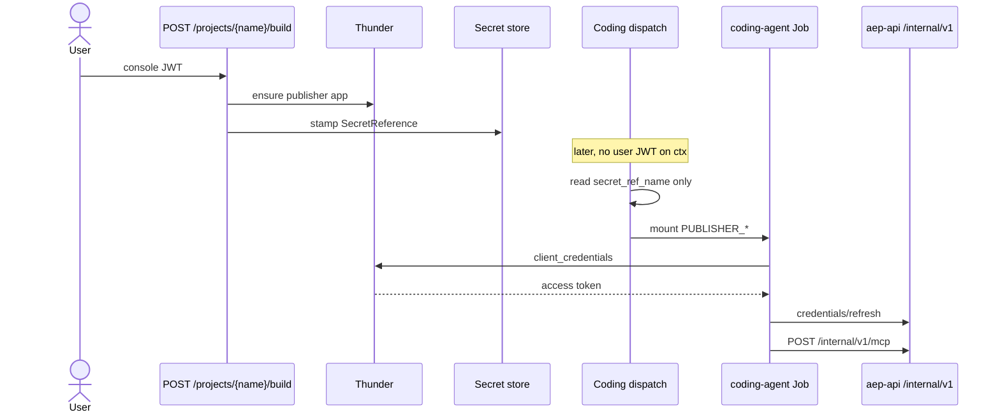
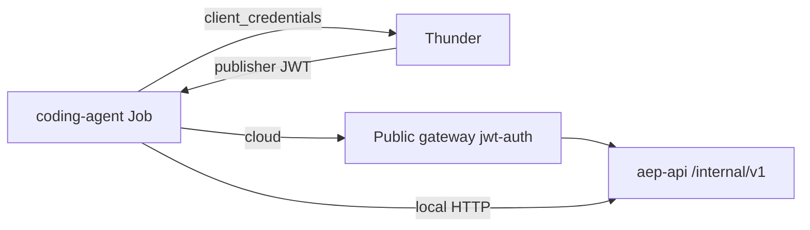
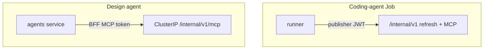

# The coding agent runs as an OpenChoreo job Component

A run cycle's agent is one **ephemeral OpenChoreo Component** in the milestone's
own project, created and destroyed through the same OC API the rest of the BFF
uses. There is one code path for local k3d and for cloud dev, and aep-api holds
no Kubernetes client: it cannot reach a Job or a pod directly, by construction.

## The unit is the run cycle

One Component per run cycle — never per milestone, never per Task. A Job's pod
template is immutable and OC prunes by id, so a name is never reused; the
Component is named from the cycle id (`ca-<…8>-<nonce>`, ≤63 chars), which makes
a dispatch resumable: every create in the chain treats `409 Conflict` as success
and re-fetches, so a dispatch that crashed halfway re-runs over the same names.

The chain is **Component → Workload (per-cycle env + secret-env refs) →
GenerateRelease → ReleaseBinding** on the project's `development` environment.
OC renders the `batch/v1 Job` into the project's `dp-…` release namespace and
materialises the cycle's ExternalSecrets from the org's secret store — the
platform writes no secret material, only references. SecretReference CRs that
a Workload `secretKeyRef`s must live in the same control-plane namespace as
that Workload/ReleaseBinding (locally the OC org, e.g. `default`); the vault
path stays `user-app-secrets/<org-base-ns>/<name>` and is a different
namespace from the CR.

## Callback auth

The coding-agent Job authenticates to aep-api as the org's **publisher
client** (Thunder confidential app `aep-publisher-{org}`). Local k3d and
cloud use this path. The Job's only platform credential is publisher CC
(`PUBLISHER_*`). Runner callbacks accept publisher `client_credentials`
tokens only.

`POST /projects/{projectName}/build` provisions the Thunder app and stamps
the SecretReference (`ProvisionPublisherForBuild`, actor `build-provision`)
while the console user JWT is still on ctx — Temporal dispatch has no user
JWT, so it cannot write SM-API. Rotate once if the Thunder app already
exists without `secret_ref_name`. Fail closed (503) if the secret write
fails or secrets delivery is off. Coding dispatch then reads
`secret_ref_name` only and mounts `PUBLISHER_CLIENT_ID` /
`PUBLISHER_CLIENT_SECRET`. An empty name does not create the OpenChoreo
Component; the run settles blocked (`publisher-credentials-missing`) instead
of spending the re-dispatch budget. `PUBLISHER_TOKEN_URL` is plain env, derived from
`PLATFORM_IDP_JWKS_URL` (`/oauth2/jwks` → `/oauth2/token`).

The runner mints at callback time and presents the same token for
**both** `credentials/refresh` and `POST /internal/v1/mcp`. A loopback MCP
proxy attaches a live bearer (SDK headers are static): `getToken()` uses the
5-minute CC renewal buffer, an HTTP 401 remints once, and a second 401 or a
remint failure exits the Job.

Cloud traffic still crosses the public gateway, whose jwt-auth only accepts
`iss=platform-idp`. That is why the Job presents a Thunder publisher token
(`iss=platform-idp`), not a BFF-signed identity JWT (`iss=aep-bff`). Local
compose has no such gateway; it still uses the publisher token.

The **design agent** is a different caller, not a second environment:
ClusterIP `AEP_API_INTERNAL_BASE_URL` with a BFF MCP token (`mcpForTurn`,
`aud=aep-api-mcp`). `AgentsScopedVerifier` dual-accepts that token **or** a
publisher JWT because those are two actors.

`EnsureOrgPublisher` on first protected deploy (`actor "deployment"`) still
swallows SM-API write errors: that path must not fail a deploy. Admin
**Rotate IDP client secret** is fail-closed: Thunder has already rotated, so
a failed mirror is an error.

## The type is per-org, and it is the billing key

The Component's type is a **namespaced `coding-agent` ComponentType**
(`workloadType: job`), seeded into the org's namespace at provisioning and
lazily re-seeded on the dispatch path, so an org that predates the rollout works
on first use. The re-seed CONVERGES: a stored type whose spec has drifted from
the shipped one is updated in place, because the stored copy is what validates
every dispatch — otherwise widening a parameter's bounds would reach new orgs
only and break the next dispatch of every existing one. Deliberately not a `ClusterComponentType` and not seeded through
wso2cloud's org-default-resources bootstrap: the BFF owns the template, so it
owns its upgrades.

The type pins the cost envelope rather than trusting callers: `backoffLimit: 0`
(the runner pushes commits and opens pull requests — a silent retry would repeat
side effects), `activeDeadlineSeconds` (a coding cycle passes 3h — it ends with a browser
verification wave — and a validation cycle 2h),
`ttlSecondsAfterFinished` as a backstop, and schema-bounded CPU/memory requests
and limits, where the schema enforces the ceiling so an out-of-bounds
per-dispatch override is rejected instead of silently clamped.

The type name is also what wso2cloud's entitlement gate keys on
(`job/coding-agent`, `coding-agent`). A create over the org's cap answers
**402**, and the platform reports the run **blocked, not failed**, with a message
naming the wait-or-cancel choice. There is no retry loop, and no code branches on
environment: the local path simply never 402s.

## Status comes from the pod, never from the binding

`ReleaseBinding.Ready` is **not trusted and must not be re-introduced as a
shortcut**: OC registers no health check for `batch/v1 Job`, so a binding reports
success while the Job is still running or has already failed. The watcher polls
the release binding's K8s resource tree and classifies from the Job's child
**Pod** phase. A pod that never reaches Running inside the startup grace fails
the cycle with a reason built from the pod and tree **events**, which is what
makes an image-pull failure, an unschedulable pod and a missing secret three
distinguishable answers instead of one timeout. Transient OC 5xx never fails a
cycle; only terminal pod state or a sustained 404 does. Watcher state is derived
from the cycle rows, so a BFF restart resumes without duplicating anything.

A zero exit is not completion: a succeeded pod leaves the cycle open, and the
**pull-request webhook** closes it through the supervisor's ordinary settle path.
Once the watcher has marked a cycle failed, a late webhook does not reopen it —
`ended_at` fences the row. The reverse is also fenced: a cycle that already
opened a pull request is never closed by a later pod failure.

Pod-outcome classification, startup grace, sustained-404 rule, and the
pull-request webhook interaction are spelled out in
[`cycle-status-and-logs.md`](cycle-status-and-logs.md).

## Two log planes, and a third state that is not an error

- **Live**, while the pod exists: the pod's own log, read through the OC API
  (`GetReleaseBindingK8sResourceLogs`) with the pod name taken from the resource
  tree. This is what the run progress stream serves.
- **Archive**, after the pod is gone: an observer query
  (`POST /api/v1/logs/query`) at component scope. Component-scope indexing
  resolves through the Component CR, so this answer exists **only while the
  Component is retained**.
- **Unavailable**: a cycle whose Component has been pruned has no log; the
  reader emits a single `logs_unavailable` progress line ("Logs for this cycle
  are no longer available.") rather than an empty stream. There is no Postgres
  copy of agent output — OpenChoreo observability is the log system, and a stored
  second copy would be a second truth to keep honest.

Reader mechanics, the `logs_truncated` banner, and legacy execution-row reads are
in [`cycle-status-and-logs.md`](cycle-status-and-logs.md).

## Retention, and the one case that deletes immediately

A finished cycle's Component is **retained** so its archive stays queryable, up
to `DefaultCodingAgentComponentRetention` (10), overridable per process with
`CODING_AGENT_COMPONENT_RETENTION` (local compose lowers it so prune is
observable without eleven cycles). Before each create, terminal Components past
the cap are pruned oldest-first. Retained Components still hold entitlement
slots, so the cap is a billing decision as much as a storage one, and an org
whose plan limit is below the retention cap sees dispatches blocked until older
cycles are pruned.

**Cancel deletes at once.** A cancel signal settles the run row on the existing
path; deleting the Component is what stops the pod mid-air and frees the slot,
so it does not wait for retention. **User-facing consequence:** a cancelled
cycle's agent log is gone with the Component (no archive, no live tail) — that
is intentional, not a capture bug. A cancelled cycle is quiet by design for the
watcher too: it recognises the deliberate deletion and never reports it as a
missing job. Cancel writes no `ExecCanceled` and mints no execution row — agent
work has none.

Every delete goes through the OC API. An out-of-band `kubectl` delete emits no
billing decrement, which is why no code path may hold a Kubernetes client, and
why deleting a project API-deletes its live cycle Components first.

## Visibility

Rendered objects carry `aep.wso2.com/internal: "true"` plus the cycle's identity
(`aep.wso2.com/milestone`, `aep.wso2.com/cycle`, `aep.wso2.com/run-name`) — a
cycle is milestone-scoped, so there is no task label — and the standard
`app.kubernetes.io/{managed-by,part-of,name}` set for operators. Listing filters
internal-marked Components **in the OC client**, so a future listing endpoint
inherits the filter instead of re-implementing it. Humans who do see an instance
read a dynamic display name: `Coding cycle — milestone #<n> <title>`, or
`Validation cycle — …` for a validation cycle.
