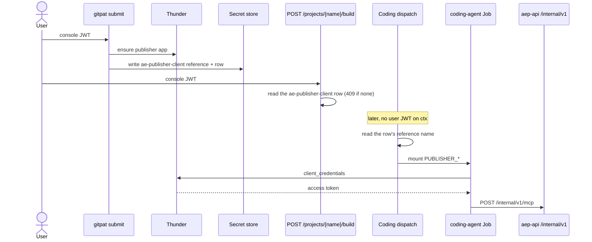
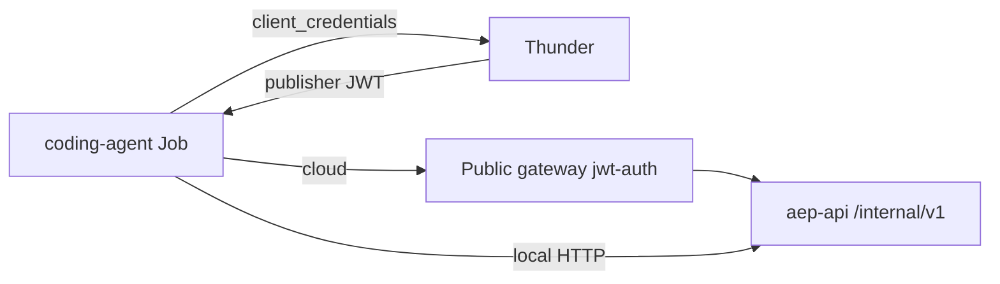
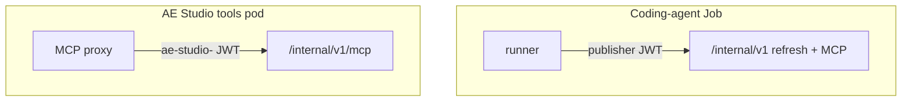

# The coding agent runs as an OpenChoreo job Component

A run cycle's agent is one **ephemeral OpenChoreo Component** in the milestone's
own project, created and destroyed through the same OC API the rest of the BFF
uses. There is one code path for local k3d and for cloud dev, and aep-api holds
no Kubernetes client: it cannot reach a Job or a pod directly, by construction.

## The unit is the run cycle

One Component per run cycle — never per milestone, never per Task. A Job's pod
template is immutable and OC prunes by id, so a name is never reused; the
Component is named from the cycle id (`ca-<…8>-<nonce>`, ≤63 chars), which makes
a dispatch resumable: every create in the chain treats `409 Conflict` as success
and re-fetches, so a dispatch that crashed halfway re-runs over the same names.

The chain is **Component → Workload (per-cycle env + secret-env refs) →
GenerateRelease → ReleaseBinding** into the project's **write target** (the root
of its own deployment pipeline), resolved once per dispatch before anything is
written. A project whose pipeline names none is refused before
`CreateComponent`, so no billed Component is minted; the run settles failed
(`no-write-target`) without spending the re-dispatch budget. The environment the
Job was bound into is recorded on the cycle (`run_cycles.environment`, beside
`model_host`), and the watcher, the feed, the log source and the archive
read the cycle there. So is the Component's UID (`run_cycles.component_uid`,
from the create reply; the 409 path re-reads it), which every observer read of
the cycle filters on. A cycle with none recorded (dispatched before the column
existed, or whose launch write failed) falls back to the project's write target
at read time, and says so in the log. OC renders the `batch/v1 Job` into the project's `dp-…` release namespace and
materialises the cycle's ExternalSecrets from the org's secret store — the
platform writes no secret material, only references. SecretReference CRs that
a Workload `secretKeyRef`s must live in the same control-plane namespace as
that Workload/ReleaseBinding (locally the OC org, e.g. `default`); the vault
path stays `user-app-secrets/<org-base-ns>/<name>` and is a different
namespace from the CR.

## Callback auth

The coding-agent Job authenticates to aep-api as the org's **publisher
client** (Thunder confidential app `aep-publisher-{org}`). Local k3d and
cloud use this path. The Job's only platform credential is publisher CC
(`PUBLISHER_*`). Runner callbacks accept publisher `client_credentials`
tokens only.

The publisher's credentials live only in vault, in the org's
`ae-publisher-client` reference, which the gitpat submit's client ensure
writes (the only writer). `POST /projects/{projectName}/build` only reads:
no `ae-publisher-client` row answers `409 publisher_credentials_missing`
("Reconnect GitHub to set up this organization's build credentials") before
a tag is cut, and nothing reaches Thunder. Coding dispatch reads the name
the row records and mounts `PUBLISHER_CLIENT_ID` /
`PUBLISHER_CLIENT_SECRET` from it. No row does not create the OpenChoreo
Component; the run settles blocked (`publisher-credentials-missing`) instead
of spending the re-dispatch budget. `PUBLISHER_TOKEN_URL` is plain env, derived from
`PLATFORM_IDP_JWKS_URL` (`/oauth2/jwks` → `/oauth2/token`).

```mermaid
sequenceDiagram
  actor User
  participant Submit as gitpat submit
  participant Thunder
  participant Store as Secret store
  participant Build as POST /projects/{name}/build
  participant Dispatch as Coding dispatch
  participant Job as coding-agent Job
  participant API as aep-api /internal/v1

  User->>Submit: console JWT
  Submit->>Thunder: ensure publisher app
  Submit->>Store: write ae-publisher-client reference + row
  User->>Build: console JWT
  Build->>Build: read the ae-publisher-client row (409 if none)
  Note over Dispatch: later, no user JWT on ctx
  Dispatch->>Dispatch: read the row's reference name
  Dispatch->>Job: mount PUBLISHER_*
  Job->>Thunder: client_credentials
  Thunder-->>Job: access token
  Job->>API: POST /internal/v1/mcp
```

The runner mints at callback time and presents the same token for
`POST /internal/v1/mcp` (git uses the org gitpat the Job mounts as `GITHUB_TOKEN`; there is no credentials/refresh). A loopback MCP
proxy attaches a live bearer (SDK headers are static): `getToken()` uses the
5-minute CC renewal buffer, an HTTP 401 remints once, and a second 401 or a
remint failure exits the Job.

Cloud traffic still crosses the public gateway, whose jwt-auth only accepts
`iss=platform-idp`. That is why the Job presents a Thunder publisher token
(`iss=platform-idp`), not a BFF-signed identity JWT (`iss=aep-bff`). Local
compose has no such gateway; it still uses the publisher token.

```mermaid
flowchart LR
  J[coding-agent Job] -->|client_credentials| T[Thunder]
  T -->|publisher JWT| J
  J -->|cloud| GW[Public gateway jwt-auth]
  GW --> API[aep-api /internal/v1]
  J -->|local HTTP| API
```

`POST /internal/v1/mcp` (`auth.MCPGate`) accepts the runner's credential, the
org's publisher client token, and the AE Studio tools pod's, its recorded
`ae-studio-<org>` client token. A token aep-api signs itself
(`aud=aep-api-mcp`) is refused (401). The two remote-git
tools are not on aep-api: the runner and the tools pod serve them in-process.

That gate is org-scoped, so the CODING runner has no cycle-scoped callback:
nothing on aep-api can refuse a coding agent because its cycle closed. For a
coding cycle the Job suspend (below) is the only fence against an agent
running for a closed cycle. The one cycle-scoped callback is the validation
runner's `GET /internal/v1/runs/{cycleId}/validation-context`, behind
`auth.RunnerAuthorizer`: the cycle must belong to the token's org (checked
first) and be open, and both refusals give the same 403 `cycle not found`, so
neither "closed" nor "another org's" is an oracle for which cycle ids exist. A
closed cycle logs `runner callback: cycle closed` with the cycle id only.

```mermaid
flowchart TB
  subgraph job [Coding-agent Job]
    J[runner] -->|publisher JWT| R["/internal/v1 refresh + MCP"]
  end
  subgraph studio [AE Studio tools pod]
    P[MCP proxy] -->|ae-studio-<org> JWT| C["/internal/v1/mcp"]
  end
```

A protected deploy only reads the org's IDP profile (its issuer); it never
creates or heals the publisher app. There is no user rotation of the
publisher secret.

## The type is per-org, and it is the billing key

The Component's type is a **namespaced `coding-agent` ComponentType**
(`workloadType: job`), seeded into the org's namespace at provisioning and
lazily re-seeded on the dispatch path, so an org that predates the rollout works
on first use. The re-seed CONVERGES: a stored type whose spec has drifted from
the shipped one is updated in place, because the stored copy is what validates
every dispatch — otherwise widening a parameter's bounds would reach new orgs
only and break the next dispatch of every existing one. Deliberately not a `ClusterComponentType` and not seeded through
wso2cloud's org-default-resources bootstrap: the BFF owns the template, so it
owns its upgrades.

One type serves both coding-agent runtimes. It carries a `runtime` parameter
(enum `claude-code | opencode`, default `claude-code`) that renders as the
`aep.wso2.com/runtime` label on the Job and on its pod, merged over
`metadata.labels` / `metadata.podSelectors` with `oc_merge` so the observer's
pod selectors stay intact. The pods otherwise differ only in their image, which
the Workload carries, so a second type would duplicate every pin below for one
string. The convergence above is what rolls a changed body out: the next
dispatch into an org whose stored type lacks the parameter updates it in place.

The type pins the cost envelope rather than trusting callers: `backoffLimit: 0`
(the runner pushes commits and opens pull requests — a silent retry would repeat
side effects), `activeDeadlineSeconds` (a coding cycle passes 3h — it ends with a browser
verification wave — and a validation cycle 2h),
`ttlSecondsAfterFinished` as a backstop, and schema-bounded CPU/memory requests
and limits, where the schema enforces the ceiling so an out-of-bounds
per-dispatch override is rejected instead of silently clamped.

The Job's CPU request is the type's `cpuRequest` default, set from `CODING_AGENT_CPU_REQUEST` (default `500m`; a positive CPU quantity such as `250m` or `0.5`, at most the `cpuLimit` default `3`; boot fails naming the key otherwise). The value is canonicalised (`0.5` and `500m` are one value). Unset or `500m` renders the schema unchanged; `1` (already in the enum) changes only the default; any other value becomes the default and is prepended to the enum. aep-api re-asserts the type on every dispatch, so a change reaches the next cycle. Memory is not tunable.

The TTL is rendered per Component from `CODING_AGENT_JOB_TTL` (default `600s`).
It is the only path that deletes a finished Job's pod with a propagation policy,
but OpenChoreo re-creates a TTL-deleted Job from the binding it still renders.
So the type also carries one environmentConfig, `suspend` (boolean, default
false), rendered on `Job.spec.suspend`: once a cycle is over its binding gets
`componentTypeEnvironmentConfigs.suspend = true` through
`ComponentClient.SuspendJobBinding`, and the re-created Job is born suspended
and never runs the runner again. That verb is update-only (a missing binding is
`ErrNotFound`, never re-created, unlike `ApplyReleaseBinding`). OpenChoreo
renders a binding from its release's frozen ComponentType snapshot and accepts
any key on the binding, so a release cut before the schema would take the write
and leave the Job live. The verb therefore reads the bound release first and
answers `ErrSuspendUnsupported`, writing nothing, when its snapshot has no
`suspend` environmentConfig. A `400` (`ErrBadRequest`) or `422` on the write is
a malformed request, never a legacy release.

The pod-truth watcher is the caller at a natural end: the first tick that sees
the cycle's pod Succeeded or Failed captures its usage, THEN suspends, and
stamps `job_suspended_at` so no later tick asks again. A gone binding
(`ErrNotFound`) is stamped too, since there is nothing left to suspend.
`ErrSuspendUnsupported` is logged (`codingagent.job_suspend_unsupported`) and
NOT stamped, leaving the Job to its TTL; any other error is retried next tick.
Only a suspend that took effect logs `codingagent.job_suspended` (`cause` =
`terminal`). Once a cycle is suspended or closed, a snapshot with no pod is the
expected state, never an absent-pod or startup verdict.

The watcher also suspends an agent that never started. Its deadline is
`RunCycle.StartupDeadline`, which the run view shows too. The startup grace
(`delivery.CycleStartupGrace`, 10 min) counts from `startup_clock_at`: the
creation of the attempt's pod, or before it its Job, as the watcher first sees
it in the resource tree, and never earlier than `dispatched_at` (`updated_at`
on a row without it), because a re-dispatch reuses the Job and its old
creation time. From attempt 2 a Job created more than `dispatchClockSkew`
(30 s) before `dispatched_at` is attempt 1's, complete, and starts no pod:
it counts as no Job yet (`NotYetApplied`, apply cap), and the Job OpenChoreo
re-creates after its TTL starts the clock. That keeps `CODING_AGENT_JOB_TTL`
plus OpenChoreo's re-create lag under the 30-min cap (600 s by default). Cloud
OpenChoreo applies a release 8-13 min after it is requested, which is why the
grace does not count from the dispatch. The clock
is written once per attempt, fenced on `attempts`, `startup_clock_at IS NULL`
and the cycle being open, so a tick that read attempt N writes nothing after a
re-dispatch to N+1; it decides the deadline only once written. Until it is,
the attempt is bounded by the apply cap (`delivery.CycleApplyCap`, 30 min from
`dispatched_at`), past which a tree with no Job closes the cycle
`startup_failed:not_applied`. Past the deadline a pod not yet Running closes
the cycle `startup_failed:<reason>[: <message>]`; the replica whose close won
then suspends the Job binding (`cause` = `startup_failed`), whatever the pod
is doing, `not_applied` included: the suspend is a binding patch, so a Job
OpenChoreo applies later is created suspended.
Kubernetes deletes a suspended Job's active pods, Pending ones included, so
the pod that would schedule once the cluster has room never starts an agent
for the closed cycle. Any later tick that finds a cycle closed
`startup_failed:*`, unsuspended, with a Pending or Running pod suspends it too:
that covers a close won by another replica, a restart between the close and
the suspend, and rows closed before this rule. A terminal pod takes the
terminal path above. The run then settles `failed` / `agent-start-failed`
(dev and validation runs alike), not `redispatch-budget`: one dispatch was
made and nothing ran.

While an open cycle's pod is Pending with a stuck waiting reason
(`Unschedulable`, `ImagePullBackOff`, `CreateContainerConfigError`, anything
but the normal `ContainerCreating` / `PodInitializing`), the watcher records it
on the row (`startup_wait_reason`, `startup_wait_since`), writing only when the
reason changes and logging `codingagent.startup_wait {cycle, component,
reason}`. While the tree has no Job and no clock is written, the reason is the
platform's own `NotYetApplied`; the Job appearing clears it. A pod that runs,
or is Pending and no longer stuck, clears it; `NoteDispatch` clears it and
`startup_clock_at` for a new attempt. None of these writes moves `updated_at`.
The run view projects it as `RunCycleView.startupWait {reason, since, failsAt}`
on an open cycle only, `failsAt` = `StartupDeadline`, so the console shows the
wait and its deadline without a cluster read.

The stamp belongs to the attempt, not the cycle. A landing-timeout re-dispatch
reuses the cycle's Component (its name is stable per cycle and the 409 is
coalesced), so `NoteDispatch` stamps `dispatched_at` and clears
`job_suspended_at` and `pod_gone_at` in the write that moves `job_ref`. Only
after that fenced write has moved an OPEN row does the supervisor's
`NoteCycleDispatch` call `ComponentClient.ResumeJobBinding`: the update-only
inverse of the suspend, which sets `suspend` back to false when attempt 1 left
it true (a binding that is not suspended is one read and no write). A cycle
closed or cancelled in between is never un-suspended. A legacy release
(`ErrSuspendUnsupported`) has nothing to undo. Any other failure is logged, not
retried (a retry would count a second attempt): the Job stays suspended and
the watcher's startup grace reports the attempt.

Attempt 1's finished pod stays in the reused binding's tree until its Job's
TTL. From attempt 2 on, the watcher ignores a TERMINAL pod that was created and
finished more than `dispatchClockSkew` (30 s) before `dispatched_at`: it is neither
the attempt's terminal pod (no suspend, no usage) nor its pod for the startup
grace, and the in-memory absent/seen facts are kept per attempt. A Running or
Pending pod from before the dispatch (attempt 1's agent outliving the 2 h
landing timeout under its 3 h deadline) is the same Job still in flight, which
cannot start a second pod, so it is watched as the current attempt's: present
for the grace, captured and suspended when it ends (its finish time is after
the dispatch).

`activeDeadlineSeconds` is also handed to the RUNNER, as
`AEP_RUN_DEADLINE_SECONDS`, and that is one number with two consumers on
purpose. The cluster's deadline is a backstop: when it passes the pod is killed
mid-sentence and explains nothing — no result line, no watchdog snapshot, and for
a run with background subagents no way to tell "still working" from "wedged".
The runner's own guard fires a margin earlier, stops the tasks still live and
settles with a reason on the feed. The margin is the runner's and is deliberately
not stated here; duplicating it would let the two drift apart silently.

## The org's runtime and model connection ride on the same env

`AEP_AGENT_RUNTIME` carries the organization's `agents` runtime (ADR-0028) and
`AEP_AGENT_MODEL` its model connection's model
([ADR-0038](../../../../../../docs/decisions/ADR-0038-an-organization-has-one-model-connection.md))
onto every cycle, beside the credential ref. The runtime is read FIRST, because
it decides the credential: `ResolveCodingCredential(org, runtime)` returns the org's Claude
subscription only when the runtime is Claude Code, and its connection key
otherwise, with the connection that key is for; exactly one credential reaches
the run (ADR-0036). A subscription whose token was never recorded in vault
resolves to the connection's key, with a WARN, rather than failing the
dispatch. The organization domain answers with a KIND, never a
variable name: `modelEnv` (`model_env.go`) is the one mapping onto the runner's
contract. The connection rides as plain env (`AEP_MODEL_FORMAT`,
`AEP_MODEL_BASE_URL`, `AEP_MODEL_AUTH_SCHEME`, `AEP_MODEL_WEB_SEARCH`, and
`AEP_MODEL_CONTEXT_WINDOW` / `AEP_MODEL_OUTPUT_LIMIT` where the connection states
them, never on `api.anthropic.com`), and the credential as one secret ref:
`CLAUDE_CODE_OAUTH_TOKEN` for a subscription, `ANTHROPIC_API_KEY` for a key on
Anthropic's own API, `AEP_MODEL_API_KEY` for a key on any other host. Each runtime adapter maps that to what its binary reads. They
are **copied, not referenced**: a
change applies from the next cycle, because a run that re-read the setting halfway through would leave a feed
whose model names disagree with the tokens they were billed for. The dispatch
also writes the connection's host on the cycle, so its usage is priced on
`(host, model)`. An org that never chose a runtime gets the platform default, but a
resolver that ERRORS fails the dispatch rather than falling back, since the org
did choose something and launching on the default would bill it for a runtime
it moved off without ever saying so. An org with no model connection fails the
dispatch too: there is no platform key to fall back to.

The runtime also picks the image: `AGENT_RUNNER_IMAGE` for Claude Code,
`AGENT_RUNNER_IMAGE_OPENCODE` for OpenCode (two tags from one Dockerfile). Neither
has a built-in default; an OpenCode cycle with no OpenCode image fails its
dispatch naming the variable rather than starting on an image with no OpenCode
binary. Such an installation does not offer OpenCode on `/config` either, so
only an org that chose it before the image went missing reaches this failure. The dispatcher stamps the same runtime as the Component's `runtime`
parameter and as the `aep.wso2.com/runtime` label on the Component and Workload.
Which credential it mounts is the organization domain's answer for the run's
runtime (`ResolveCodingCredential`): an OpenCode run is always handed the API key
([ADR-0036](../../../../../../docs/decisions/ADR-0036-the-coding-credential-is-a-subscription.md)).

The type name is also what wso2cloud's entitlement gate keys on
(`job/coding-agent`, `coding-agent`). A create over the org's cap answers
**402**, and the platform reports the run **blocked, not failed**, with a message
naming the wait-or-cancel choice. There is no retry loop, and no code branches on
environment: the local path simply never 402s.

## Status comes from the pod, never from the binding

`ReleaseBinding.Ready` is **not trusted and must not be re-introduced as a
shortcut**: OC registers no health check for `batch/v1 Job`, so a binding reports
success while the Job is still running or has already failed. The watcher polls
the release binding's K8s resource tree and classifies from the Job's child
**Pod** phase. A pod that never reaches Running inside the startup grace fails
the cycle with a reason built from the pod and tree **events**, which is what
makes an image-pull failure, an unschedulable pod and a missing secret three
distinguishable answers instead of one timeout. Transient OC 5xx never fails a
cycle; only terminal pod state or a sustained 404 does. Watcher state is derived
from the cycle rows, so a BFF restart resumes without duplicating anything.

A zero exit is not completion: a succeeded pod leaves the cycle open, and the
**pull-request webhook** closes it through the supervisor's ordinary settle path.
Once the watcher has marked a cycle failed, a late webhook does not reopen it —
`ended_at` fences the row. The reverse is also fenced: a cycle that already
opened a pull request is never closed by a later pod failure.

Pod-outcome classification, startup grace, sustained-404 rule, and the
pull-request webhook interaction are spelled out in
[`cycle-status-and-logs.md`](cycle-status-and-logs.md).

## Two log planes, and a third state that is not an error

- **Live**, while the pod exists (whatever its Job's state): the pod's own
  whole log, read through the OC API (`GetReleaseBindingK8sResourceLogs`) with
  the pod name taken from the resource tree.
- **Archive**, after the pod is gone: an observer query
  (`POST /api/v1/logs/query`) filtered on the cycle's Component UID
  (`run_cycles.component_uid`) — component scope while the Component's release
  binding resolves, project scope once the settler has deleted it. The lines
  stay readable for the observability plane's log retention
  (`OBSERVER_LOG_RETENTION`, default 72h).
- **Unavailable**: a cycle past that retention, or one with no Component UID,
  has no log; the reader emits a single `logs_unavailable` line rather than an
  empty stream. There is no Postgres
  copy of agent output — OpenChoreo observability is the log system, and a stored
  second copy would be a second truth to keep honest.

Reader mechanics, the `logs_truncated` banner, and legacy execution-row reads are
in [`cycle-status-and-logs.md`](cycle-status-and-logs.md).

## Settle: the Component is deleted once no pod is left

Why the platform suspends first and deletes at settle is
[ADR-0049](../../../../../../docs/decisions/ADR-0049-a-finished-runs-feed-is-read-from-the-observer.md);
the lifecycle at a glance is in
[cycle-status-and-logs.md](cycle-status-and-logs.md#the-lifecycle-of-a-cycles-job).

A closed cycle's Component still holds an entitlement slot, and OC re-creates
its Job after the TTL, so `ComponentSettler` (a watcher, one pass a minute over
at most 200 closed cycles from `ListSettling`) deletes it at settle. The
delete waits for all of:

1. the binding still resolves; `ErrNotFound` means someone else deleted the
   Component, recorded with `MarkComponentDeleted` and nothing more;
2. no pod of ANY attempt in the binding's tree (the watcher's leftover rule does
   not apply: deleting with a pod orphans it);
3. `job_suspended_at` set (by the watcher at the first terminal pod, the cancel,
   or the settler's backstop), so a Job re-created meanwhile is born suspended.
   A legacy release (`ErrSuspendUnsupported`) cannot suspend: it is deleted on
   1, 2 and 4 alone, so it is still never deleted while a pod exists;
4. a "no pod" read noted on an earlier pass (`pod_gone_at`), and
   `CODING_AGENT_SETTLE_GRACE` (5m) elapsed since the LATER of that note and
   `job_suspended_at`; any pass that sees a pod clears the note (a failed
   clear stops the row deciding anything until it lands, and a note written
   before this process started is cleared and re-noted, since that memory
   does not survive a restart). The resource tree
   can answer 200 and empty under load, so one empty read is never evidence.

Then `DeleteComponent` by name (404 is success; a pre-UID row has no UID) and
`codingagent.component_deleted {cycle, component, componentUid}`. A finished
run's Component goes about TTL + grace + one pass after its pod finished; a
cancelled run's about grace + 30 s after the cancel. The settle does not wait
on usage: the watcher attempts the capture from the pod's log at the first
terminal pod, and a failed usage write is logged, not retried.

**The backstop** suspends a closed cycle's Job nobody suspended
(`codingagent.job_suspended`, `cause` = `backstop`): on sight for a terminal
pod; for no pod only when an earlier pass also saw none (one empty read can
hide a Running pod); and for a `Running`/`Pending` pod at once unless the
cycle merged. A merge-closed cycle's live pod is left to the watcher until
`ended_at` + 3h10m (the deadline ceiling + 10 min), so its last line and usage
are kept. Every other close is suspended at once, whatever its pod is doing: a
cancel (its cancel-time suspend failed), a `startup_failed:*` close (its agent
never started), and a cycle the run closed with nothing merged (a spent
budget, a conflict, no work, a landing timeout), so no Pending pod starts an
agent on a closed cycle when the cluster has room. The trade: an agent still
running on such a close is stopped mid-run, and its usage line, if any, is not
captured. A suspend that keeps failing (for example a binding naming a
missing release) leaves the row settling and never deleted.

**Fair paging.** Every visited row is stamped `settle_checked_at` before
anything else, and `ListSettling` orders never-checked first, then least
recently checked (partial index `ix_run_cycles_settling`), so rows that never
settle cannot starve a cycle that closes later. The JobWatcher skips a cycle
whose Component is deleted.

**Cancel suspends, then settles.** `CycleReaper.ReapRunCycle` (reached from
`runread.Commands.Cancel` after the run's cancel stamp and the signal) closes
the cycle as cancelled (`FinishCancelled`, `agent_reason = cancelled`, no pull
request fence), THEN suspends its Job binding, THEN stamps `job_suspended_at`
and logs `codingagent.job_suspended` (`cause` = `cancel`). Suspending the Job
terminates its pod after the runner's 30 s SIGTERM grace, and the Job OC
re-creates after its TTL is born suspended. Cancel deletes nothing: the
Component, and the billing slot it holds, goes at settle. A gone binding
(`ErrNotFound`) is stamped and not announced; a legacy release
(`ErrSuspendUnsupported`) still closes cancelled but is NOT stamped, so the
settler knows the suspend did not apply; any other suspend failure is logged by
the cancel and left to the settler's backstop. A cycle another path already
closed is still suspended.

The close comes first because it is the fence a re-dispatch already in flight
reads: `NoteDispatch` moves only an open row, and `NoteCycleDispatch` resumes a
binding only after that write moved one. A dispatch whose write landed before
the close can still resume after the cancel's suspend, so `NoteCycleDispatch`
re-reads the run's cancel stamp AFTER its resume and, when it is set, suspends
the binding again. The cancel stamps the run before it suspends, so the last
write to the binding is always a suspend. The same read stops a first attempt
whose dispatch the reap could not see (the cycle had no `job_ref` yet). Cancel
writes no `ExecCanceled` and mints no execution row — agent work has none.

Every delete goes through the OC API. An out-of-band `kubectl` delete emits no
billing decrement, which is why no code path may hold a Kubernetes client, and
why deleting a project API-deletes its live cycle Components first.

## Visibility

Rendered objects carry `aep.wso2.com/internal: "true"` plus the cycle's identity
(`aep.wso2.com/milestone`, `aep.wso2.com/cycle`, `aep.wso2.com/run-name`) — a
cycle is milestone-scoped, so there is no task label — and the standard
`app.kubernetes.io/{managed-by,part-of,name}` set for operators. Listing filters
internal-marked Components **in the OC client**, so a future listing endpoint
inherits the filter instead of re-implementing it. Humans who do see an instance
read a dynamic display name: `Coding cycle — milestone #<n> <title>`, or
`Validation cycle — …` for a validation cycle.

## Two model credentials on one pod

A cycle mounts the model credential the organization's coding runs bill
(ADR-0036) — under the one variable `modelEnv` names, never two. That is the
credential the agent's own session authenticates with.

It also mounts the org's **connection** key as `AEP_EVAL_MODEL_API_KEY`,
for the agent-evaluation step a build runs before opening an ai-agent's PR. That
step needs a model twice over — for the generated agent it boots and for the LLM
judge that grades it — and both are API calls, so the credential has to be an API
key. The connection key always is; the coding one may be a subscription token
that authenticates neither.

The connection the key is for rides beside it as plain values, on every format:
`AEP_EVAL_MODEL_FORMAT`, `AEP_EVAL_MODEL_BASE_URL`, `AEP_EVAL_MODEL_NAME` and
`AEP_EVAL_MODEL_AUTH_SCHEME` (`evalModelEnv`). The harness boots the agent and
runs its judge on the same connection the deployed agent will use. The five are
set together or not at all: a URL with no key reaches a host the harness cannot
authenticate against, and a key with no format would be read as Anthropic's.

The separate variable is not decoration. `ANTHROPIC_API_KEY` belongs to Claude
Code, which ranks it above `CLAUDE_CODE_OAUTH_TOKEN`, so mounting the evaluation
key there would move a subscription org's whole coding session onto it — the
silent mis-bill ADR-0036 keeps out.

A dispatch whose connection key cannot be resolved for evaluation goes out
**without** those variables and the run proceeds: evaluation reports, it never fails a build, and a missing key must
not cost an org a delivery. That is the one credential here whose absence is not
a dispatch failure — `evaluationKeyRef` logs it rather than returning an error,
because "the agent never became ready" is otherwise a puzzling thing to read in
a build report.

### Why the pod also carries `AEP_EVAL_KEY_MANAGED`

Every dispatch sets `AEP_EVAL_KEY_MANAGED=1` — a plain env var, not a
credential, and set whether or not an evaluation key was resolved. It is a
**declaration of ownership**: on this pod the platform decides the evaluation
credential, so if `AEP_EVAL_MODEL_API_KEY` is not here, this run has none.

Without it the harness cannot read a pod correctly. Outside one —
a developer in the monorepo — `ANTHROPIC_API_KEY` simply is "the key", and the
harness falls back to it. On a pod that same name holds the **coding**
credential, which may be the org's Claude subscription. An org whose
subscription is live while its connection key's vault reference is not (a failed
mirror) is the case that makes this concrete: the dispatch succeeds on the
subscription, `KeyRef` finds nothing, and an unconditional fallback would then grade agents on the
subscription token — which cannot authenticate an API call — quietly, and
contradicting what this note says happens. The declaration is what makes the
documented behaviour the actual one.

It is set unconditionally on purpose. A marker that appeared only alongside the
key would carry no information: the case it exists for is exactly the dispatch
that has no key to mount. And it is a variable of the platform's own rather than
a reused one — `AEP_TASK_ID` would have been the obvious candidate, but
`local/run-local.sh` mints one for every local run, so keying on it would
suppress the fallback in the one place the fallback is the only path to a key.
