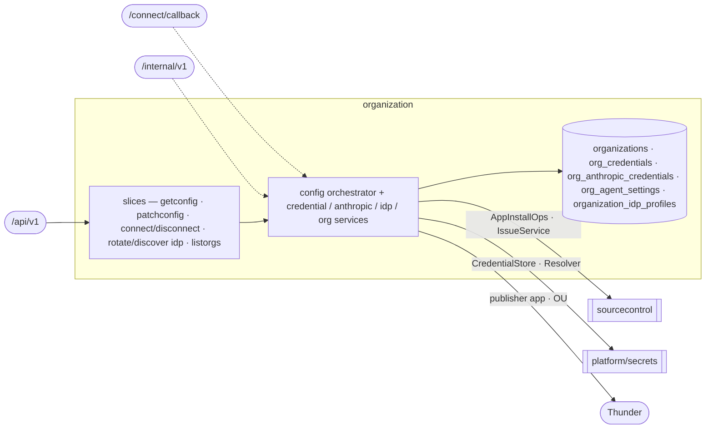

# organization — Organization Onboarding & Settings

> **L2 · a domain.** Part of the [aep-api architecture](../../README.md).

Bring a tenant org onto the platform (JIT onboarding + the phantom-OU trust guard) and own every
per-org, org-keyed record that configures its integrations — GitHub credential, the AI agents card
(Anthropic key, model, coding runtime, Claude subscription), IDP publisher — all fronted by the
consolidated `/config` resource.

## Slices
| Slice | Use-case | Entry |
|---|---|---|
| `getconfig` `patchconfig` | read / atomic multi-section write of the org config | `GET`+`PATCH .../config` |
| `connectgithub` `disconnectgithub` | start GitHub App connect / disconnect cascade | `POST .../config:connect-git-provider` etc. |
| `rotateidp` `discoveridp` | rotate the publisher client secret / OIDC discovery | `POST .../config:rotate-idp-secret` etc. |
| `listorgs` | enumerate orgs (tenant-gate carve-out — no org ctx) | `GET /organizations` |

*Flat in the domain root, outside the slices: the credential / anthropic / agent-settings / idp
services, the raw connect-callback controller, and the S2S credentials-refresh.*

## Ports
| Port | Dir | Peer · contract |
|---|---|---|
| `AppInstallOps` · `IssueService` | needs | `sourcecontrol` — App/PAT probes, disconnect issue cascade |
| `CredentialStore` · `Resolver` · `AppTokenMinter` | needs | `platform/secrets` — sealed git-token/anthropic store, credential resolution |
| `thundersvc` · `secretmanagersvc` | needs | publisher-app CRUD + OU check · secret-ref mirror |
| `OrganizationService` · `CredentialService` · `AnthropicCredentialService` · `IDPService` | offers | `delivery` (coding identity/key/publisher) · `sourcecontrol` (credential resolution) |
| `AgentSettingsService` | offers | `delivery` (the run's model + runtime) · the app root (the spec agents' per-turn model) |
| `CredentialsRefreshService` | offers | the S2S runner-refresh op (edge projects it onto `igen.RefreshResponse`) |

## Owns
- `organizations` (+ `thunder_org_uuid`, `llm_disconnected_at`), `org_credentials`,
  `org_anthropic_credentials` (keyed `(oc_org_id, role)` — the `default` API key and the optional
  `coding` Claude subscription), `org_agent_settings` (one row per org, absent = the platform defaults),
  `organization_idp_profiles` + `idp_audit_events` — gorm + entities in this domain (`entity_*.go` over
  `repository_*.go`), single write-authority.

## Invariants — don't break
- **The phantom-OU trust guard** (`ouIsTrustworthy`): reject a JWT `ouId` ONLY when a wired validator
  positively reports it does not exist; empty id / no validator / transient error all fail-open. A phantom
  OU poisons `wc-` namespace derivation + the publisher OU binding. Both write paths are guarded.
- **This domain is FAIL-LOUD**, not nil-tolerant: a nil collaborator panics, unlike sourcecontrol's
  503 — the edge assigns it directly, no `OrEmpty`.
- The `/config` PATCH is an **atomic multi-section** apply; sections are three-state `patch.Field`.
- **The AI agents card** (`llm` + `agents`, [ADR-0036](../../../../docs/decisions/ADR-0036-the-coding-credential-is-a-subscription.md)):
  - One save is ONE transaction under the per-org `org_anthropic:<org>` advisory lock, covering the
    credential rows, `org_agent_settings` and the `org_secrets` bytes (`repository_agents_card.go`).
    A failure anywhere writes nothing. `AgentSettingsService` is the only writer of credential rows.
  - One rule, judged on the state the patch leaves (`judgeCard`), before the probes and again in the
    transaction: a Claude subscription needs `claude-code` and a connected API key. `opencode`,
    `llm: null` and `agents: null` delete the token in the same save; a token the end state cannot
    use, or a blank key or token, is refused on its section.
  - The `default` role holds an API key only, the `coding` role a subscription token only (CHECK
    `org_anthropic_credentials_role_kind`; `ValidateKey` refuses the wrong kind before any probe).
  - `agents` is never null on the wire: the platform defaults until someone chooses, `updatedBy`
    telling the two apart. `null` on the PATCH resets (row and token deleted); omitted fields keep
    the stored value. `AgentRuntimes` / `AgentModels` are pinned against the contract's enums.
  - A runtime is never substituted. `agents.model` is the one model every agent uses: the spec
    agents resolve it per turn, a coding run copies it at dispatch.
  - The `AgentModel` enum is the set the platform can PRICE: offering a model is a `model_rates` row
    and a contract change together (`modelcost.SumCost` is all-or-nothing per cycle).
  - `llm_disconnected_at` is the only trace of a disconnected key; projected as `llmDisconnectedAt`
    while `llm` is null, cleared by the next key save.
  - The SM-API copy is mirrored after commit, best-effort. A credential save clears the row's
    `secret_ref_*` triplet, so a failed mirror fails dispatch closed instead of mounting the previous
    credential; a deleted credential's copy is deleted after commit, and an orphaned copy is
    accepted (nothing reads it, the next save of that role overwrites it).
  - Exactly one credential variable reaches a coding run: the persisted `credential_kind` picks
    `ANTHROPIC_API_KEY` xor `CLAUDE_CODE_OAUTH_TOKEN`. `ResolveCodingSecretRef(ctx, org, runtime)` is
    the single statement of which: the subscription only on `claude-code`, else the API key, failing
    closed on an unusable subscription. Every other reader is default-only.
- **Publisher SecretReference for coding Jobs is fail-closed on `POST /build`.**
  `ProvisionPublisherForBuild` (actor `build-provision`) ensures the Thunder publisher app and stamps
  `secret_ref_name` while the console JWT is on ctx. A missing or disabled `SecretRefWriter` returns
  an error (Build 503) and does not touch Thunder. `EnsureOrgPublisher` on the deployment path still
  swallows SM-API errors. Coding dispatch reads `secret_ref_name` only.
- **`OrgCatalogVaultKey` reconstructs a Registered External's org-catalog vault path from the
  request JWT `ouId`** — a read, not a second write. Used after aep-api restart when the
  process-local value plane is empty (ADR-0021). A missing `ouId` cannot invent a path.
- Org config wire types (`ConfigProjection`/`ConfigPatch`/`*Projection`) are hand-written pure DTOs in
  `models/` (codegen can't express them) — referenced directly, **not** a wire/domain split.
- The `ListOrganizations` op is the one tenant-gate carve-out (it carries no org context). Platform-wide
  rules (tenant gate, secrets fence) → [../../README.md](../../README.md).
