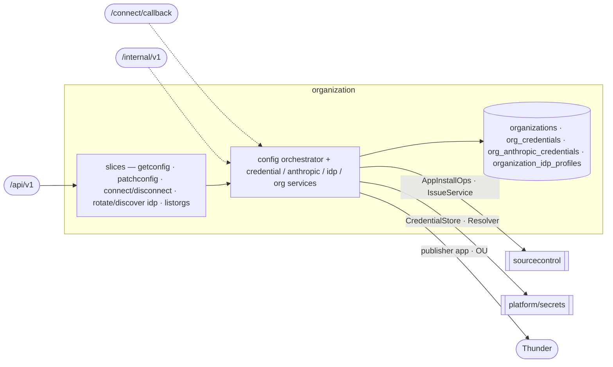

# organization — Organization Onboarding & Settings

> **L2 · a domain.** Part of the [aep-api architecture](../../README.md).

Bring a tenant org onto the platform (JIT onboarding + the phantom-OU trust guard) and own every
per-org, org-keyed record that configures its integrations — GitHub credential, Anthropic key, IDP
publisher — all fronted by the consolidated `/config` resource.

## Slices
| Slice | Use-case | Entry |
|---|---|---|
| `getconfig` `patchconfig` | read / atomic multi-section write of the org config | `GET`+`PATCH .../config` |
| `connectgithub` `disconnectgithub` | start GitHub App connect / disconnect cascade | `POST .../config:connect-git-provider` etc. |
| `rotateidp` `discoveridp` | rotate the publisher client secret / OIDC discovery | `POST .../config:rotate-idp-secret` etc. |
| `listorgs` | enumerate orgs (tenant-gate carve-out — no org ctx) | `GET /organizations` |

*Still flat in the domain root (not carved into slices): the credential / anthropic / idp lifecycle
services, the raw connect-callback controller, and the S2S credentials-refresh.*

## Ports
| Port | Dir | Peer · contract |
|---|---|---|
| `AppInstallOps` · `IssueService` | needs | `sourcecontrol` — App/PAT probes, disconnect issue cascade |
| `CredentialStore` · `Resolver` · `AppTokenMinter` | needs | `platform/secrets` — sealed git-token/anthropic store, credential resolution |
| `thundersvc` · `secretmanagersvc` | needs | publisher-app CRUD + OU check · secret-ref mirror |
| `OrganizationService` · `CredentialService` · `AnthropicCredentialService` · `IDPService` | offers | `delivery` (coding identity/key/publisher) · `sourcecontrol` (credential resolution) |
| `CredentialsRefreshService` | offers | the S2S runner-refresh op (edge projects it onto `igen.RefreshResponse`) |

## Owns
- `organizations` (+ `thunder_org_uuid`), `org_credentials`, `org_anthropic_credentials`
  (keyed `(oc_org_id, role)` — one row per `default` / `coding` Anthropic credential),
  `organization_idp_profiles` + `idp_audit_events` — gorm + entities in this domain (`entity_*.go` over
  `repository_*.go`), single write-authority.

## Invariants — don't break
- **The phantom-OU trust guard** (`ouIsTrustworthy`): reject a JWT `ouId` ONLY when a wired validator
  positively reports it does not exist; empty id / no validator / transient error all fail-open. A phantom
  OU poisons `wc-` namespace derivation + the publisher OU binding. Both write paths are guarded.
- **This domain is FAIL-LOUD**, not nil-tolerant: a nil collaborator panics (its pre-migration handlers had
  no nil guard), unlike sourcecontrol's 503 — the edge assigns it directly, no `OrEmpty`.
- The `/config` PATCH is an **atomic multi-section** apply; sections are three-state `patch.Field`.
- **The coding-agent Anthropic credential is an OVERRIDE, never a peer** (ADR-0016). A `coding` row may
  exist only while an active `default` row does, and disconnecting the default cascades it away — so
  `llm=null, codingLlm=set` is unrepresentable. Its ABSENCE is what "reuse the org's key" means; no
  column stores a mode, because one could disagree with row presence. `codingLlm: null` therefore means
  *reuse*, not *not connected* — the one section whose null differs from the rest.
- **Exactly one credential variable reaches a coding run.** `credential_kind` (`api_key` |
  `oauth_token`) is persisted, not re-derived — dispatch reads the row and never the secret bytes — and
  picks `ANTHROPIC_API_KEY` xor `CLAUDE_CODE_OAUTH_TOKEN`. Claude Code ranks the former above the
  latter, so mounting both would silently ignore an org's subscription token. An `oauth_token` is
  coding-only (CHECK-enforced): the design agent is an AI SDK call and cannot present a bearer token.
- `ResolveCodingSecretRef` is the **single** statement of the coding→default fallback, and it fails
  closed: a configured-but-unusable coding credential aborts the dispatch rather than quietly billing
  the default key. Every other reader (`EffectiveKey`, the RCA push) is default-only by construction.
- **Publisher SecretReference for coding Jobs is fail-closed on `POST /build`.**
  `ProvisionPublisherForBuild` (actor `build-provision`) ensures the Thunder publisher app and stamps
  `secret_ref_name` while the console JWT is on ctx. A missing or disabled `SecretRefWriter` returns
  an error (Build 503) and does not touch Thunder. `EnsureOrgPublisher` on the deployment path still
  swallows SM-API errors. Coding dispatch reads `secret_ref_name` only.
- Org config wire types (`ConfigProjection`/`ConfigPatch`/`*Projection`) are hand-written pure DTOs in
  `models/` (codegen can't express them) — referenced directly, **not** a wire/domain split.
- The `ListOrganizations` op is the one tenant-gate carve-out (it carries no org context). Platform-wide
  rules (tenant gate, secrets fence) → [../../README.md](../../README.md).
