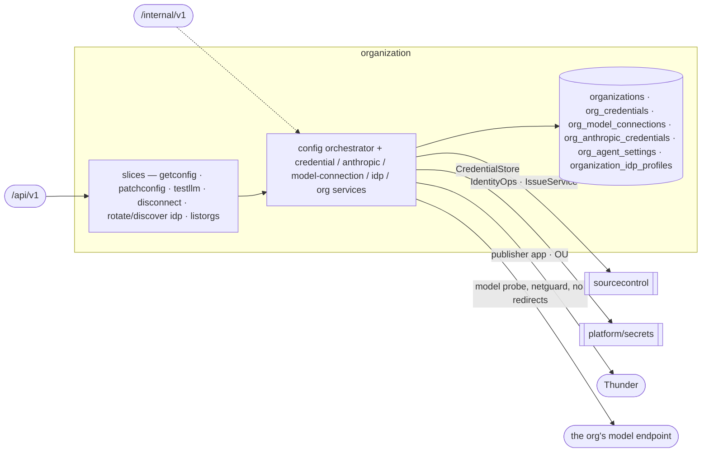

# organization — Organization Onboarding & Settings

> **L2 · a domain.** Part of the [aep-api architecture](../../README.md).

Bring a tenant org onto the platform (JIT onboarding + the phantom-OU trust guard) and own every
per-org, org-keyed record that configures its integrations — GitHub credential, the AI agents card
(the model connection, coding runtime, Claude subscription), IDP publisher — all fronted by the
consolidated `/config` resource.

```mermaid
flowchart LR
  API(["/api/v1"]) --> SL
  S2S(["/internal/v1"]) -.-> CORE
  subgraph organization
    SL["slices — getconfig · patchconfig · testllm · disconnect · rotate/discover idp · listorgs"]
    CORE["config orchestrator + credential / anthropic / model-connection / idp / org services"]
    SL --> CORE
    CORE --> DB[("organizations · org_credentials · org_model_connections · org_anthropic_credentials · org_agent_settings · organization_idp_profiles")]
  end
  CORE -->|IdentityOps · IssueService| SC[[sourcecontrol]]
  CORE -->|CredentialStore| SEC[[platform/secrets]]
  CORE -->|publisher app · OU| THUNDER(["Thunder"])
  CORE -->|model probe, netguard, no redirects| MODEL(["the org's model endpoint"])
```

## Slices
| Slice | Use-case | Entry |
|---|---|---|
| `getconfig` `patchconfig` | read / atomic multi-section write of the org config | `GET`+`PATCH .../config` |
| `testllm` | probe a model connection without saving it (rationed: 10 per org per minute) | `POST .../config/llm/test` |
| `disconnectgithub` | disconnect cascade for the org's git provider | `POST .../config/git-provider/disconnect` |
| `rotateidp` `discoveridp` | rotate the publisher client secret / OIDC discovery | `POST .../config:rotate-idp-secret` etc. |
| `listorgs` | enumerate orgs (tenant-gate carve-out — no org ctx) | `GET /organizations` |
| `aestudio` | install and converge the org's AE Studio (ticket 08): its desired state, the Ensure over OpenChoreo, the status state machine; the tools pod's lookups behind `/internal/v1/ae-studio/` (`ProjectRepositories`: a project's repository; `SkillsRepositories`: the org's `_skills` repository, its library reconciled first) | `StudioConverger` · `AEStudioStatusReader` |

*Flat in the domain root, outside the slices: the credential / anthropic / agent-settings /
model-connection / idp services, the model key rename watcher (`ModelKeyRename`), and the
S2S credentials-refresh.*

## Ports
| Port | Dir | Peer · contract |
|---|---|---|
| `IdentityOps` · `IssueService` | needs | `sourcecontrol` — the validator's PAT probe (the gitpat's GitHub user, read through the org's pod), disconnect issue cascade |
| `OwnerLookup` | offers | `sourcecontrol` — `CredentialService.GitHubOwner`, the connected login new repositories are created under |
| `CredentialStore` | needs | `platform/secrets` — sealed git-token / model-key / subscription store |
| `thundersvc` · `secretmanagersvc` | needs | publisher-app CRUD + OU check · secret-ref mirror |
| `OrganizationService` · `CredentialService` · `AnthropicCredentialService` · `IDPService` | offers | `delivery` (coding identity/publisher) · `sourcecontrol` (credential resolution) · the edge (dev secret-ref resync) |
| `ModelConnectionService` — `ConnectionReader` · `CodingCredentialResolver` | offers | the app root (the spec agents' and task planning's connection + key per turn; Agent Manager's provider key) · `projects` (ai-agent model access) · `delivery` (the coding credential and the connection's model; the evaluation key) |
| `RateCard` | needs | `platform/modelcost` (the boot-time `Stamper`) — whether `(host, model)` is priced, for `llm.priced` |
| `AgentSettingsService` | offers | `delivery` (the run's runtime) |
| `CredentialsRefreshService` | offers | the S2S runner-refresh op (edge projects it onto `igen.RefreshResponse`) |
| `StudioConverger` · `AEStudioStatusReader` (+ `AEStudioStatus`) | declared here, implemented by `aestudio` | the gitpat submit and a key or connection save trigger a converge; `GET /ae-studio` reads the state |
| `aestudio.OC` | needs | OpenChoreo — Project, PRB, ResourceType, Resource, RRB, SecretReference reads; one client set: status reads and the converge alike as aep-api's own identity where the install impersonates orgs (the `/api/v1` org-membership gate is the only check on the caller) |

## Owns
- `organizations` (+ `thunder_org_uuid`, `llm_disconnected_at`), `org_credentials`,
  `org_model_connections` (one row per org, absent = no connection: format, base URL, host, model, auth
  scheme, probed limits and image input, key preview; the key's bytes in `org_secrets` `model/key`,
  and as the org secret `default-key`. `ModelKeyRename` moves a key found under the
  Anthropic-era names (`anthropic/key`, entity `anthropic`) onto these: `migrate/phase20_model_key_rename`
  copies a connected org's bytes at boot, the watcher writes the `default-key` reference and switches the row under
  the card's lock, and retires the old copies on a periodic pass (never at boot) once the org has no
  open cycle),
  `org_anthropic_credentials` (the optional `coding` Claude subscription only — CHECK
  `org_anthropic_credentials_subscription_only`), `org_agent_settings` (the runtime; one row per org,
  absent = the platform default), `ai_agent_model_endpoints` (the endpoint the Agent Manager govern stage
  last stored beside each governed ai-agent's key, per environment; non-secret, read by
  `delivery/agentgovernance` to tell a moved base path), `organization_idp_profiles` + `idp_audit_events` — gorm + entities in
  this domain (`entity_*.go` over `repository_*.go`), single write-authority.

## Invariants — don't break
- **The phantom-OU trust guard** (`ouIsTrustworthy`): reject a JWT `ouId` ONLY when a wired validator
  positively reports it does not exist; empty id / no validator / transient error all fail-open. A phantom
  OU poisons `wc-` namespace derivation + the publisher OU binding. Both write paths are guarded.
- **This domain is FAIL-LOUD**, not nil-tolerant: a nil collaborator panics, unlike sourcecontrol's
  503 — the edge assigns it directly, no `OrEmpty`.
- The `/config` PATCH is an **atomic multi-section** apply; sections are three-state `patch.Field`.
- **The AI agents card** (`llm` + `agents`, [ADR-0038](../../../../docs/decisions/ADR-0038-an-organization-has-one-model-connection.md),
  [ADR-0036](../../../../docs/decisions/ADR-0036-the-coding-credential-is-a-subscription.md)):
  - One save is ONE transaction under the card's per-org advisory locks, `org_anthropic:<org>` then
    `org_model:<org>` (the first is the previous release's name, so replicas of both serialize),
    covering the connection row, the subscription row, `org_agent_settings` and the `org_secrets`
    bytes (`repository_agents_card.go`). A failure anywhere writes nothing.
    `AgentSettingsService` is the only writer of these rows.
  - `llm` is patched field by field (`model_connection_rule.go`): first connect needs `kind` and
    `apiKey` (the URL and model default from `modelconn.Formats`, so `{kind: anthropic, apiKey}`
    connects); a host or port change needs a new key (`https://x` and `https://x:443` are one origin); a format change on the same host keeps it; keys under 12
    characters are refused; an https URL with no userinfo, query or fragment, a path-less Anthropic URL
    gaining `/v1`. The `sk-ant-` shape and subscription-token refusal apply only on `api.anthropic.com`.
  - One rule, judged on the state the patch leaves (`judgeCard`), before the probe and again in the
    transaction: a format needs a runtime this installation runs; Claude Code needs the Anthropic
    format; the subscription needs `claude-code` and `claudeSubscription` (Anthropic's own API), and a
    save that leaves either deletes it; `llm: null` deletes the connection, its bytes and the token.
  - The probe (`model_probe.go`, one prober per format) runs before the transaction whenever the key,
    URL, format or model changes, through `netguard` with NO redirects (a redirect is
    `llm_unreachable`; Go forwards `x-api-key` across one). It lists models, and proves the key with
    one `max_tokens=1` request when the listing is missing or public (Ollama's is). 401 on x-api-key
    earns one Bearer retry; a rate-limit-shaped 429 proves the key (warning `provider_limit`), a bare
    429 is `llm_unexpected_status`; 5xx is `llm_upstream_error` (502). On `ollama.com` it reads
    `/api/show` for the context window and vision. An unlisted model is a warning, not a refusal. The
    apply refuses (409) a connection that changed since it was probed.
  - A stored connection is usable by construction: there is no status and nothing revalidates.
  - `agents` is never null on the wire: the platform default runtime until someone chooses,
    `updatedBy` telling the two apart. `null` on the PATCH resets (row and token deleted).
  - A runtime is never substituted. Only a runtime the installation can run is selectable
    (`agents.availableRuntimes`, `agents_runtime_unavailable`); `llmFormats[].runtimes` says which
    runtimes here run each format.
  - `llm_disconnected_at` is the only trace of a disconnected connection; projected as
    `llmDisconnectedAt` while `llm` is null, cleared by the next connection save.
  - The copies outside Postgres (the key references, the Agent Manager provider) follow the commit,
    best-effort, in a second transaction under the same locks, made from the rows as they stand, so
    two saves' copies land in save order and a stored key never sits beside another host's row. A
    saved connection key is a new `default-key` reference and a saved subscription token a new
    `coding-agent-key` one (`OrgSecretWriter.Write`), each row's triplet stamped inside that
    transaction; the previous reference is retired only after it commits. A Default key write
    also repoints the key's path consumers (`ModelKeyConsumers`: the org's `ai-agent-model-access`
    SecretReference behind direct ai-agent components, implemented in `projects`) under the card's
    lock; while that fails the previous reference is kept, and the rename keeps the Anthropic-era
    copies until the consumers read the row's current reference. A save that writes a key
    clears the row's triplet (a save that keeps the key keeps it), so a failed write fails dispatch
    closed instead of mounting the previous key. A deleted credential's row and reference are removed
    unless a credential saved since replaced them (its own write retires the old one); a pre-phase-1
    copy nothing records is deleted by name, and an orphaned copy is accepted.
  - A save that changes what the AE Studio pod reads triggers its converge after the copies: a
    written Default key, a disconnect (the pod is re-pinned without the key), or a change to the
    connection's non-secret fields (`AE_MODEL_CONNECTION`). A subscription token never rolls the
    pod: the next coding Job reads its row.
  - Exactly one credential reaches a coding run. `ResolveCodingCredential(ctx, org, runtime)` is
    the single statement of which: the subscription only on `claude-code`, else the connection key,
    failing closed on an unusable subscription. It answers with a kind and the connection, never a
    variable name; dispatch (`codingagent/model_env.go`) maps that to the runner's env.
  - Generated agents run on the connection, on every format (`modelconn.CapabilitiesOf` says
    `GeneratedAgents` for all). The Agent Manager provider's copy follows it (`syncModelProvider`):
    republished after commit on a save that changes the key, URL, format or auth scheme, and
    cleared once on a disconnect.
- **The model connection is read only through `ModelConnectionService`** (`model_connection_service.go`):
  a `modelconn.Connection` (format, base URL, host, model, auth scheme, limits, image input) beside the
  key's bytes (`Effective`), its vault reference (`KeyRef`) or the coding credential
  (`ResolveCodingCredential`), from `org_model_connections`. No consumer outside this domain reads
  the rows for a key.
- **Consumers mount the reference an org secret's row records, not its triplet** (R7,
  `RecordedOrgSecretRef`): `KeyRef` and `ResolveCodingCredential` take the `default-key` /
  `coding-agent-key` name, coding dispatch the `github-pat` (key `token`) and `ae-publisher-client`
  names, a component build (`StageBuildSecret`) the `github-pat` name as `repository.secretRef`
  (the checkout reads key `password`; no value passes through aep-api, no row is
  `ErrOrgDisconnected` with no triplet fallback), so a rotation whose triplet stamp lags never hands out a deleted reference. A mount needs
  only the name and the key (C10), so `KeyRef` carries no vault path. The ai-agent model access,
  which points its own SecretReference at the key's vault path, reads `KeyPathRef` instead: the
  stamped triplet whole, live by construction (a reference a committed stamp names is retired only
  after its successor's stamp commits). While a key-writing save's copy has not landed the triplet
  is empty and `KeyPathRef` fails closed until the next key save; the model access also refuses an
  incomplete legacy triplet. An org with no row yet (connected before phase 1) resolves from its triplet columns,
  name and key from that one source; phase 6 removes this fallback. Each read logs which source it
  used (`org secret reference resolved`, value-free).
- **Publisher SecretReference for coding Jobs is fail-closed on `POST /build`.**
  `ProvisionPublisherForBuild` (actor `build-provision`) ensures the Thunder publisher app and stamps
  `secret_ref_name` while the console JWT is on ctx. A missing or disabled `SecretRefWriter` returns
  an error (Build 503) and does not touch Thunder. `EnsureOrgPublisher` on the deployment path still
  swallows SM-API errors. Coding dispatch reads the reference name only (the `ae-publisher-client`
  row's, else `secret_ref_name`).
- **Thunder org apps are read by their stored entity id.** Thunder has no lookup by clientId, so the
  profile keeps `publisher_thunder_app_id` (and `studio_thunder_app_id` for `ae-studio-<org>`); every
  ensure, rotate and delete passes it to `thundersvc`, which falls back to one full list scan only on a
  miss. A revoke or IDP-kind switch clears it with the rest of the publisher columns.
- **The org secrets are written as a new reference per write** (`OrgSecretWriter`): new
  reference → row (compare-and-swap) → repoint → delete the previous one by its stored name, under
  a per-(org, secret) advisory lock taken after any caller lock and never inside a repoint. The
  GitHub PAT (`github-pat`, keys `token` + `password`) and the publisher client go through it, with
  their legacy triplet stamped inside the repoint.
  - Retire timing (ruled in phase 1): the previous reference is retired right after the row and
    stamp commit, not after the AE Studio pod has moved off it. The pod's converge is only
    triggered, so its ExternalSecrets (`es-tools`, `es-agent`) still name the retired vault path
    until that converge repoints them. They set `deletionPolicy: Retain` explicitly
    (`resourcetype.yaml`, pinned by `TestTemplate_Invariants`), so the pod keeps its last synced
    Secret, the previous values, until the converge rolls it onto the new reference. Retiring only
    after a converge confirms the new rev is the later fix, owned by the phase whose pod first
    uses these secrets.
- **A gitpat submit is: validate → Connect → `github-pat` reference → `github-webhook-secret` (made
  once, under the lock) → `EnsureClient` publisher, then studio → converge trigger** (`gitpat_submit.go`).
  Connect writes no reference itself, and the setup runs after the patch's other sections (an idp
  kind switch's publisher revoke cannot undo it). Every vault path derives from the request's `ouId`
  (the Secret Manager API derives namespaces from the JWT); a client's Thunder OU is the org row's
  `thunder_org_uuid`, and `EnsureClient` refuses when they differ. A failed step fails `gitProvider`
  with code `ae_studio_setup_incomplete` (502, or 409 for a concurrent write, a foreign-OU client or a
  missing or disagreeing OU): the connection is saved, and saving the token again retries every failure
  but the OU ones, whose message names the operator action. OUs compare as UUIDs, whatever their case. With no converger or no secrets
  delivery the submit succeeds and logs `ae_studio_not_configured`. Nothing waits for the pod.
- **A gitpat disconnect takes the org's AE Studio down before the credential goes** (06 §9,
  `OrgDisconnectService`): the repo hooks are unregistered through the pod while it still holds the
  gitpat (best effort, `WebhookService.UnregisterOrg`); the Resource `ae-studio` is deleted
  (`aestudio.Service.Remove`, which holds the org's converges and waits out a running one until the
  cascade ends; OpenChoreo's finalizer takes its binding, release, pod, clones and reference documents
  with it; the Project and ResourceType stay); the `github-pat` and `github-webhook-secret` rows and
  references are removed (`SecretRefWriter.RemoveGitHubSecrets`); the hook ids are forgotten
  (`ForgetOrg`); then Phase D. Any of the last four failing stops the cascade with the credential
  active, and a retry repeats it (every step treats "already gone" as done). The converge gate needs
  both the gitpat row and an ACTIVE credential, and the sweep's hook repair needs the active credential,
  so nothing brings the pod or the hooks back for a disconnected org; a reconnect writes both secrets
  anew (the webhook secret as on a first submit) and converges.
- **AE Studio converges on drift, single-flight per org** (`aestudio`, ticket 08 §9-§10). The Ensure
  is Project `ae-system` → PRB in the write target (`WriteTargets.Resolve(org, "ae-system")`) →
  ResourceType `ae-studio` (PUT in place, annotated `aep.wso2.com/ae-studio-template-hash`, never
  deleted) → Resource `ae-studio` → wait for its release → RRB `ae-studio-<env>` pinned to it. Each
  step reads first and writes only what differs. Drift compares the live objects projected onto the
  keys aep-api writes, so OpenChoreo's defaults, labels and status are never drift. A Trigger during a
  converge makes it run once more. The converge keeps the request's values but not its cancellation.
  Status and the converge read and write as aep-api's own identity: where the install has an M2M
  identity and impersonates orgs, their clients never pass the caller's JWT through
  (`app.aeStudioOCConfig`). It takes no lock and
  ensures no client: org secrets are read by reference (`spec.data` copied, never recomputed), and a
  container's `rev` hashes the reference names it reads, so a save rolls the pod and a no-op save
  does not. The agent's key entry exists only while the `default-key` row does. A failed converge
  answers `failed` for 30 s unless the desired state changes (one that failed before it had a desired
  state matches any). A missing ProjectReleaseBinding is drift. A binding with no drift that is not
  Ready answers `provisioning` until it is stuck, then `failed` (logged value-free as
  `ae_studio.status_failed` with an OC reason code): a terminal Ready reason (`RenderingFailed`,
  `InvalidReleaseConfiguration` or `ReleaseOwnershipConflict`: a release OC cannot render or own) once a minute has passed since this replica's
  last successful converge, or not Ready for longer than `notReadyBound` (10 min, above the pod's
  200 s startup budget; this is how a stuck pod, CrashLoopBackOff, ImagePullBackOff or unschedulable, reaches `failed`, as OC reports no distinct reason for it) counted from the later of that converge and the Ready condition's last
  transition. Nothing is converged for it; a save that changes the desired state starts the clock
  again.
- **`EnsureClient` keeps Thunder and the vault agreeing** (`client_ensure.go`, 06 §5): a created app is
  stored with the secret Thunder returns once; a found app with no reference row is healed with a new
  secret written to the vault before Thunder's `PUT` (inside the repoint, so a failed `PUT` rolls the
  reference back); a found app with its row is left alone. An `ae-studio-<org>` app under another OU
  fails the ensure and is never touched. The whole ensure (Thunder ensure, row check, write, `PUT`)
  holds the client secret's lock (`OrgSecretWriter.WithLock`), as do the deployment path's
  `EnsureOrgPublisher` create-and-write and `RegenerateClientSecret`; `ProvisionPublisherForBuild` is
  `EnsureClient(publisher)`. Thunder calls and profile updates take no advisory lock, so the lock
  order holds.
- **`OrgCatalogVaultKey` reconstructs a Registered External's org-catalog vault path from the
  request JWT `ouId`** — a read, not a second write. Used after aep-api restart when the
  process-local value plane is empty (ADR-0021). A missing `ouId` cannot invent a path.
- Org config wire types (`ConfigProjection`/`ConfigPatch`/`*Projection`) are hand-written pure DTOs in
  `models/` (codegen can't express them) — referenced directly, **not** a wire/domain split.
- The `ListOrganizations` op is the one tenant-gate carve-out (it carries no org context). Platform-wide
  rules (tenant gate, secrets fence) → [../../README.md](../../README.md).
