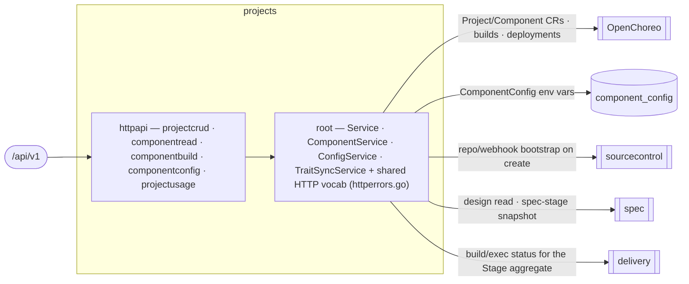

# projects — Project & Components

> **L2 · a domain.** Part of the [aep-api architecture](../../README.md).

Manage a project's lifecycle and its components, and render the whole pipeline from a single read: the
Stage aggregate (spec/build/deploy/validation), live version, components, deployments, env-config, and
per-component OpenAPI. **The OpenChoreo `Project`/`Component` aggregate roots live in OC; this domain is
their write-authority + the read projection.**

## Structure — flat-root domain
Unlike `delivery` (kernel-root), `projects` is the flat-root-of-services shape `spec`/`organization` use: the
services (`Service`, `ComponentService`, `ConfigService`, `TraitSyncService`) live in the root package
`projects`, so `Deps` sits in the root and `httpapi/` assembles the slices from it. The two merged features
(project + component) had zero symbol collisions, so the domain is one flat package plus its HTTP slices.

| Slice | Ops | Root service |
|---|---|---|
| `projectcrud` | list / create / get / delete project + get-project-status (the Stage aggregate) | `*Service` |
| `componentread` | list-components / get-component | `ComponentService` |
| `componentbuild` | trigger-build / list-builds / build-logs / list-deployments / component-openapi | `ComponentService` |
| `componentconfig` | get / update component env-config | `ConfigService` |
| `projectusage` | get-project-usage (per-phase agent usage, #245) | `TurnUsageReader` (spec) + `ExecUsageReader` (delivery) + modelcost pricer — nil-tolerant, zero usage when unwired |

The shared HTTP vocabulary — `RequireSlug`, `RequireComponentSlugs`, `MapProjectError`, `MapComponentError`
and the private `errFromStatus` — lives in the ROOT (`httperrors.go`), because a slice may not import a
sibling (`slice ⊥ sibling`); the slices call the exported root helpers. This is the flat-root analogue of
delivery's kernel: shared behaviour belongs in the root the slices import.

## Ports
| Port | Dir | Peer · contract |
|---|---|---|
| repo/workspace bootstrap · repo-name conflict | needs | `sourcecontrol` — on project create/delete |
| design read · spec-stage snapshot | needs | `spec` — the Stage aggregate's spec column + component OpenAPI source |
| build/exec status (`SetStageSources` port) | needs | `delivery` — the build/deploy columns of the Stage aggregate, wired at the root |
| OC `Project`/`Component`/`ReleaseBinding` CRUD | needs | `openchoreo` client — OC is the store |
| `Service` · `ComponentService` · `ConfigService` | offers | the edge (the 14 public ops) |

## Owns
- The OC `Project`/`Component` aggregate roots (OC is the store) and `ReleaseBinding` write-authority; the
  `ComponentConfig` env-var rows.
- **Persistence**: the `component_config` gorm and its entities live in this domain (`repository_config.go`
  over `component_config.go`), single write-authority.

## Invariants — don't break
- **Slug guards run before any service touch.** projectName/componentName/buildName path params are validated
  as DNS-label slugs (`RequireSlug`) and 400 on malformed BEFORE the OC client / repo is reached.
- **The wire quirks the contract-first cutover pinned stay pinned**: get-component-config returns a literal
  JSON `null` 200 when no row exists (not `{}`); get-component-openapi returns 409 *with* the componentType
  body for a non-service component; build-logs 503s when the observability client is unwired.
- **The Stage aggregate is one cheap poll (5s active / 30s idle), strict-join.** get-project-status runs
  three sources concurrently — spec from a fetch-free local-mirror snapshot, build from the newest `dev`
  `workflow_runs` row (task counts denormalized onto it, not a live query), deploy from the project's
  `development` release bindings — with no GitHub API, Temporal query, or origin fetch. Any source failure
  fails the whole read (the console keeps last-good); the one carve-out: a deploy tag missing from the
  local mirror degrades to a 0 denominator, not a 500.
- **A validation-phase failure is attributed to validation, not the build.** When the newest `dev` run
  failed but its task tally is fully green and its validation child row failed, the Build stage reports
  `succeeded` and the failure rides `deploy.validation = failed` (`status_stages.go`
  `validationAttributedFailure`; a green-tally guard plus a recency guard — the child was recorded after
  the dev row — defeat stale validation rows from a same-tag rebuild). Other failures (coding,
  provisioning, canceled) keep the Build card as the catch-all. `deploy.validationIssue` carries the
  validation Task's issue number so the console can open its log page.
- Platform-wide rules (tenant gate, secrets fence, feature-free domains) → [../../README.md](../../README.md).
