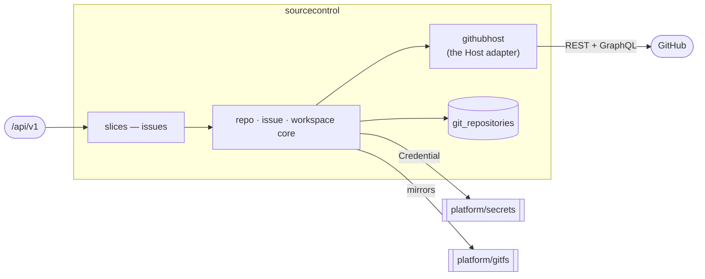

# sourcecontrol — Source Control & Webhooks

> **L2 · a domain.** Part of the [aep-api architecture](../../README.md).

The git-host integration substrate every other domain builds on: per-project
repo/issue/milestone/PR/webhook lifecycle over a provider-neutral `Host` port, and the bare-mirror
workspace behind `platform/gitfs`.

## Slices
| Slice | Use-case | Entry |
|---|---|---|
| `issues` | file / search a project's issues | `POST`+`GET /projects/{projectName}/issues` |

*Still in the domain root (not carved into slices): repo lifecycle, workspace, webhook register/receive,
and installation lifecycle.*

## Ports
| Port | Dir | Peer · contract |
|---|---|---|
| `Host` | needs | the git host — implemented by `githubhost` (the domain's own adapter; it lives here, not in `platform/clients`, because an adapter for a domain's port cannot sit in a domain-free kernel) |
| `secrets.Credential` | needs | `platform/secrets` — App-installation / per-org PAT |
| `IssueService`, `RepoService` | offers | every domain that needs repos, issues or milestones |

## Owns
- `git_repositories` (the repo coordinate registry) and `webhook_deliveries` — gorm + entities in this
  domain (`repository_repo.go` · `repository_webhook_delivery.go` over `repository_entity.go` /
  `webhook_delivery.go`), single write-authority. `GitRepository` is not `x-go-type`-aliased, so it needs
  no wire split.
- The bare-mirror workspace handle, and the GitHub host connection state.

## Invariants — don't break
- **`Host` is provider-neutral.** GitHub specifics live in `githubhost`; nothing above it names GitHub
  — including whether an op rides REST or GraphQL.
- **A milestone is addressed by NUMBER, never by title.** Titles are renamable, and the host enforces
  title uniqueness case-sensitively while filtering on it case-insensitively, so the adapter enforces
  case-insensitive uniqueness at create and callers key on the number. Issue counts come from the
  GraphQL predicate; a milestone's `open_issues` counts pull requests and is never read.
- **`MilestoneIssueCounts` is ONE call, and every alias filters on ONE label.** The dispatch predicate
  runs at every cycle boundary, so all five populations ride a single aliased GraphQL query. GraphQL's
  `labels:` argument is a **UNION** — an issue matches when it carries ANY listed label — so an
  intersection is not expressible and a multi-label alias is a wider population than its name claims.
  One label per alias removes that hazard rather than working around it: the working sets are then plain
  subtraction (`aep − validation`, and `− development` for a bug-fix run), exact because every workable
  kind carries `aep` and each subtracted kind is a strict subset of it. Gates are the deliberate
  exception — they carry no `aep`, so they are counted on their own alias and subtracted from nothing.
  Callers read the sets through `OpenDevWork()` / `OpenTaskWork()` and never subtract fields themselves;
  the arithmetic must not be duplicated.
- **Every platform issue comment is BRANDED as machine-written, at one point.** `issueService` stamps
  `MachineCommentMarker` (an HTML comment, so it renders as nothing) onto every body it sends —
  `CommentIssue` and `CloseIssue`'s closing comment alike — and the milestone comment read strips it
  again, reporting `IssueComment.Machine`. It exists because AUTHORSHIP CANNOT ANSWER THE QUESTION: the
  platform comments through the org's own credential and the coding runner is handed that same
  credential as `GITHUB_TOKEN`, so a machine comment and an agent's progress note arrive under one
  login. Stamping here rather than at the five call sites (the delivery `IssueWriter`, the provisioning
  wiring and failure notes, the plan tap, the closing comment) is deliberate — this service is the only
  adapter they all pass through, and there is no user-facing comment write on the API, so the brand is
  exactly the statement "the platform wrote this" and no call site can forget it. Branding is
  idempotent; a comment written BEFORE this shipped carries no marker and reads as human, which is an
  accepted gap (the alternative was pattern-matching five writers' openers).
- **`ListMilestoneIssueComments` is ONE call for a whole milestone's threads.** It is the version
  ledger's comment read and it rides a 5s console poll, so neither REST shape works — per-issue costs a
  call per issue and repo-wide answers the whole repository out of the budget the run loop needs; the
  arithmetic is in `milestone_comments.go`, where the choice was made. GraphQL's points budget is
  separate and this query costs ~1 of it. `milestone.issues` is a pure-issue connection, so PR
  comments are excluded by construction rather than by a filter. `comments(last:)` returns the TAIL of a
  thread already in chronological order, so the newest notes survive the cap with no reversal; a null
  `author` (deleted account) is a fact about the comment, not a decode failure, and lands as an empty
  login. **Coverage is ONE issue page, which is narrower than the REST sibling's** — `ListMilestoneIssues`
  walks pages until a short one and returns every issue, so on a milestone over 100 the issues past the
  page get no comments. Deliberate for a decorative read on a 5s poll, and logged (`hasNextPage`) because
  a missing bucket is indistinguishable from "this issue has none".
- **REST narrows on labels, GraphQL widens.** `ListMilestoneIssues`' REST `?labels=a,b` is AND (an
  issue must carry all of them); the GraphQL `labels:` above is OR. Two APIs over one resource, two
  rules — carrying an assumption from one to the other silently empties the working set, and the
  fakes on both sides model their own rule so a test cannot hide it.
- **A write's own result is the only reliable read of it.** GitHub's issue indexes lag a create by a
  beat, so `CreateIssue`'s number is authoritative while a label-filtered list moments later may not
  show the issue at all. Callers key on the returned number — `Deduped` names the case where that
  number is an existing issue's. Re-discovering a just-written issue by listing is how the run
  supervisor came to report a version `skipped` over an acceptance oracle it had itself just filed.
- Ports here are **nil-tolerant**: an unwired service answers 503, never panics — the component harness
  wires only the feature under test, and `edge`'s `sourceControlOrEmpty` preserves that for an unwired
  domain.
- `IssueInfo`'s wire keys are **CAPITALIZED** — a historical shape the deployed MCP server parses.
- Platform-wide rules (tenant gate, secrets fence) → [../../README.md](../../README.md).
