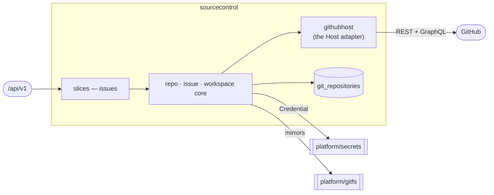

# sourcecontrol — Source Control & Webhooks

> **L2 · a domain.** Part of the [aep-api architecture](../../README.md).

The git-host integration substrate every other domain builds on: per-project
repo/issue/milestone/PR/webhook lifecycle over a provider-neutral `Host` port, and the bare-mirror
workspace behind `platform/gitfs`.

```mermaid
flowchart LR
  API(["/api/v1"]) --> SL
  subgraph sourcecontrol
    SL["slices — issues"]
    CORE["repo · issue · workspace core"]
    GH["githubhost<br/>(the Host adapter)"]
    SL --> CORE
    CORE --> GH
    CORE --> DB[("git_repositories")]
  end
  GH -->|REST + GraphQL| GITHUB(["GitHub"])
  CORE -->|Credential| SEC[[platform/secrets]]
  CORE -->|mirrors| GITFS[[platform/gitfs]]
```

## Slices
| Slice | Use-case | Entry |
|---|---|---|
| `issues` | file / search a project's issues | `POST`+`GET /projects/{projectName}/issues` |
| `issues` (Issues agent) | the console Issues view's agent searches / files issues on its one project | `POST /internal/v1/issues/mcp` (`search_issues`, `create_issue`; `user_mcp.go`) |
| `issues` (issue agent) | one issue's chat agent reads and works that one issue | the same endpoint on an issue token (`get_issue`, `list_components`, `comment_issue`, `edit_issue`, `close_issue`, `reopen_issue`, `hand_to_coding_agent`; `issue_mcp.go`) |

*In the domain root rather than a slice: repo lifecycle, workspace, webhook register/receive (including
the delivery ledger and its `webhook.Replayer`), and installation lifecycle.*

## Ports
| Port | Dir | Peer · contract |
|---|---|---|
| `Host` | needs | the git host — implemented by `githubhost` (the domain's own adapter; it lives here, not in `platform/clients`, because an adapter for a domain's port cannot sit in a domain-free kernel) |
| `secrets.Credential` | needs | `platform/secrets` — App-installation / per-org PAT |
| `IssueService`, `RepoService` | offers | every domain that needs repos, issues or milestones |
| `IssueAdopter` | needs | delivery admission for newly filed or reopened SRE work; refusal is returned as `adoptionError` |
| `IncidentRecurrence` | needs | durable recurrence evidence before reopening; defaults to the GitHub-body ledger writer |
| `issues.Promoter` | needs | the issue agent's hand-off — delivery's promote command (adapted in `app`); answers `issues.ErrNoDeployedVersion` with no deployed version |
| `issues.ComponentLister` | needs | the design's component names, sorted (spec's design, adapted in `app`) |
| `issues.IssueThreadRemover` | needs (optional) | removes a closed issue's chat thread after `close_issue`; must not wait on the calling turn; a failure is logged, never the tool's |

## Owns
- `git_repositories` (the repo coordinate registry) and `webhook_deliveries` — gorm + entities in this
  domain (`repository_repo.go` · `repository_webhook_delivery.go` over `repository_entity.go` /
  `webhook_delivery.go`), single write-authority. `GitRepository` is not `x-go-type`-aliased, so it needs
  no wire split.
- The bare-mirror workspace handle, and the GitHub host connection state.

## Invariants — don't break
- **The Issues agent is fenced to one project.** `user_mcp.go` takes org + project only from the
  `auth.IssuesMCPScope` bound from a per-turn token (aud `aep-api-issues-mcp`, claims `ocOrgId` +
  `projectId`); no tool schema declares a project, org or labels, and unknown arguments are ignored.
  Labels are server-set: `[kind, src/user]` with kind `bug | feature | improvement`. The tool names are
  a contract with the agents service's filing gate, which keys on `create_issue`.
- **An issue's agent is fenced to one issue.** The same endpoint serves a token minted with
  `IssueIssueMCPToken` (claim `issueNumber` beside `ocOrgId` + `projectId`) the issue tools only, and
  every one acts on the claimed number — no schema declares a number, project, org or labels. Each
  token lists and calls only its own set; anything else is a tool error. Writes are confirmed by the
  agents service's gate before they reach here; the tool names are its contract.
- **SRE creation owns incident identity and outcomes.** A trusted transport binds the opaque incident
  identity with `WithIncidentContext`. Creation combines it with tenant/project and normalized component,
  ignoring the client dedupe key. `ops.ClassifyActions` determines classification; config-only ledger
  issues have a separate identity namespace and cannot be adopted. The server stamps `bug` and
  `incident` (the legacy `sre-agent` label is still recognized as an incident label) and removes
  caller delivery-routing and identity labels. Missing trusted context or component is rejected
  before writing. Legacy non-SRE requests retain their existing dedupe behavior.
- **SRE identity checks fail closed.** An open match returns `deduped` without another adoption; a
  `not_planned` SRE closure returns `suppressed`. Only a completed SRE closure can recur, and it does
  even when ineligible closed duplicates share its identity; ordinary issues and unknown closure
  reasons cannot reopen through this path. When every closed match is ineligible, creation returns
  `ErrIncidentRecurrenceIneligible` (409) and files nothing until a human reopens or re-closes the
  match. New and reopened adoptable work returns `adopted` only after delivery accepts it;
  missing delivery wiring or refusal preserves the issue and returns `adoptionError`. Creates serialize
  per repository within one process. Lookup and label-creation failures prevent filing an untracked
  incident; multiple replicas still require a durable uniqueness mechanism.
- **Recurrence evidence lives in GitHub.** Each recurrence appends `## Recurrence <n>`, a fixed warning
  that the earlier merged fix failed, and the new handoff evidence, preserving the existing body.
  The host's `closed_at` identifies the closure in a hidden body marker: retrying a failed reopen
  reuses its evidence, while a later completed closure creates another section even with identical
  handoff content. A missing closure identity or evidence-write failure leaves the issue closed.
  The timestamp is not an API field and imposes no expiry or recurrence time window.
- **Issue attention is a server projection.** `ListIssues` and `GetIssue` derive it from state,
  `state_reason`, labels, and the body. Closed SRE `not_planned` issues are `no_change_verdict`;
  open, reopened SRE issues without the `aep` arming label are `unverified_fix`. An open SRE issue
  escalates from attempt four (the original attempt plus three recurrence headings), whether armed
  or disarmed, without blocking further attempts. Completed and ordinary non-SRE issues have no
  attention reason. Human edits to the body ledger affect the recurrence history.
- **The issue list is issues only, and bounded.** GitHub's issues endpoint also answers pull requests;
  `githubhost.ListIssues` drops them and walks pages until a short one or `issueListMaxPages` (10, so
  1000 items). The bell polls the unfiltered list per alerting project every minute, so the cap bounds
  that poll's rate cost. Past it the oldest issues are missing from the list (logged); `GetIssue` still
  reads any issue by number. Paging the API contract itself is the follow-up if repositories outgrow it.
- **A filed issue is listed at once (read-your-writes).** GitHub's list endpoint lags a creation by 3-10 s,
  so `ListIssues` merges in the issues this process filed in the last minute (`recent_issues.go`, per
  `owner/repo`) that GitHub's answer lacks and that satisfy the label filter, newest first; an entry is
  dropped when GitHub lists it or after 60 s. The platform's own close, reopen and title/body edits update
  the remembered entry in place, and the dedupe lookups read the same merged list. The memory is per process: it holds for the single
  replica the deployment runs, and a list answered by another replica still sees the lag.
- **`Host` is provider-neutral.** GitHub specifics live in `githubhost`; nothing above it names GitHub
  — including whether an op rides REST or GraphQL.
- **A milestone is addressed by NUMBER, never by title.** Titles are renamable, and the host enforces
  title uniqueness case-sensitively while filtering on it case-insensitively, so the adapter enforces
  case-insensitive uniqueness at create and callers key on the number. Issue counts come from the
  GraphQL predicate; a milestone's `open_issues` counts pull requests and is never read.
- **`MilestoneIssueCounts` is ONE call, and every alias filters on ONE label.** The dispatch predicate
  runs at every cycle boundary, so all five populations ride a single aliased GraphQL query. GraphQL's
  `labels:` argument is a **UNION** — an issue matches when it carries ANY listed label — so an
  intersection is not expressible and a multi-label alias is a wider population than its name claims.
  One label per alias removes that hazard rather than working around it: the working sets are then plain
  subtraction (`aep − validation`, and `− development` for a bug-fix run), exact because every workable
  kind carries `aep` and each subtracted kind is a strict subset of it. Gates are the deliberate
  exception — they carry no `aep`, so they are counted on their own alias and subtracted from nothing.
  Callers read the sets through `OpenDevWork()` / `OpenTaskWork()` and never subtract fields themselves;
  the arithmetic must not be duplicated.
- **Every platform issue comment is BRANDED as machine-written, at one point.** `issueService` stamps
  `MachineCommentMarker` (an HTML comment, so it renders as nothing) onto every body it sends —
  `CommentIssue` and `CloseIssue`'s closing comment alike — and the milestone comment read strips it
  again, reporting `IssueComment.Machine`. It exists because AUTHORSHIP CANNOT ANSWER THE QUESTION: the
  platform comments through the org's own credential and the coding runner is handed that same
  credential as `GITHUB_TOKEN`, so a machine comment and an agent's progress note arrive under one
  login. Stamping here rather than at the five call sites (the delivery `IssueWriter`, the provisioning
  wiring and failure notes, the plan tap, the closing comment) is deliberate — this service is the only
  adapter they all pass through, and there is no user-facing comment write on the API, so the brand is
  exactly the statement "the platform wrote this" and no call site can forget it. Branding is
  idempotent; a comment written BEFORE this shipped carries no marker and reads as human, which is an
  accepted gap (the alternative was pattern-matching five writers' openers).
- **A webhook is acknowledged before its handlers run, and the delivery ledger is what retries it.**
  GitHub closes a delivery's connection at 10 seconds and never redelivers on its own, so a handler
  running on the request's context lost its work to the timeout for good (a merged cycle's build
  fan-out, once). `webhook.Receive` verifies, persists and claims the delivery, answers `202`, and runs
  the handlers under `async.Go` on `context.WithoutCancel` with a 2-minute budget. `webhook_deliveries`
  carries a lease (`attempts`, `lease_until`): only the attempt holding it runs a delivery, so a
  duplicate landing mid-handler is acknowledged without running twice, and a failed run is held for
  its backoff (30s, doubling). `webhook.Replayer` re-runs due deliveries within 15 minutes of receipt,
  5 attempts in all, claiming them with one `UPDATE` over `FOR UPDATE SKIP LOCKED`, so a delivery is
  run by exactly one attempt across replicas; a pod lost mid-handler leaves its lease to lapse and is
  replayed. The last failed attempt logs `webhook: delivery abandoned` and the row keeps its error.
  What a delivery past its window was for is `eventcore`'s reconcile sweeps' to heal
  (`webhook.ReplayHorizon` sets their grace). Every handler must stay idempotent: a replay re-runs
  whatever the failed attempt got through. A routing failure is answered before anything is
  persisted, so nothing replays it.
- **A stored delivery never carries a published credential.** Every verified webhook delivery's
  body is persisted to `webhook_payloads` — for audit, and as what the `Replayer` re-runs — so a comment the
  platform posts *on purpose* carrying credentials would land in the database in cleartext, the one
  place here where every other credential is sealed. The roles gate publishes each test user's login as
  an issue comment (ADR-0022), GitHub delivers that comment straight back, and `webhook/redact.go`
  rewrites the body before `Persist`. It keys on `PublishedCredentialsMarker` — declared beside
  `MachineCommentMarker` precisely because the writer is not the only party that has to know it — and
  matches on the part of it that survives JSON escaping, since Go's encoder turns `<` into `\u003c` and
  a scan for the literal marker finds nothing. A body it cannot rewrite is dropped, not stored. A
  replay therefore runs the redacted copy; no registered handler reads a comment or issue body, and a
  dropped body routes to no handler.
- **`ListMilestoneIssueComments` is ONE call for a whole milestone's threads.** It is the version
  ledger's comment read and it rides a 5s console poll, so neither REST shape works — per-issue costs a
  call per issue and repo-wide answers the whole repository out of the budget the run loop needs; the
  arithmetic is in `milestone_comments.go`, where the choice was made. GraphQL's points budget is
  separate and this query costs ~1 of it. `milestone.issues` is a pure-issue connection, so PR
  comments are excluded by construction rather than by a filter. `comments(last:)` returns the TAIL of a
  thread already in chronological order, so the newest notes survive the cap with no reversal; a null
  `author` (deleted account) is a fact about the comment, not a decode failure, and lands as an empty
  login. **Coverage is ONE issue page, which is narrower than the REST sibling's** — `ListMilestoneIssues`
  walks pages until a short one and returns every issue, so on a milestone over 100 the issues past the
  page get no comments. Deliberate for a decorative read on a 5s poll, and logged (`hasNextPage`) because
  a missing bucket is indistinguishable from "this issue has none".
- **`ListIssueComments` is its single-issue sibling, and it is GraphQL for a DIFFERENT reason.** The
  milestone read goes GraphQL because REST cannot answer a whole milestone in one call; for one issue
  REST can, and still comes back from the wrong end — an issue's comments page **oldest-first with no
  sort parameter**, so the newest sits on the last page and reaching it costs a second request to learn
  where that page is. `comments(last:)` asks for the tail directly, which is the bar `graphql.go` sets
  for using the transport at all. Same projection as the milestone read (`comments.go`'s shared node
  and mapper), so the machine-comment FLAG, the null-`author` rule and the ordering are one behaviour
  across both, not two that happen to agree today. Both readers flag and unbrand a machine comment and
  return it; **dropping is `delivery`'s policy, not this layer's** (`task/reads.go` `commentViews`), so
  a later audit or debug surface can still ask for them.
- **REST narrows on labels, GraphQL widens.** `ListMilestoneIssues`' REST `?labels=a,b` is AND (an
  issue must carry all of them); the GraphQL `labels:` above is OR. Two APIs over one resource, two
  rules — carrying an assumption from one to the other silently empties the working set, and the
  fakes on both sides model their own rule so a test cannot hide it.
- **A write's own result is the only reliable read of it.** GitHub's issue indexes lag a create by a
  beat, so `CreateIssue`'s number is authoritative while a label-filtered list moments later may not
  show the issue at all. Callers key on the returned number — `Deduped` names the case where that
  number is an existing issue's. Re-discovering a just-written issue by listing is how the run
  supervisor came to report a version `skipped` over an acceptance oracle it had itself just filed.
- Ports here are **nil-tolerant**: an unwired service answers 503, never panics — the component harness
  wires only the feature under test, and `edge`'s `sourceControlOrEmpty` preserves that for an unwired
  domain.
- `IssueInfo`'s wire keys are **CAPITALIZED** — a historical shape the deployed MCP server parses.
- Platform-wide rules (tenant gate, secrets fence) → [../../README.md](../../README.md).
