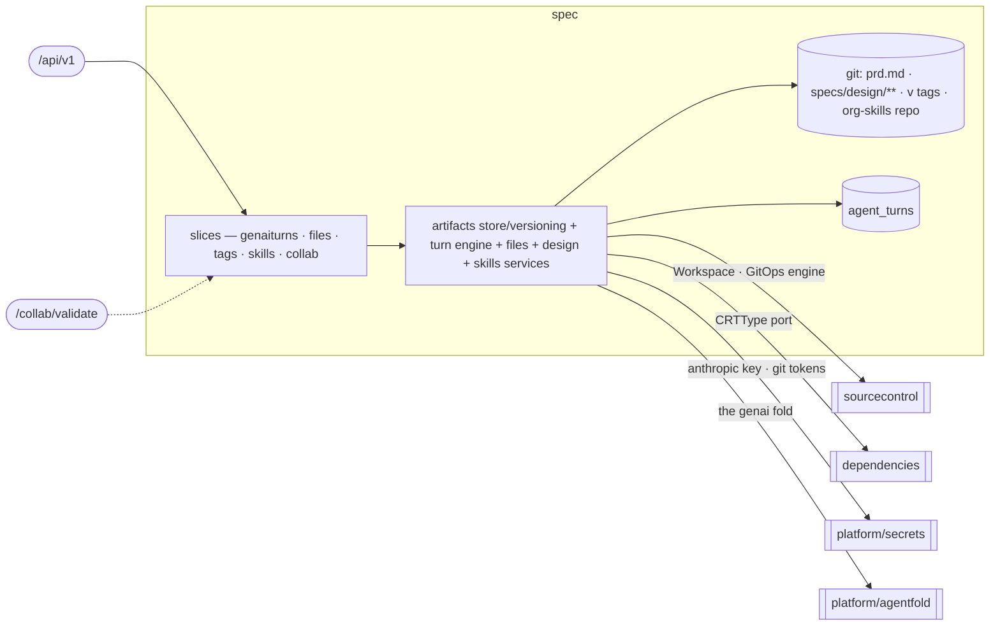

# spec — Spec Authoring & Versioning

> **L2 · a domain.** Part of the [aep-api architecture](../../README.md).

Turn a prompt into a versioned requirements+design Spec stored as committed truth in git, let humans and
agents co-edit it live, cut and read the `v<N>` Spec version, and steer authoring with the org's Skill
library. **Single write-authority over the git spec-content store and its version tags.**

## Slices
| Slice | Use-cases | Entry |
|---|---|---|
| `genaiturns` | create / get / active / stream turn + get-conversation (the AgentTurn lifecycle) + list/rotate the project's conversation threads (#430) | `.../agents/{cid}/messages`, `.../agents/conversations`, `.../turns/...` |
| `files` | list / read / apply files over the project workspace | `GET/POST .../files...` |
| `tags` | list the project's `v<N>` spec version tags | `GET .../tags` |
| `skills` | list / create / update / delete / import / sync / get the org Skill library | `/skills...` |
| `collab` | the collab session descriptor + the S2S room-access oracle | `.../spec/collab-session`, `GET /collab/validate` |

*Still flat in the domain root (not carved into finer slices): the artifacts store/versioning machinery,
the genai turn engine (runner/broker/sweeper), and the files / design / skills services.*

## Ports
| Port | Dir | Peer · contract |
|---|---|---|
| `Workspace` · `GitOpsService` · `RepoService` | needs | `sourcecontrol` — the gitfs engine hosting all spec + skills git content |
| `resourceTypeCatalog` (returns `CRTType`) | needs | `dependencies` — the PE-authored CRT markers + declared outputs, projected at the root |
| `AnthropicKeyResolver` · git-token `Resolver` | needs | `platform/secrets` — per-org keys + sealed git tokens |
| `ArtifactService` · `ArtifactStore` · `SplitFrontmatter` | offers | `delivery` / `projects` / `dependencies` — design reads, spec-save, status snapshots |
| `HardConfigEdges` | offers | `projects` (deploy order) — which sibling addresses a component cannot start without |
| `DescriptorWriter` | offers | `projects` — stamps `specs/.agentic-engineer.toml` into a repo at project create |
| `CredentialsRefreshService`-adjacent turn/tag reads | offers | delivery/build (SpecTagger, validation criteria) |

## Owns
- git spec content (`prd.md`, `specs/design/**`), the annotated `v<N>` tag (the version store),
  the org-skills repo, `AgentTurn` (turn lifecycle) + the resumable-turn SSE broker (in-memory seam).
- **The Skill library.** One flat authored library at repo-root `skills/`, COPY'd into the image and read
  at runtime from `config.SkillsDir` (default `/app/skills`) — not go:embed'd. A skill dir is `SKILL.md`
  plus the [Agent Skills standard structure](https://agentskills.io/specification) — `scripts/`,
  `references/`, `assets/`, and any other files or directories — carried byte-faithfully end to end
  (loader → reconcile → org-skills repo → design agent → coding runner); scanners walk the whole dir with
  no extension filter, skipping only `SKILL.md` itself and dotfile segments; `scripts/` files materialize
  with the exec bit on the coding runner. Model-context reads (the design agent's `loadSkillReference`)
  and JSON API responses inline UTF-8 text only; binary aux files are listed, never inlined
  (`binaryReferences` in the API; a corrective error naming the binary path in the tool) — they are
  delivery-only over the JSON API (their content never round-trips through a GET→edit→PUT cycle) and stay
  durable only via the embedded library or tarball import, which carry the bytes directly. The same
  aux-file contract governs user-facing create/update and tarball import, rejecting any `..`/absolute path
  outright rather than silently dropping it.
- **Kind, editability, and reconcile.** Kind (`platform | org | imported`) lives in frontmatter
  `metadata.aep.kind`, absent ⇒ `org` (a stored legacy `custom` also reads back as `org` — the `custom`
  kind is retired, folded into `org`). Kind is an ownership label, not the editability switch:
  `SkillEditable(kind)` is the single seam — org + imported are editable, platform is read-only — so a
  platform-seeded skill can be unlocked for editing without reclassifying it. `SkillDeletable(kind)`
  equals `SkillEditable(kind)`: an org skill (platform-seeded or user-authored) is always deletable; a
  platform-kind skill never is. Each org's flat `org-skills` repo is reconciled THREE-WAY against a
  `skills-manifest.json` baseline (`{name: {origin, source?, baseHash}}`, `origin` = `platform`) written in
  the same commit as any skill files: reconcile keys off manifest presence/origin, never off the skill's
  `kind` — clean copy + platform moved → refresh and advance the baseline; org moved → override, left
  alone; both moved → conflict, left alone and surfaced by `/updates` (states `update` / `overridden` /
  `conflict`); both moved but converged on identical content → auto-resolves clean. A pre-manifest repo
  copy is backfilled (baseline stamped; a divergent copy is treated as an override, never clobbered). Names
  with no manifest entry are org-authored and never touched — this is what lets a user-authored `org`-kind
  skill coexist with platform-seeded `org`-kind skills without reconcile confusing the two. Seeding an
  absent default is split by ownership: a `platform`-kind default is always (re-)seeded; an `org`-kind
  default is seeded only at first org creation — an ongoing sync leaves an absent org default out (opt-in)
  but still runs the full three-way, including auto-refresh, against any PRESENT org skill. Purge only
  retires manifest-tracked platform entries with a clean copy; an overridden retiree keeps its files and
  just loses the entry, becoming a plain org skill.
- **The project descriptor** (`specs/.agentic-engineer.toml`, `descriptor.go`) — the marker identifying a
  repo as an Agentic Engineer project, carrying the idea the user gave at creation. Written by `projects`
  at create through the `DescriptorWriter` port (best-effort: a failed write never fails the create) and
  read back here to put the idea on a `/start` turn. TOML rather than the YAML/JSON used elsewhere because its one
  load-bearing field is a paragraph of free text a user typed — a real encoder keeps quotes, backslashes
  and newlines intact.
- **Flow-command recognition** (`start_command.go`) — every `/<skill>` command arrives VERBATIM and the
  server classifies it into an `agentsvc.TurnSpec`: what the turn is FOR, never its wording. `/start`
  additionally carries the descriptor's idea, which only the server can read. The agents service composes
  the instruction and derives the flow's eager skills from the spec, so a console CTA, a typed command and
  a playground run produce identical turns (services/agents/design/ADR-0003). This domain holds NO prompt
  text; the flow token is kept here because it also gates web search and MCP minting for design turns.
- **Persistence**: the `agent_turns` gorm lives in this domain (`repository_turn.go` over the
  `agent_turn.go` entity), single write-authority — as does `project_conversations`
  (`repository_conversation.go`): the project's CURRENT chat thread pointer (#430), server-minted,
  one current row per (org, project, use case) under a partial unique index; StartTurn refuses a
  non-current id with 409 `conversation_rotated` (the single-era rule — it relaxes to "belongs to
  this project" when multiple live threads land). Spec content itself is not gorm — it lives in git,
  reached through sourcecontrol's `Workspace`/gitfs engine.

## Invariants — don't break
- **Single write-authority** over the git spec-content store and its `v<N>` tags — every save/tag/discard
  runs through this domain's gitfs Workspace engine; no other domain writes spec content.
- **One authority for which wiring edges are HARD** (`wiring_edges.go`). A hard edge is an address the
  platform must have before a component can serve its first useful byte — today a web app's sibling
  *services*, whose cluster Service URLs are injected as pod env for nginx (`<DEP>_URL`). `projects`
  orders the deploy waves around that rule. Everything else is soft (it flows consumer→provider: an
  OIDC callback) and orders nothing. Deliberately NOT hard: service→service, which OpenChoreo resolves
  through its own connection mechanism — ordering it would refuse two services that call each other.
  ADR-0019.
- **`CRTType` is a projection, not a re-export.** design-save reads the dependencies resource-type catalog
  through the `resourceTypeCatalog` port in spec's OWN vocabulary (`CRTType`), mapped by a root
  adapter — the spec domain names the dependencies domain nowhere.
- **Design save DERIVES two platform facts, in one pass over one catalog call** (`derive.go`, ADR-0013):
  `exposesAPI.auth` off a resource type's role marker (`derive_auth.go`), and each `platform-resource` /
  `external` dependency's `wiring` — the OC ref plus output→env-var mapping the coding agent copies into
  `workload.yaml` (`derive_wiring.go`). Both mutate the design in place and commit only the components whose
  derived state actually changed, so an unchanged design commits nothing.
  - Derived, therefore **re-derived and overwritten every pass** — which is exactly what lets the write
    gates ACCEPT `wiring` instead of rejecting it as agent-authored: the design agent reads-edits-writes
    `design.json`, so a rejection rule would reject its own echo.
  - Both env-var and ref naming route through `platform/ocname`, the SAME helper the dependencies domain
    injects pod env vars with. The two must agree byte-for-byte or the agent's `workload.yaml` references a
    resource that does not exist; a bounded-name test pins it.
  - Fail-closed: a design declaring a platform-resource whose catalog is unreachable returns
    `ErrResourceCatalogUnavailable` (503) rather than silently skipping either derivation.
- The `/collab/validate` oracle recovers the acting org from VERIFIED claims and refuses any room whose
  `spec-<org>-` prefix mismatches — never a hint of whether the room exists. Platform-wide rules (tenant
  gate, secrets fence) → [../../README.md](../../README.md).
- The genai turn is **committed-truth**: the fold (`platform/agentfold`) verifies hash-parity before the
  commit; a mismatch rejects the turn and leaves `main` untouched.
- **Skill read-only is enforced by the mutation guards, not by visibility.** `Resolve`/`List` return every
  kind — platform skills list read-only on the skills page; reserved names/prefixes block name collisions.
- **The descriptor is unreadable by the agent, structurally.** Its dot-led segment is stripped from every
  turn snapshot (`agentfold.InTurnSnapshot` and its TS mirror), and `.toml` is not an admitted extension
  either — so the captured idea reaches a turn ONLY via the `/start` expansion, never by the model opening
  the file. Do not "fix" this by widening the snapshot filter.
- **The kickoff is never signalled through `useCase`.** That field is part of the conversation identity
  (`namespacedID`), so keying `/start` on it would put the turn in a different conversation from the chat
  around it — and `/start` runs an interview whose answers arrive as ordinary chat turns.
