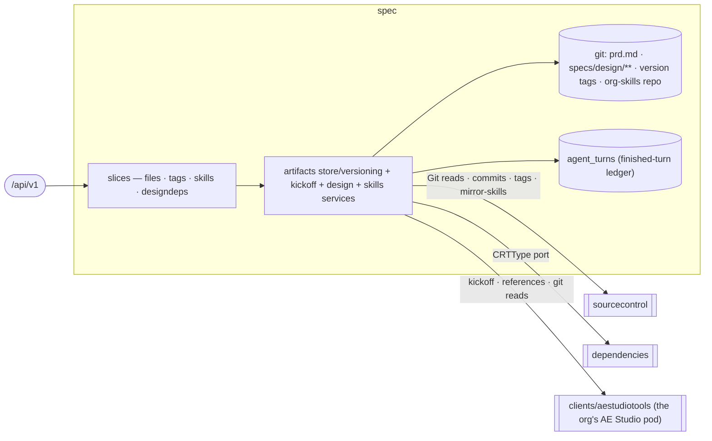

# spec — Spec Authoring & Versioning

> **L2 · a domain.** Part of the [aep-api architecture](../../README.md).

Turn a prompt into a versioned requirements+design Spec stored as committed truth in git, let humans and
agents co-edit it live, cut and read the named Spec version, and steer authoring with the org's Skill
library. **Single write-authority over the git spec-content store and its version tags.**

```mermaid
flowchart LR
  API(["/api/v1"]) --> SL
  subgraph spec
    SL["slices — files · tags · skills · designdeps"]
    CORE["artifacts store/versioning + kickoff + design + skills services"]
    SL --> CORE
    CORE --> GIT[("git: prd.md · specs/design/** · version tags · org-skills repo")]
    CORE --> TURNS[("agent_turns (finished-turn ledger)")]
  end
  CORE -->|Git reads · commits · tags · mirror-skills| SC[[sourcecontrol]]
  CORE -->|CRTType port| DEP[[dependencies]]
  CORE -->|kickoff · references · git reads| POD[["clients/aestudiotools (the org's AE Studio pod)"]]
```

## Slices
| Slice | Use-cases | Entry |
|---|---|---|
| `files` | upload a project's reference documents (a pass-through to the org's AE Studio pod) | `PUT .../references` |
| `tags` | list the project's spec version tags, newest first by creation time | `GET .../tags` |
| `skills` | list / create / update / delete / import / sync / get the org Skill library | `/skills...` |
| `designdeps` | the two writes into an external dependency's directory: provide its contract (a URL the platform fetches, or the document itself), and record the user's authorization to build on the design agent's assumed contract — before the agent writes it (the resolve flow's card) or after (the definition's acceptance box) | `POST .../dependencies/{name}/contract`, `POST .../dependencies/{name}/assumption` |

*Still flat in the domain root (not carved into finer slices): the artifacts store/versioning machinery,
the kickoff, the finished-turn ledger, and the design / skills services. Agent turns themselves run
in the org's AE Studio pod ([turn-runtime](../../../../components/dataplane/ae-system-project/ae-studio/ae-design-agent/design/turn-runtime.md)); aep-api starts only the kickoff and stores what the pod records.*

## Ports
| Port | Dir | Peer · contract |
|---|---|---|
| `sourcecontrol.Git` | needs | the org's AE Studio pod (`clients/aestudiotools`) — every read (bundles, trees, files, tags, the status snapshot: local head + local tags, then sha-addressed reads the adapter caches) and every write: the version tag (`Tag`), the skills library and the descriptor (`Commit` through `sourcecontrol.CommitRetrying`: each attempt reads the base, a conflict re-reads, 3 tries); no author or tagger is sent, the pod uses its gitpat identity |
| `SkillMirrorPort` (= `sourcecontrol.SkillsMirrorOps`) · `RepoService` | needs | the pod's mirror-skills (the project `.claude/skills` copy; the copy rule is the pod's) · the skills repo row, provisioned on first use |
| `resourceTypeCatalog` (returns `CRTType`) | needs | `dependencies` — the PE-authored CRT markers + declared outputs, projected at the root |
| `ArtifactService` · `ArtifactStore` · `SplitFrontmatter` | offers | `delivery` / `projects` / `dependencies` / `identity` — design reads, spec-save, status snapshots; `identity` reads `security.json` from the design bundle AT THE TAG being built, never at HEAD |
| `HardConfigEdges` | offers | `projects` (deploy order) — which sibling addresses a component cannot start without |
| `DescriptorWriter` | offers | `projects` — stamps `specs/.agentic-engineer.toml` into a repo at project create |
| `KickoffService.Kickoff` | offers | `projects` (create) · `spec/files` (references upload) — fires the project's opening `/start` turn in the org's AE Studio pod |
| `aestudiotools.Turns` · `aestudiotools.References` | needs | `clients/aestudiotools` — the org pod's `/internal/v1` turns (kickoff) and reference store (the references upload, a pass-through) |
| `TurnRepository.Newest` · `NewestCompletedFlow` · `SumUsageByProject` | offers | `projects` — the status poll's `spec.agent` (has the project run a turn, and did the newest fail), the build gate's design baseline, Settings → Usage |
| `TurnRepository.RecordFinished` | offers | `edge` — `record-turn-usage`, the pod's finished turns |
| Turn and tag reads | offers | delivery/build (SpecTagger, validation criteria) |

## Owns
- git spec content (`prd.md`, `specs/design/**`), the annotated version tag (the version store),
  the org-skills repo, `AgentTurn` (the finished-turn ledger).
- **One external dependency, one definition** (ADR-0027). An external dependency lives in
  `specs/design/dependencies/<name>/` — `dependency.json` holds a full `resource` block in the one
  shape a resource has everywhere (name, description, provider, config keys, `contract {type, path,
  origin, accepted}`, the organization's consumption instructions when it is a copy — `ref` set),
  plus this project's `provenance` and open `suggestions` — beside the contract DOCUMENT it points at
  (a whole OpenAPI/GraphQL document or an `sdk.json` manifest; never a slice, never a URL). Style is
  computed from the contract type, not stored. A component's `design.json` references the dependency
  by name only; `AssembleDesign` hydrates every reference from the directory (`dependency_json.go`),
  so downstream readers keep the flat `Dependency`, and `SplitDesign` writes both halves back. A file
  in the previous flat shape, or a design from before the directory existed, is lifted into the nested
  shape in memory and rewritten at its next save. `ComputeDependencyStatus` reads the state off the
  hydrated edge plus ONE registry lookup for a copy — `ref` set and the org has a REGISTERED resource
  of that name → the copy stands; `ref` set and none → needs-input; no provider → needs-input; no
  contract file on disk → needs-contract; an assumed contract with no acceptance → needs-acceptance;
  else resolved, flagged registered / assumed / derived / sdk-only / stale (the copy's document hash
  no longer matches the registry's) — and the build gate blocks on nothing else. The write-gates
  (zod in `@aep/agent-stream` at write, `designspec` at save: the schema plus
  `dependency_shape.go`, the shape rules the schema cannot say) validate the file; `consumptionInstructions` and `contract.accepted` are the fields only the platform writes
  (the registry copy, `designdeps`). **The platform copies at the design write** (`registry_copy.go`,
  for the AE Studio pod's saves): a stub `{ name, resource: { ref, name } }` is completed from the org
  record — block, document, provenance — and a `contract` of origin `provider` with a
  `provenance.sourceUrl` and no hash has its document fetched (https, 5 MiB) and landed beside it.
  Both read the registry / the URL before the pod commits and never fail the save: a miss lands the
  stub with a warning and the dependency reads needs-input / needs-contract. Only stubs are completed or
  warned about, and a landed document is always a file directly in its dependency's directory
  (`dependencyDocumentPath`; an escaping `contract.path` is refused before any fetch). `CompleteDependencies` is the one entry point, run for the AE
  Studio tools pod's `POST /internal/v1/ae-studio/dependency-completions` (`edge/internal_aestudio.go`),
  so the registry read and the fetch of a model-chosen URL stay in aep-api, never in the container that
  holds the org's git credential. That answer encodes at most 24 MiB of completions (inside the pod's
  32 MiB read cap): a completion past it is left out, its stub lands as written, and its success warning
  becomes the kind's not-completed one. **Promote reuses the
  same renderer** (`promote.go`): `ReadProjectResource` hands the project's own block and document to
  the registry side, and `RewriteAsRegistryCopy` lands `renderRegistryCopy` of a stub over the
  existing files under their CAS tokens — so a promoted dependency and a reused one are the same bytes.
- **The Skill library.** One flat authored library at repo-root `skills/`, COPY'd into the image and read
  at runtime from `config.SkillsDir` (default `/app/skills`) — not go:embed'd. A skill dir is `SKILL.md`
  plus the [Agent Skills standard structure](https://agentskills.io/specification) — `scripts/`,
  `references/`, `assets/`, and any other files or directories — carried byte-faithfully end to end
  (loader → reconcile → org-skills repo → design agent → coding runner); scanners walk the whole dir with
  no extension filter, skipping only `SKILL.md` itself and dotfile segments; `scripts/` files materialize
  with the exec bit on the coding runner. Model-context reads (the design agent's `loadSkillReference`)
  and JSON API responses inline UTF-8 text only; binary aux files are listed, never inlined
  (`binaryReferences` in the API; a corrective error naming the binary path in the tool) — they are
  delivery-only over the JSON API (their content never round-trips through a GET→edit→PUT cycle) and stay
  durable only via the embedded library or tarball import, which carry the bytes directly. The same
  aux-file contract governs user-facing create/update and tarball import, rejecting any `..`/absolute path
  outright rather than silently dropping it.
- **Kind, editability, and reconcile.** Kind (`platform | org | imported`) lives in frontmatter
  `metadata.aep.kind`, absent ⇒ `org` (a stored legacy `custom` also reads back as `org` — the `custom`
  kind is retired, folded into `org`). Kind is an ownership label, not the editability switch:
  `SkillEditable(kind)` is the single seam — org + imported are editable, platform is read-only — so a
  platform-seeded skill can be unlocked for editing without reclassifying it. `SkillDeletable(kind)`
  equals `SkillEditable(kind)`: an org skill (platform-seeded or user-authored) is always deletable; a
  platform-kind skill never is. Each org's flat `org-skills` repo is reconciled THREE-WAY against a
  `skills-manifest.json` baseline (`{name: {origin, source?, baseHash}}`, `origin` = `platform`) written in
  the same commit as any skill files: reconcile keys off manifest presence/origin, never off the skill's
  `kind` — clean copy + platform moved → refresh and advance the baseline; org moved → override, left
  alone; both moved → conflict, left alone and surfaced by `/updates` (states `update` / `overridden` /
  `conflict`); both moved but converged on identical content → auto-resolves clean. A pre-manifest repo
  copy is backfilled (baseline stamped; a divergent copy is treated as an override, never clobbered). Names
  with no manifest entry are org-authored and never touched — this is what lets a user-authored `org`-kind
  skill coexist with platform-seeded `org`-kind skills without reconcile confusing the two. Seeding an
  absent default is split by ownership: a `platform`-kind default is always (re-)seeded; an `org`-kind
  default is seeded only at first org creation — an ongoing sync leaves an absent org default out (opt-in)
  but still runs the full three-way, including auto-refresh, against any PRESENT org skill. Purge only
  retires manifest-tracked platform entries with a clean copy; an overridden retiree keeps its files and
  just loses the entry, becoming a plain org skill.
- **The project descriptor** (`specs/.agentic-engineer.toml`, `descriptor.go`) — the marker identifying a
  repo as an Agentic Engineer project, carrying the idea the user gave at creation. Written by `projects`
  at create through the `DescriptorWriter` port (best-effort: a failed write never fails the create) and
  read in the org's AE Studio pod to put the idea on a `/start` turn. TOML rather than the YAML/JSON used elsewhere because its one
  load-bearing field is a paragraph of free text a user typed — a real encoder keeps quotes, backslashes
  and newlines intact.
- **The kickoff** (`kickoff.go`, `KickoffService`) — the project's opening `/start`, fired server-side
  at creation so the journey starts itself instead of waiting on a Generate-spec click. It is a `start`
  turn in the org's AE Studio pod (`aestudiotools.Turns`), credited to the verified caller
  (`display_identity.go`: the claims' subject and display name, never the raw bearer). It has two
  triggers, project create and the references upload a create with `referencesPending` held it for, so
  it is idempotent twice: the finished-turn ledger (`Newest`) refuses a project that already ran a turn,
  and the turn id is uuidv5 of `org/project`, so a retry while the interview runs reattaches to it. The
  start is INLINE (the create answers once the pod has the turn); the stream is then followed in the
  background only to log the outcome. Bounded (20s on aep-api's side; the pod runs the turn on) and
  error-swallowing: a kickoff that cannot start never fails the creation, and the spec view's empty
  state offers it instead.
- **The references upload** (`files/references.go`) — a pass-through to the org's pod, which stores and
  validates the documents. The strict server hands over a `*multipart.Reader`, so each `files` part is
  re-streamed through an `io.Pipe` (same field, name and content type, never buffered whole); a body
  that breaks off aborts the pod's upload. The held kickoff fires only on the pod's `2xx`.
- **Design staleness is derived, never stored** (#575). "Have the requirements moved since the
  design was written?" is answered by reading the requirements at the commit the newest successful
  `/design` turn recorded reading the project at, and comparing that reduction against today's —
  `RequirementsFingerprint` over a tree listing (path + blob sha, so no content is read). Nothing is
  stamped, so nothing falls out of sync, and the question is answerable for projects predating the
  check. A stored fingerprint was rejected because a turn NEVER commits: its file changes stream to
  the project's Room and the Room's committer (`ae-collab`) commits them later, carrying no turn id and no author — there
  is no moment the platform controls, and no way to tell that flush from a hand edit. The build gate
  refuses on it (`DESIGN_OUTDATED`), which is what makes it a block rather than a display.
- **Persistence**: the `agent_turns` gorm lives in this domain (`repository_turn.go` over the
  `agent_turn.go` entity), single write-authority. Spec content itself is not gorm — it lives in git,
  read and written through the org's AE Studio pod (`sourcecontrol.Git`). aep-api's own writes are
  complete files committed raw: no scaffolding, completions or soft validation run on them (the pod
  runs those for the Room's edits); the design service's writes carry the caller's baseSha, and a
  stale one is `ErrSpecCommitConflict` (409), not retried.
- **`agent_turns` is the finished-turn ledger.** An org's AE Studio tools pod hands
  over the turns its design agent ran through `record-turn-usage` (`POST
  /internal/v1/ae-studio/turn-usage`, the org's ae-studio client token, ≤ 100 records). `RecordFinished`
  writes each record once (`ON CONFLICT (org_id, id) DO NOTHING`, so a resent batch changes nothing) with
  its `kind` (`browser | kickoff | plan`), `started_at`/`finished_at`, and `cost_usd` stamped at
  ingest from the `(host, model)` rate then in force. `created_at` is the turn's start, so
  `Newest`/`NewestCompletedFlow` order ledger rows by when the turn ran, whatever order they
  arrive in. The edge refuses the whole batch with 404 when any record names a project outside
  the token's org; a record with no project (a marketplace turn) is stored under
  `project_id = ''`. The primary key is `(org_id, id)`: the pod chooses turn ids (the kickoff's
  is uuidv5 of `org/project`, which anyone can compute), so another org's row with the same id
  never stands in for this org's record. Nothing runs here: whether a turn is running right now is
  the pod's to say. Rows written by aep-api's former in-process turn engine were reshaped by
  migrate's `phase24_agent_turns_ledger`: it gave them a kind and a start, deleted the running ones
  and dropped that engine's columns, guard index and `project_conversations`.

## Invariants — don't break
- **Single write-authority** over the git spec-content store and its version tags — every save/tag/discard
  runs through this domain's writers over the Git port; no other domain writes spec content.
- **A version carries the name the user gave it** (console ADR-0030, `version_naming.go`). The name is
  the tag, the milestone title and the `/builds/<name>` address; `v<N>` is only what the build dialog
  SUGGESTS (`v<count + 1>`, stepped past any taken name). Two consequences: a tag is recognised as a
  version by its `Spec <name>` annotation subject, never by its name — so a release tag, or a legacy
  `v<N>-<M>` design tag, is not one — and versions are ORDERED by `TagInfo.CreatedAt`, never by a
  number parsed out of a name. A supplied name is used verbatim: a collision is `ErrVersionNameTaken`
  (the build maps it to 409), never a quietly different tag. Only a name the platform itself suggested
  is recomputed past a racing pusher. Reads at a version apply the SAME name rule
  (`ValidateVersionName`) rather than any shape test: a name that could never have been created
  cannot be asked for either, and nothing walks out of `tags/` onto a branch.
- **A name labels a snapshot; it does not make one.** `SaveSpec` still compares the whole `specs/` tree
  with the newest version's and reuses that version when they match — the requested name is ignored on
  that path, because cutting a second tag over an identical tree would spend a planning turn to change
  a word. `BuildVersionFacts` reads the same comparison out as the build dialog's change list.
- **One authority for which wiring edges are HARD** (`wiring_edges.go`). A hard edge is an address the
  platform must have before a component can serve its first useful byte — today a web app's sibling
  *services*, whose cluster Service URLs are injected as pod env for nginx (`<DEP>_URL`). `projects`
  orders the deploy waves around that rule. Everything else is soft (it flows consumer→provider: an
  OIDC callback) and orders nothing. Deliberately NOT hard: service→service, which OpenChoreo resolves
  through its own connection mechanism — ordering it would refuse two services that call each other.
  ADR-0019.
- **`CRTType` is a projection, not a re-export.** design-save reads the dependencies resource-type catalog
  through the `resourceTypeCatalog` port in spec's OWN vocabulary (`CRTType`), mapped by a root
  adapter — the spec domain names the dependencies domain nowhere.
- **Design save DERIVES two platform facts, in one pass over one catalog call** (`derive.go`, ADR-0013):
  `exposesAPI.auth` off a resource type's role marker (`derive_auth.go`), and each `platform-resource` /
  `external` dependency's `wiring` — the OC ref plus output→env-var mapping the coding agent copies into
  `workload.yaml` (`derive_wiring.go`). Both mutate the design in place and commit only the components whose
  derived state actually changed, so an unchanged design commits nothing.
  - Derived, therefore **re-derived and overwritten every pass** — which is exactly what lets the write
    gates ACCEPT `wiring` instead of rejecting it as agent-authored: the design agent reads-edits-writes
    `design.json`, so a rejection rule would reject its own echo.
  - Both env-var and ref naming route through `platform/ocname`, the SAME helper the dependencies domain
    injects pod env vars with. The two must agree byte-for-byte or the agent's `workload.yaml` references a
    resource that does not exist; a bounded-name test pins it.
  - Fail-closed: a design declaring a platform-resource whose catalog is unreachable returns
    `ErrResourceCatalogUnavailable` (503) rather than silently skipping either derivation.
  - **Unknown `resourceType` is refused at build claim, not at design save.** After the catalog
    fetch, a membership pass (`rejectUnknownResourceTypes`) returns `ErrUnknownResourceType`
    when a `platform-resource` names a CRT that is not installed. Delivery maps that to HTTP 409
    and cuts no tag — a design/task-breakdown agent inventing a type must not start a Temporal
    run. An empty or nil catalog (`PLATFORM_RESOURCES_ENABLED=false`) skips membership so the
    disabled path does not reject every build. Membership is against the live catalog map, never
    a hardcoded type name (ADR-0007). Wiring derivation still treats an unknown type as "not
    derivable yet"; the membership pass is a separate gate before persist.
- **A component `openapi.yaml` is judged against its two siblings, at save AND at build**
  (`openapi_security_gate.go`). A component behind end-user sign-in declares the `oauth2` scheme and
  the document default `security: [{oauth2: []}]`; each operation's `security` is absent, `[]`
  (public), or ONE requirement object naming `oauth2` with at most one scope; every operation scope
  and every `flows.*.scopes` key is a handle `specs/design/security.json` declares AND whose resource
  THIS component owns; the five OIDC scopes (`openid profile email group ou`) are refused anywhere,
  because one emitted as an API scope admits every signed-in account while looking guarded; an
  `X-User-*` header parameter is `required: false` (the generated server binds parameters before the
  auth middleware, so `required: true` answers 400 where the design promises 401) and a public
  operation declares none at all. Code `INVALID_OPENAPI`, wording from the ONE vendored table
  (`platform/securityspec/openapi-security-messages.json`) the agent's write gate renders from, so
  the model never meets one rule in two wordings.
  - **Protected is read off committed truth, never a type name**: `exposesAPI.auth =
    end-user-required`, which design-save already derived from the CRT role marker (ADR-0007). No
    cluster round-trip, and a new sign-in flavour needs no app-factory release. The agent's bundle
    still keys on the literal `thunder-app` resourceType, so a renamed or aliased sign-in CRT is
    protected here and unprotected there — recorded in the file header.
  - **The gate and the gateway read the block ONCE** (`openapi_operations.go`). `OpenAPIOperations`
    turns a protected spec into `(method, path, public | signedIn | scope)` for the deployment
    projection (`projects.OperationsFromSpec`), and the gate's per-operation rules ARE that
    function's structural half plus the two catalog rules. Two readings of `security` that can
    disagree would be a silent authorization bug: the gate would pass a document the projection
    then renders as something else, visible only as a 401 nobody can explain. Nothing else in
    aep-api parses an OpenAPI `security` block.
  - **A missing sibling narrows the check, it never refuses.** No `design.json` → no security verdict
    (the premise is unknowable); no `security.json` → the structural rules still run and only catalog
    membership and ownership wait. The build gate is the backstop that sees every file at the tag.
- Platform-wide rules (tenant gate, secrets fence) → [../../README.md](../../README.md). Who may join a
  project's Room is decided in the org's AE Studio pod, not here
  ([room](../../../../components/dataplane/ae-system-project/ae-studio/ae-collab/design/room.md)).
- **Skill read-only is enforced by the mutation guards, not by visibility.** `Resolve`/`List` return every
  kind — platform skills list read-only on the skills page; reserved names/prefixes block name collisions.
- **The descriptor is unreadable by the agent, structurally.** Its dot-led segment is stripped from every
  turn snapshot the design agent loads, and `.toml` is not an admitted extension either — so the captured
  idea reaches a turn ONLY via the `/start` expansion, never by the model opening the file.
