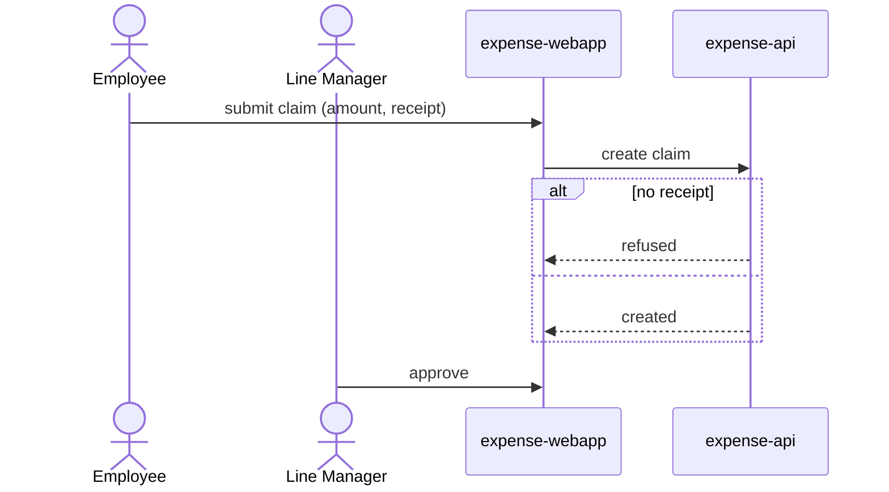

# Design

The design step: derive the complete design of the PRD from the requirements
under `specs/requirements/` — the product page `prd.md`, one file per feature
under `features/`, and `product-wide.md` (`prd-contract`). Design makes its
artifacts in a fixed order (**The lineup**), and each artifact builds on the
artifacts before it. The build gate checks the result mechanically — every
story claimed by some component's design.json, every component enriched — so
the way to a clean Build is to follow that order.

## Which features this run designs

Design works per feature. A feature is **designable** once it has been
interviewed (it has stories) and no `*blocking*` question in its Open
Questions stops it; a stub and a blocked feature are left out, and say so in a
line.

- `/design F1 F2` names the features: design those, and leave every other
  feature's part of the design as it is — shared components change only where
  the named features need them to.
- A bare `/design` designs every designable feature.
- Lines tagged `*assumed*` are designed **as written**. Seeing an assumption in
  a screen or a contract is the quickest way for the user to judge it; do not
  stop to ask about one, and do not leave it out.

The build checks each feature against the requirements the run that designed
it read: a feature whose words change after its design is out of date until a
run designs it again, and every other feature's design stands.

## The PRD is the brief

Design FROM those files, and do not widen or narrow the scope: what the PRD
says is what gets designed. No `prd.md` means the user needs `/start` first,
and no designable feature means a feature's interview comes first
(`/interview F<n>`) — stop and say so. The gap check (step 1) is the one step
that writes the requirements, and it adds only what the product needs to do
what the PRD already says.

**Questions do not stop the run.** Some calls only the user can make: a fact
only the user knows, or a choice that the PRD left open on purpose. Do not
make such a call, and do not stop to ask it. Write it as an open question in
the file that its answer changes (`prd-contract`), design the parts that do
not depend on it, and list it in your closing. The PRD's own answers are
settled: asking one back reads as the document being ignored. An open question
already in the requirements does not stop the run either, except a
`*blocking*` one, which leaves its feature out (above). One marked "deferred"
is one the user has already declined for now; leave it alone.

## Reference documents ground the design

The kickoff may have attached reference documents — and for design, the ones
that matter most are the user's own sketches: a drawn wireframe, a form
screenshot, a mockup image. They are attached to this conversation natively
(images and PDFs) or in your workspace files (text). When any exist:

- **A user-drawn sketch is the layout brief.** The web application's
  prototype follows what the user drew — screen structure, navigation, the
  controls they placed — refined, not reinvented. Look at the image before
  you write a screen.
- A form document (paper form, PDF) is the field inventory: the screens that
  digitize it carry its fields and sections, and the data model holds them.
- Where a sketch and the PRD disagree, the PRD's scope wins, but the sketch's
  layout intent survives inside that scope — and the discrepancy is worth a
  line in your closing.

No documents attached is the ordinary case: design from the PRD alone.

## Say what you write, and report each artifact

Design runs long, and a reader who can only see finished files cannot tell how
much is left. **Call `declare_plan` before you start writing**, naming the
files that step is about to produce, and call it again each time the plan grows
— you cannot know the per-component files until the cell fixes the component
set, so the list arriving in waves is the real shape of the work, not a failure
to plan. Restating a path you already declared is harmless. It does not end
your turn: declare, then write.

**When an artifact is complete, say so in the chat in one short line**, right
after its write succeeds and before the next step starts: the artifact's name,
then what it holds, in words the user knows. Do not recap the file.

- `Gap check: 3 decisions added to F1 and F2, 1 question for you.`
- `Architecture: expense-web (web app), expense-api (service), receipt-ocr (outside service).`
- `Data model: Employee (with manager), Claim, Expense, Receipt.`
- `Roles and permissions: Employee, Manager, Finance.`
- `expense-web prototype: 7 screens, 4 flows.`

## The lineup

Each step names the skill that governs it. Those bodies are inlined for this
turn — apply them directly, and load one only if you find you do not have it.
Each step reads the steps before it, so keep the order. Inside one step, write
the files that do not depend on each other as parallel calls.

0. **Declare the first wave** — `declare_plan` with what you can already name:
   `specs/design/design.cell`, `specs/design/domain-model.md`,
   `specs/design/security.json` and `specs/design/decisions.md`, plus each
   requirements file the gap check changes.
1. **Gap check** — before the architecture, find the holes in the requirements
   of the features this run designs, and close them (**The gap check**, below).
2. **Architecture** (`cell-design`, then `architecture`).
   - Emit `design.cell` FIRST: every component, boundaries and edges. The
     console streams it into the live diagram, and the platform scaffolds a
     design.json skeleton per deployable component when it lands.
   - Then `declare_plan` the per-component files and fill each component's
     design.json: language (org Tech stack default first), the `stories` it
     serves, by ID (`"F2.3"`; every story the feature files define must be
     claimed by some component — the build gate checks coverage), dependencies
     (discover before you invent), description, pinned skills.
   - A dependency is a cell node: a database or cache you introduce here goes
     into design.cell first (`component <id> as "…" database`, inside the
     cell) — the cell is the source of truth, and a design.json naming a node
     it lacks is refused.
   - An external dependency is also its own definition,
     `specs/design/dependencies/<name>/dependency.json`, written before the
     component that references it (`architecture` owns the shape). Its
     contract and its assumptions wait for step 7.
3. **Data model** — `specs/design/domain-model.md`: an H1 title, one or two
   sentences of intro, then exactly ONE mermaid `erDiagram` (entities, key
   fields, relations). The prototype's records and the API schemas come from
   it. Brief entity notes after the diagram are fine; keep them to a few
   lines. Never a second erDiagram.
4. **Roles and permissions** (`security-design`) — `specs/design/security.json`
   when the design has sign-in or roles. Write each role's and each
   permission's description in plain words, with its limits: a business
   reviewer checks them. Grant what each role's stories need; step 6 checks
   the grants against the screens.
5. **One artifact per component**, in this order:
   - each `web-application`: its prototype (`prototype`),
     `prototype.json` and `prototype.tsx` in its component directory. It is
     built on the data model and the roles, and it is what a business reviewer
     uses and comments on. Write it before any `openapi.yaml`, also when its
     screens call that service: the contract serves the screens, so the
     screens come first.
   - each `service`: its `openapi.yaml` (`openapi-conventions`). Its
     operations serve the screens of each prototype that calls it, and its
     schemas come from the data model.
   - each `ai-agent`: its `agent.afm.md` (`agent-building`), after the
     contracts whose operations it calls.
   A component of another kind (a scheduled task, a worker) has no artifact:
   its design.json `description` and `dependencies` hold its behaviour.
6. **Grants pass** (`security-design`) — re-read `specs/design/security.json`
   now that the screens and the operations exist. Step 4 wrote each role's
   `grants` against a design it could only intend; the operations the screens
   in each role's flow load are decidable only here. Walk each flow in each
   prototype (`prototype.json` `flows`), open the contract behind each screen,
   and make sure the role holds the handle of the operation each screen loads.
   Make sure also that each field the screen draws (a column, a value, a name
   in a select or a list) comes from that operation, or from one list
   operation that each role loading the screen may call. A field that no
   operation gives is a gap in the contract, and the build cannot change the
   contract: add the field now to the response of the operation that the
   screen loads (a name next to its id). Do not widen a scope to close the gap.
   The service fills a name from its own records, never from a name that the
   client sends. Re-emit a file only if it changes. Skip the step only when
   step 4 wrote no security.json at all. No gate refuses a role that is one
   handle short — the build's mock walk is what catches it, as a hidden screen
   — so this pass is where it is cheap.
7. **Dependencies** (`architecture`) — for each external dependency, now that
   the components show what they call: its contract and config keys when its
   provider is chosen (`architecture`'s steps 3 and 4), then `assumptions.md`
   beside them, the facts about the service that the design relies on and
   nothing confirms.
8. **Flows** — only when a flow is worth writing (see **Flows**, below). A
   design with one component, or with no journey across components, has none.
9. **Acceptance tests** (`acceptance-criteria`) — LAST, because they come from
   the prototypes: `specs/validation/acceptance/F<n>-<slug>.feature`, one per
   feature this run designs. A design without them is unfinished — never skip
   this step.

Write `specs/design/decisions.md` after step 4 and edit it when a later step
makes a new decision (**Technical decisions**, below).

## The gap check

A gap is something the built product must do or have that no requirement
says. A coder who meets a gap guesses, and the user sees the guess only after
the build. Find the gaps now, from the requirements of the features this run
designs, before any artifact exists.

Walk each actor's work through the product, from an empty database. Ask these
questions about each story and decision:

- **What must exist first?** The database starts empty, and nothing is
  seeded. Each record or relation that a story needs must come from a story or
  a decision that makes it through the product. Example: "a manager approves
  their team's claims" needs each employee's manager, so something must set
  it.
- **Who can do it, and who cannot?** Each actor reaches what its stories need,
  and no more. Example: can a manager see the claims of another team? Can a
  manager approve their own claim?
- **What happens at each limit?** Each amount, date, count or state change has
  a boundary. Example: does a claim of exactly $1,000.00 need Finance's
  approval?
- **What does the actor see when it goes wrong?** An empty list, a refused
  action, an outside service that fails or is slow.

Close each gap that you find in one of these ways:

- **The product user would notice it, and you can decide it.** Write the
  decision as a line in the Decisions of the feature it belongs to (or of
  `product-wide.md`, when it spans features), closed by `*assumed*`
  (`prd-contract`). Give the work to an actor that `prd.md` defines. Example:
  `- Finance assigns each employee's manager, on a People screen. *assumed*`.
  Then design the line as written, like every `*assumed*` line.
- **Only an engineer would notice it.** It is not a requirement. It is a
  technical decision, made at the artifact it shapes (**Technical
  decisions**).
- **Only the user can decide it** (a fact only they know, or a choice
  between two products, such as an actor nobody defined). Write it as an open
  question in that feature's file (`prd-contract`; never `*blocking*`). Design
  the rest of the feature, and list the question in your closing.

Then report the gap check in one chat line, with the count of decisions per
feature and the count of questions. A gap that a later step finds goes the
same way, in that step.

## Technical decisions

`specs/design/decisions.md` holds the technical decisions that the design
makes and the requirements do not state. One test decides where a decision
goes: **would a person who uses the product notice it?**

- Yes: it is a requirement. It goes in the feature's file, as the gap check
  writes it.
- No: it goes in `decisions.md`.
- It is a fact about an outside service ("Xero accepts up to 500 lines per
  batch"): it goes in that dependency's `assumptions.md` (`architecture`).

```markdown
# Technical decisions

- [architecture] Receipt photos are kept in object storage, not in the database. *assumed* (F1)
- [data-model] Amounts are stored in cents. *assumed* (F1, F2)
- [security] A manager reads the team's claims through /me/team/claims. *assumed* (F2)
- [expense-api] A list returns 50 claims per page. *assumed* (F1, F2)
```

- One line per decision. The line starts with the tag of the artifact that
  the decision shapes: `architecture`, `data-model`, `security`, `flows`, or
  the name of a component (`expense-api`, `expense-web`). Then the decision,
  in one sentence. Then `*assumed*`. Then, in parentheses, the IDs of the
  features that the decision serves, or `all`.
- Write a line only for a choice between real options that a reviewer could
  change. Do not restate a requirement: a choice that a requirement line
  already makes stays only in the requirements. A fact that an organization default or a skill settles (the
  language, the stack, the sign-in provider) is not a decision.
- Write `decisions.md` once the roles and permissions are written, with
  every decision made so far and those you already know the later artifacts
  will follow. Edit it when a later step makes a new decision.
- `*assumed*` stays on the line until the user confirms or changes the
  decision. Then the tag comes off, and the line stays.
- On a later run, keep each line that still holds, with its words and its
  tag. Remove a line when no artifact makes that choice now.

## Flows

A flow is a PRD actor's end-to-end journey across components: it starts with
an actor, spans cell components or an outside service, and involves more than
one component interaction or a decision or async step. Plain CRUD on one entity
is NOT a flow, and a screen-by-screen walk is the prototype's, not a flow's.
One file per flow: `specs/design/flows/<kebab-slug>.md`, an H1 title, one or
two sentences naming the actor and the outcome, then exactly ONE mermaid
`sequenceDiagram`. Every participant must be a node design.cell declares (a
component, or a boundary external such as the identity server or a SaaS) or an
actor from the PRD — never an invented name. No context/C1 diagram anywhere:
the cell and the PRD carry that. The shape is formulaic — write it like this,
first try:



Names are ONE word. A multi-word PRD actor gets an alias — `actor
LineManager as Line Manager` — and every message uses the one-word id;
spaces in a declared name or a message endpoint are refused. The
platform judges both documents (the data model and each flow) as you write
them: a second diagram, a statement outside plain mermaid, or an unresolved
participant is refused (`INVALID_DIAGRAM`, `UNKNOWN_PARTICIPANT`) with the
offending line and the ids you may use — fix it and re-emit the whole file
once.

## Regeneration and the delta pass

A design already exists → CONVERGE it to the current PRD, for the features
this run designs: update what
drifted, remove what the PRD no longer calls for, keep what holds. A legacy
`specs/design/design.md` (the retired single-file overview) is not part of
the design any more — `removeFile` it and put its content where it now
belongs (domain-model.md, flows/).

An amended PRD is a **delta pass with shipped parts protected**: design what
the new stories require and touch shipped components only where those stories
force it — calling out every such change. When built reality contradicts the
design, surface the conflict to the user; never silently redraw shipped
architecture.

## Where this stops

`/design` ends at the design and its acceptance tests — no task planning,
no application code. Close with these parts and nothing more: one line per
component (name, type, one-clause role); a **"Questions for you"** block with
each open question the gap check wrote, as one line with the feature it holds,
and each ambiguity the acceptance tests met;
a **"Needs your input"** block
listing only the dependencies still unresolved, each as a link to its
definition (`[<name>](aep://spec/specs/design/dependencies/<name>/dependency.json)`,
the `architecture` skill's closing form) followed by the one thing you need,
so the user opens it with a click; and
a one-line pointer to `specs/design/`. Leave out a block that has nothing in
it. The artifact lines and the dependency narration during the turn (the
`architecture` skill owns its format) already carried the play-by-play.
