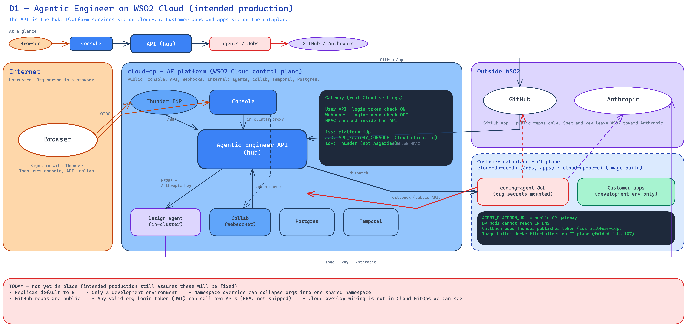

<!--
Copyright (c) 2026, WSO2 LLC. (https://www.wso2.com).

WSO2 LLC. licenses this file to you under the Apache License,
Version 2.0 (the "License"); you may not use this file except
in compliance with the License.
You may obtain a copy of the License at

http://www.apache.org/licenses/LICENSE-2.0

Unless required by applicable law or agreed to in writing,
software distributed under the License is distributed on an
"AS IS" BASIS, WITHOUT WARRANTIES OR CONDITIONS OF ANY
KIND, either express or implied.  See the License for the
specific language governing permissions and limitations
under the License.
-->

# Introduction

Agentic Engineer is a spec-driven software platform. A person describes what they want. Agents write specs in GitHub. Coding agents develop the app based on the spec and the platform deploys it in the cloud.

This threat model reviews the **intended WSO2 Cloud deployment**. Where today is weaker than that shape, we name the gap. Later chapters mark those gaps as controls not yet in place.

## What runs where

In the WSO2 Cloud deployment, Agentic Engineer platform services run on the control-plane cluster (`cloud-cp`):

- Console (browser app)
- Agentic Engineer API
- Agent service
- Collab (live spec editing)
- Temporal

Those services use Postgres on that plane. The database is Cloud-managed (not an Agentic Engineer pod).

Customer apps and coding-agent Jobs run on the customer dataplane (`cloud-dp-oc-dp`). Image builds run on the workflow / CI plane (`cloud-dp-oc-ci`). OpenChoreo projects for those customer orgs live in one `wc-*` namespace per organization on `cloud-dp-oc-cp`. That namespace fence is not the Agentic Engineer API tenant gate (organization comes from the login token). People who use those customer apps sign in with that organization’s Thunder on the dataplane, not the shared Thunder used for the Agentic Engineer console.

A person signs in with Thunder (platform IdP on `cloud-cp`). The browser talks to the console over public HTTPS. The console forwards backend calls inside the cluster.

**D1 — Agentic Engineer on WSO2 Cloud (intended deployment)**

## Today's gaps (not yet in place)

- Agentic Engineer has not taken the GitHub App path that WSO2 Cloud provides. Until it does, new GitHub repos stay public.
- The intended API control is **Admin** and **AgenticDeveloper**. Today any valid organization login token (JWT) can call organization APIs.
