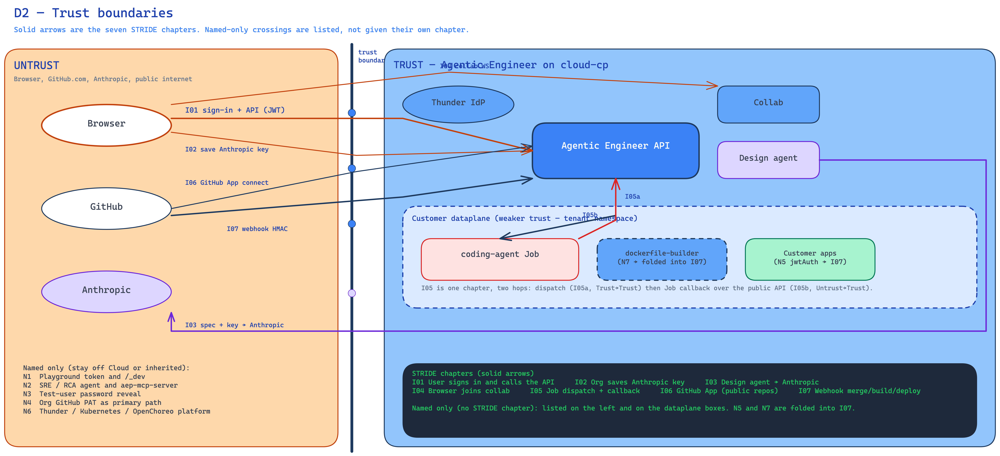

<!--
Copyright (c) 2026, WSO2 LLC. (https://www.wso2.com).

WSO2 LLC. licenses this file to you under the Apache License,
Version 2.0 (the "License"); you may not use this file except
in compliance with the License.
You may obtain a copy of the License at

http://www.apache.org/licenses/LICENSE-2.0

Unless required by applicable law or agreed to in writing,
software distributed under the License is distributed on an
"AS IS" BASIS, WITHOUT WARRANTIES OR CONDITIONS OF ANY
KIND, either express or implied.  See the License for the
specific language governing permissions and limitations
under the License.
-->

# Trust Boundaries

This section lists the crossings this model cares about. Seven of them get a full STRIDE chapter later (I01–I07). A few others are named only: they are not this WSO2 Cloud deployment, or they are Cloud internals we do not review here.

Trust types in simple words:

- **Untrust → Trust:** someone or something outside starts a call into Agentic Engineer (browser, GitHub, a dataplane Job hitting the public API).
- **Trust → Trust:** two things we run talk to each other (API to the agent service, API to OpenChoreo).
- **Trust → Untrust:** we call out (Anthropic, GitHub.com).

**D2 — Trust boundaries**

## Seven STRIDE crossings

| ID | Interaction | Trust boundary |
| :---- | :---- | :---- |
| I01 | User signs in with Thunder (platform IdP) and calls the Agentic Engineer API with a login token (JWT). Tenant gate binds the organization from the token. Intended control is **Admin** and **AgenticDeveloper**. Today any valid organization login token can call organization APIs. | Untrust → Trust |
| I02 | Organization saves the Anthropic API key through the API. | Untrust → Trust |
| I03 | Agent service sends the spec (and the key) to the AI provider. | Trust → Untrust |
| I04 | Browser joins a collab document over a websocket. The console forwards that connection to collab. Collab asks the Agentic Engineer API to check the login token before the live spec opens. | Untrust → Trust |
| I05a | Platform starts a coding-agent Job on the customer dataplane (secrets land in that Job). | Trust → Trust |
| I05b | The Job calls back to the public Agentic Engineer API. | Untrust → Trust |
| I06 | Organization connects GitHub. Agentic Engineer has not taken the GitHub App path that WSO2 Cloud provides, so new repos stay public. | Untrust → Trust |
| I07 | GitHub tells Agentic Engineer that code was merged. Agentic Engineer builds the image and deploys the customer app. | Untrust → Trust |

I05 is one later chapter with two hops. I05a is dispatch. I05b is the public callback.

## Named only (no STRIDE chapter)

| ID | Interaction | Trust boundary | Why named only |
| :---- | :---- | :---- | :---- |
| N1 | SRE / RCA agent and `aep-mcp-server` | Untrust → Trust | Not deployed in this WSO2 Cloud deployment. |
| N2 | Test-user password reveal / publishing test passwords to GitHub | Trust → Untrust | Being removed. Not a live control in the WSO2 Cloud deployment. |
| N3 | WSO2 Cloud GitHub App path (how Cloud authorizes each created repo) | Inherited | Agentic Engineer has not taken this path. The live gap is public repos (I06). |
